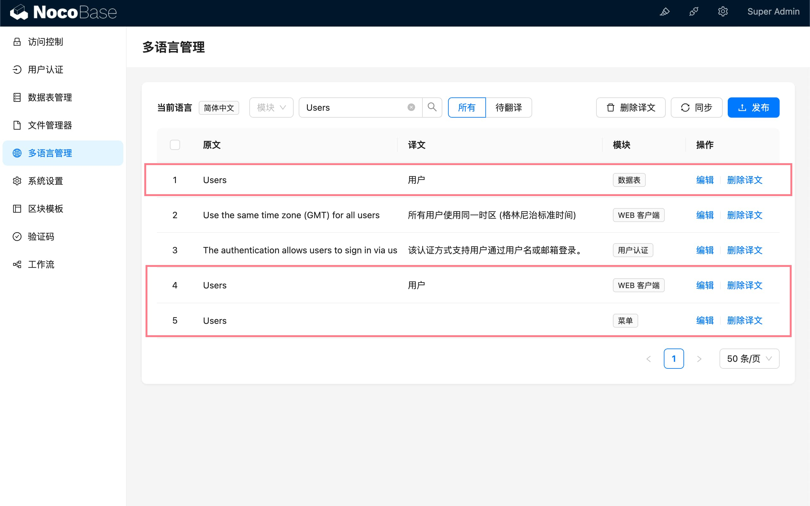

# 0.17.0-alpha.3

## Localization management

### Background

Refer to <a target="_blank" href="https://blog.nocobase.com/posts/organize-text-namespaces-by-modules-in-localization-management/">Update（localization-management）：Organize text namespaces by modules</a>

### Translation texts are no longer deduplicated

Duplicate texts across modules require separate translations.



### Removed `fallbackNS` option from `i18n` instance

The `i18n` instance of client no longer includes the option `fallbackNS: "client"`.

For plugin developers, if language files in a plugin omit some texts already present in the core client, it's necessary to supplement them. If you still want to reuse content from `packages/core/client/src/locale`, pass the appropriate parameters when using it, for example:

```ts
import { useTranslation } from 'react-i18next';

export const NAMESPACE = 'localization-management';

export const useLocalTranslation = () => {
  return useTranslation([NAMESPACE, 'client'], { nsMode: 'fallback' });
};
```
