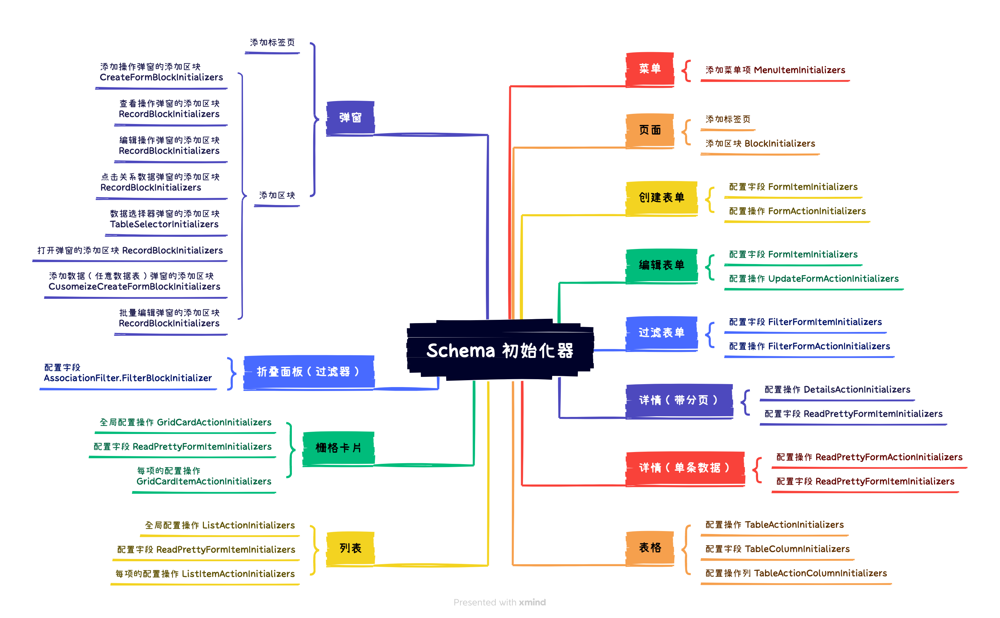

# SchemaInitializer 初始化器

当激活 UI 配置之后，界面上直观可见的各种橙色按钮就是 Schema 初始化器，用于向界面内添加各种区块、字段、操作等。


## 内置的初始化器



## 向已有的初始化器里添加项

推荐使用 [`schemaInitializerManager.addItem()`](#) 方法添加项，item 的详细配置参考 [SchemaInitializer Item API](#)

```ts
class PluginDemoAddSchemaInitializerItem extends Plugin {
  async load() {
    this.schemaInitializerManager.addItem(
      'myInitializer', // 示例，已存在的 schema initializer
      'otherBlocks.custom', // 向 otherBlocks 分组内添加 custom
      {
        type: 'item',
        useComponentProps() {},
      },
    );
  }
}
```

<code src="./demos/schema-initializer-manager-add-item/index.tsx"></code>

## 添加新的初始化器

SchemaInitializer 的详细参数参考 [SchemaInitializerOptions API](https://client.docs-cn.nocobase.com/core/ui-schema/schema-initializer#new-schemainitializeroptions)

```ts
const myInitializer = new SchemaInitializer({
  // 初始化器标识，全局唯一
  name: 'myInitializer',
  title: 'Add Block',
  // 包装，例如插入到 Grid 里，需要用 Grid.wrap 处理（添加行列标签）
  wrap: Grid.wrap,
  // 插入位置，默认为 beforeEnd，支持 'beforeBegin' | 'afterBegin' | 'beforeEnd' | 'afterEnd'
  insertPosition: 'beforeEnd',
  // 下拉菜单项
  items: [
    {
      name: 'a',
      type: 'item',
      useComponentProps() {},
    },
  ],
});
```

### 在插件的 load 方法中注册

推荐使用 `schemaInitializerManager.add()` 将新增的初始化器添加到应用里

```ts
class PluginDemoAddSchemaInitializer extends Plugin {
  async load() {
    const myInitializer = new SchemaInitializer({
      name: 'myInitializer',
      title: 'Add block',
      wrap: Grid.wrap,
      items: [
        {
          name: 'helloBlock',
          type: 'item',
          useComponentProps() {
            const { insert } = useSchemaInitializer();
            return {
              title: 'Hello',
              onClick: () => {
                insert({
                  type: 'void',
                  'x-decorator': 'CardItem',
                  'x-component': 'h1',
                  'x-content': 'Hello, world!',
                });
              },
            };
          },
        },
      ],
    });
    this.schemaInitializerManager.add(myInitializer);
  }
}
```

### 如何使用新添加的初始化器

SchemaInitializer 用于 Schema 的 `x-initializer` 参数中。

#### 现有支持 `x-initializer` 的 Schema 组件

通用的支持 `x-initializer` 的 Schema 组件有 Grid、ActionBar、Tabs，例如：

```ts
{
  type: 'void',
  'x-component': 'Grid',
  'x-initializer': 'myInitializer',
}
```

<code src="./demos/schema-initializer-manager-add/index.tsx"></code>

#### 自定义组件如何支持 `x-initializer` 参数

如果 Grid、ActionBar、Tabs 这类组件并不满足需求，自定义的组件中，也可以使用 [useSchemaInitializerRender()](https://client.docs-cn.nocobase.com/core/ui-schema/schema-initializer#useschemainitializerrender) 处理 `x-initializer` 的渲染。

<code src="./demos/use-schema-initializer-render/index.tsx"></code>

## API 参考

- [SchemaInitializerManager](https://client.docs-cn.nocobase.com/core/ui-schema/schema-initializer-manager)
- [SchemaInitializer](https://client.docs-cn.nocobase.com/core/ui-schema/schema-initializer)
