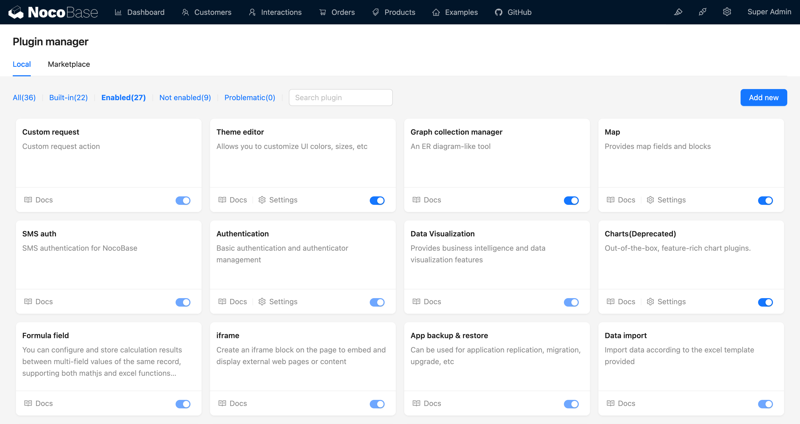

# Introduction

NocoBase adopts a microkernel architecture, where various functionalities are extended in the form of plugins. The plugin-based design reduces the coupling between modules, increasing reusability. With the continuous expansion of the plugin library, common scenarios can be easily built by combining plugins. NocoBase's no-code platform is composed of various plugins.

## Plugin Manager

NocoBase provides a powerful plugin manager to handle plugin management. No-code users can manage the addition, activation, deactivation, and deletion of plugins through the interface.

Developers can also manage plugins through the CLI.

For more plugin examples, see [packages/samples](https://github.com/nocobase/nocobase/tree/main/packages/plugins/%40nocobase).

## Extensibility

Whether it's generic functionalities or personalized customization, they can be written in the form of plugins. NocoBase's extensibility is reflected in various aspects:

- It can be visible user interface-related page modules, block types, operation types, field types, etc.
- It can also be used for enhancing or restricting HTTP API filters, validators, access restrictions, etc.
- It can also be more fundamental enhancements of features such as data tables, migrations, events, command-line, etc.

Modules are distributed as follows:

- Server-side
  - Data tables and fields
  - Resources and operations
  - Middleware
  - Events
  - Custom command-line
  - Internationalization
- Client-side
  - Route management and plugin configuration pages
  - Styles and themes
  - Providers and contexts
  - UI Schema
  - Internationalization
