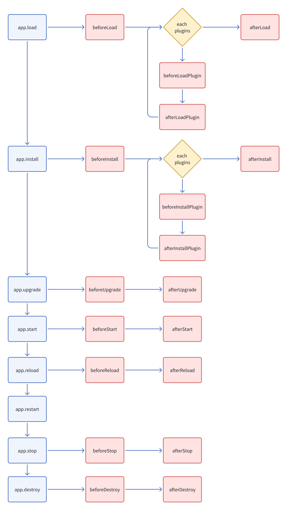
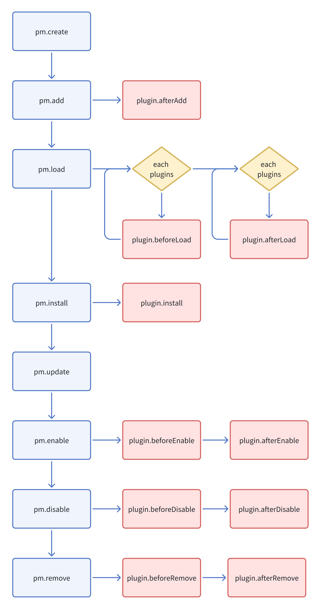

# Lifecycle

## Lifecycle of the server-side application



Triggered by `app.on()`, see [Server-side - Events](/development/server/events) for details.

```ts
class PluginSampleHelloServer extends Plugin {
  async beforeLoad() {
    this.app.on('beforeInstall', async () => {
      // coding...
    });
  }
}
```

## Lifecycle of the server-side plugin



Written in the plugin class, see [Server - Overview](/development/server) for usage details.

```ts
class PluginSampleHelloServer extends Plugin {
  async beforeLoad() {}
}
```

## Lifecycle of the client-side plugin


Written in the plugin class, see [Client - Overview](/development/client) for usage details.
