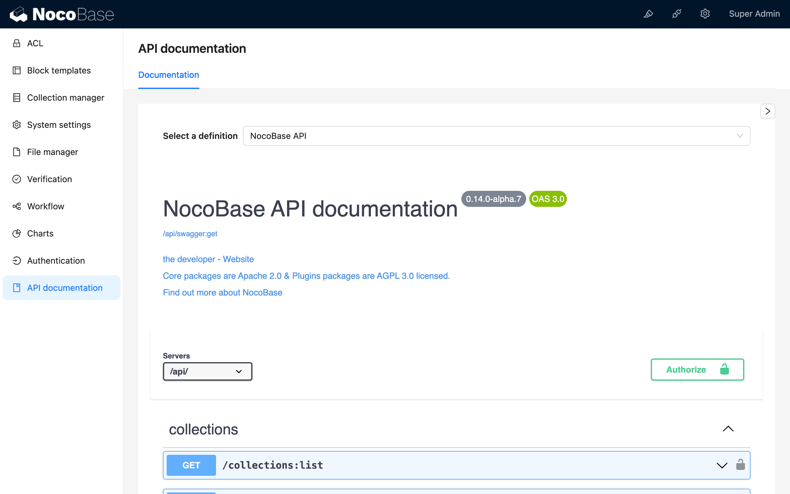

# API Documentation

<PluginInfo name="api-doc"></PluginInfo>

## Introduction

An OpenAPI documentation generator for NocoBase HTTP API.

## Installation

This is a built-in plugin, no installation required. Activate to use.

## Usage Instructions

### Accessing the API Documentation Page

http://localhost:13000/admin/settings/api-doc/documentation



### Documentation Overview


- Total API Documentation: `/api/swagger:get`
- Core API Documentation: `/api/swagger:get?ns=core`
- All Plugins API Documentation: `/api/swagger:get?ns=plugins`
- Each Plugin's Documentation: `/api/swagger:get?ns=plugins/{name}`
- User Customized Collections API Documentation: `/api/swagger:get?ns=collections`
- Specified `${collection}` and related `${collection}.${association}` resources: `/api/swagger:get?ns=collections/{name}`

## Developer Guide

### How to Write Swagger Documentation for Plugins

Add a `swagger/index.ts` file in the plugin's `src` folder with the following content:

```typescript
export default {
  info: {
    title: 'NocoBase API - Auth plugin',
  },
  tags: [],
  paths: {},
  components: {
    schemas: {},
  },
};
```

For detailed writing rules, please refer to the [Swagger Official Documentation](https://swagger.io/docs/specification/about/).