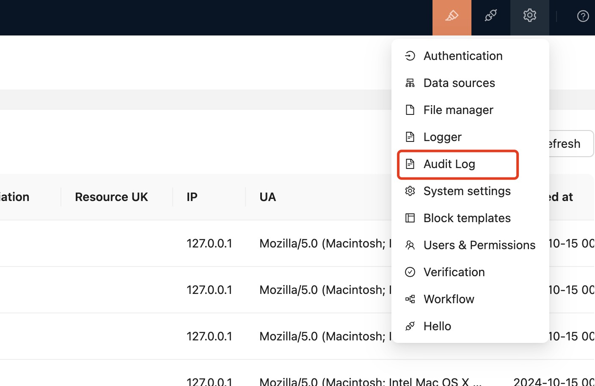
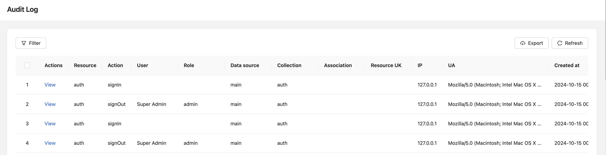

# Audit Log

<!-- :::warning
Documentation to be added
::: -->

## Introduce

According to product security requirements, all resource operations within the application need to be recorded in audit logs to monitor and regulate users' operating behaviors within the system.

## Install

<!-- 你可以在「[插件管理器](/handbook/plugin-manager)」里增加审计日志插件。系统会默认添加`app:restart`、`app:clearCache`、`pm:add`、`pm:update`、`pm:delete`、`user:add`、`user:update`、`user:delete`等日志记录。 -->
You can add audit log plug-ins in「[Plug-in Manager](/handbook/plugin-manager)」. The system will add `app:restart`, `app:clearCache`, `pm:add`, `pm:update`, `pm:delete`, ` by default User:add`, `user:update`, `user:delete` and other log records.

## How to use

`this.app.auditManager.registerAction` single registration

`this.app.auditManager.registerActions` batch registration

Registering resources and operations that need to participate in auditing supports several usages:

- Register a global operation that takes effect on all resources:`registerActions(['create'])`
- Valid for all operations on a resource `resource:*`:  `registerActions(['app:*'])`
- An operation on a resource takes effect `resource:action`:  `registerActions(['pm:update'])`
- Support passing custom `getMetaData` method

``` javascript
registerActions([
  'create',
   { name: 'auth:signIn', getMetaData }
])
```

- When registered interfaces overlap, fine-grained registration methods have higher priority, for example

``` javascript
registerAction('create');
registerAction('xxx:create', { getMetaData }); // 采用这个
```

- If you do not customize the `getMetaData` method, the built-in method will be used by default.
``` javascript
async getDefaultMetaData(ctx: Context) {
  return {
    request: {
      params: {},
      body: {}
    },
    response: {
      body: {}
    }
  }
}
```

## interface
When the audit log is started, you can enter the audit page from this entrance



You can filter through the page, view log details, and export in batches.



## Log info


| Field name  | describe                                                         |
| ----------- | ------------------------------------------------------------ |
| uuid        | Log record identification. If there is a problem, you can also locate it with the system log.                   |
| dataSource  | data source                                                       |
| resouce     | Resources, data table: a, a.b. Other custom resources, custom resources do not need to record collection and association |
| collection  | a or<br />a.b, b is the field name, and the actual table name is b.target. <br />If it is an inherited table, it will be processed according to the tableoid situation. |
| association | Related fields, b of a.b                                          |
| action      | operate                                                         |
| resouceUk   | When there are multiple unique keys involved in resources, use `,` to separate them, such as creation operations.   |
| userId      | Operation user ID                                               |
| roleName    | name of role                                             |
| IP          | source IP                                                      |
| UA          | UserAgent information                                               |
| status      | operate status 0 - fail, 1 - success                                  |
| createdAt   | operate time                                                     |
| metadata    | Operation status code, error message. Operation-related contextual information, customized record content, etc. |


## Related

- [API - @nocobase/actions](../../api/actions)
<!--
## 介绍

## 安装

## 使用说明 -->

