# 认证：企业微信

<PluginInfo commercial="true" name="auth-wecom"></PluginInfo>

## 介绍

认证：企业微信 插件支持用户使用企业微信账号登录 NocoBase.

## 激活插件

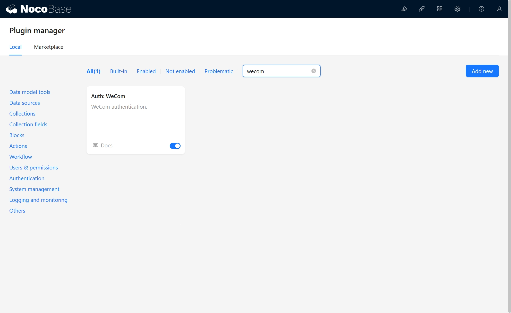

## 在企业微信管理员后台创建企业微信自建应用

进入企业微信管理员后台，创建企微应用

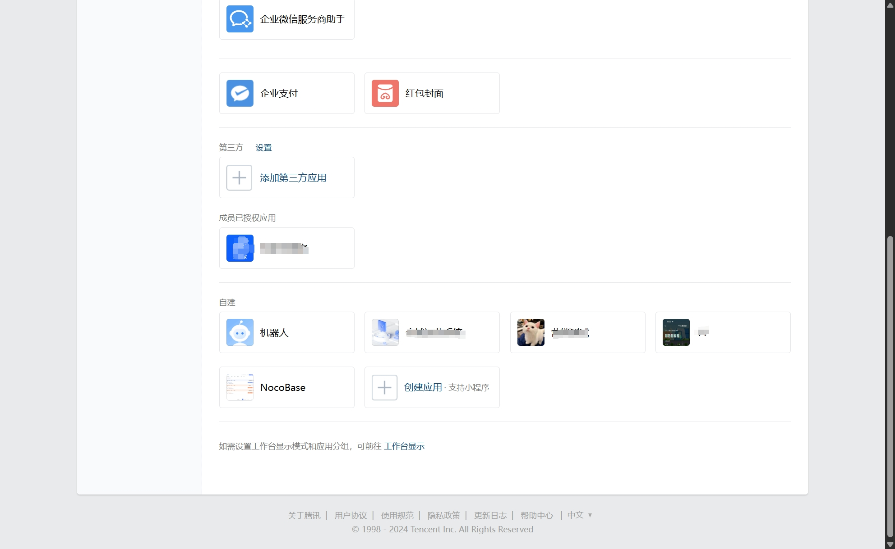

在应用详情页，点击设置企业微信授权登录

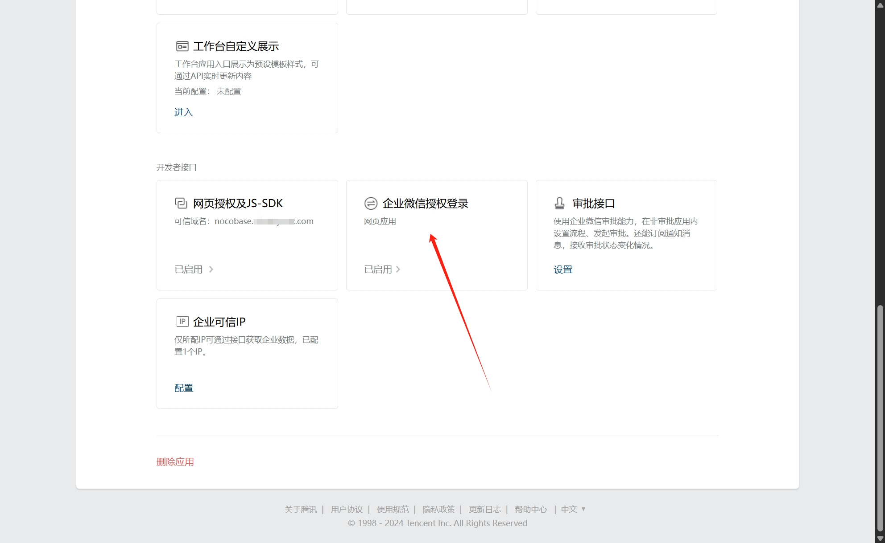

设置授权回调域为应用域名

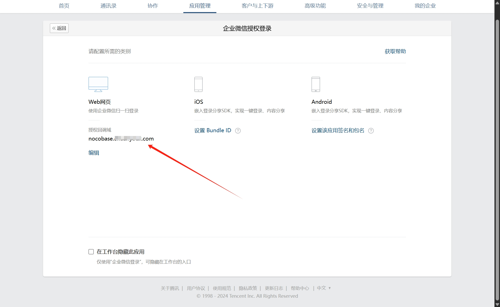

在应用详情页，点击设置网页授权及JS-SDK域名

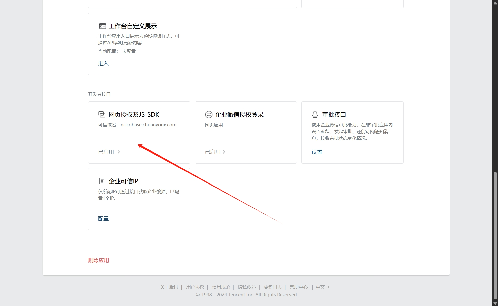

设置OAuth2.0网页授权功能的回调域名

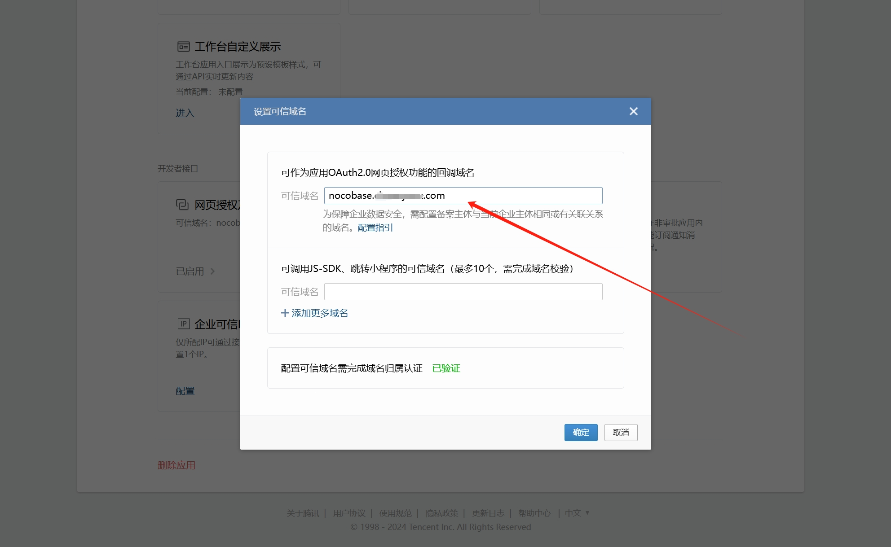

在应用详情页，点击设置企业可信IP

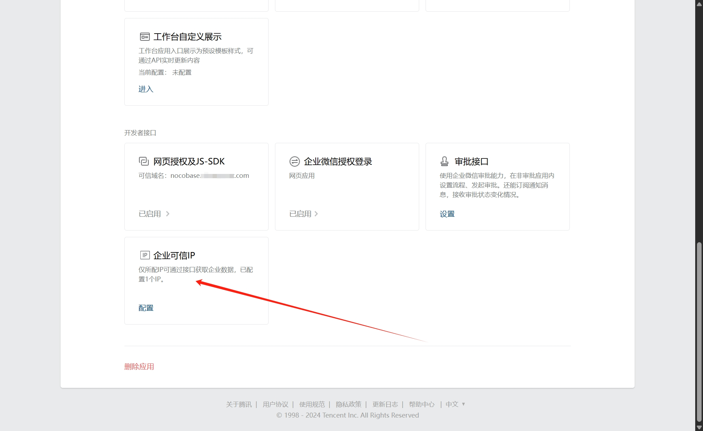

设置企业可信IP

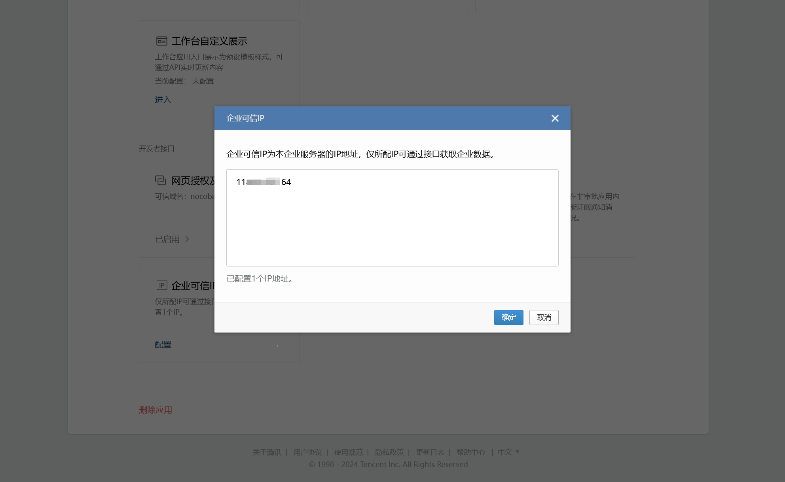

## 从企业微信管理员后台获取密钥

在企业微信管理后台-->我的企业，复制 企业 ID.

在企业微信管理后台-->应用管理，进入上一步创建应用的详情页，复制 AgentId 和 Secret

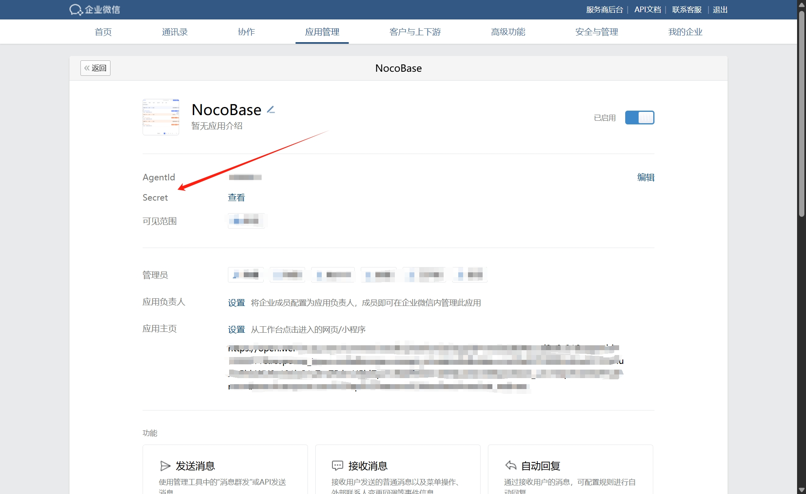

## 在 NocoBase 上添加企业微信认证

进入用户认证插件管理页面。

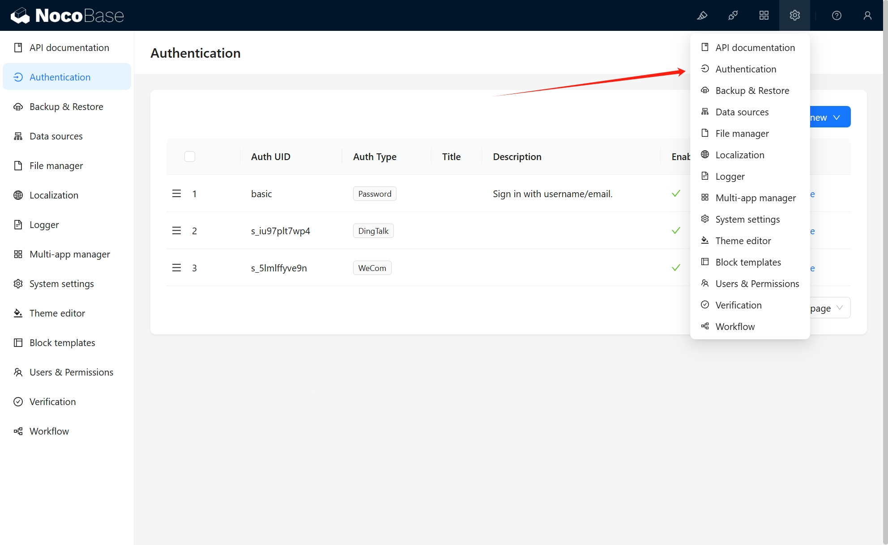

添加 - 企业微信

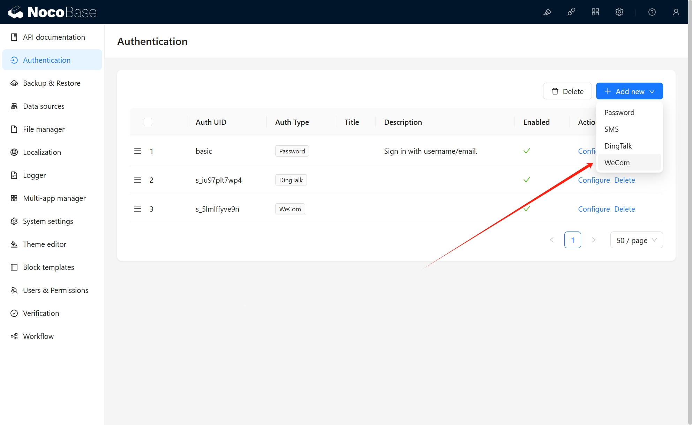

配置

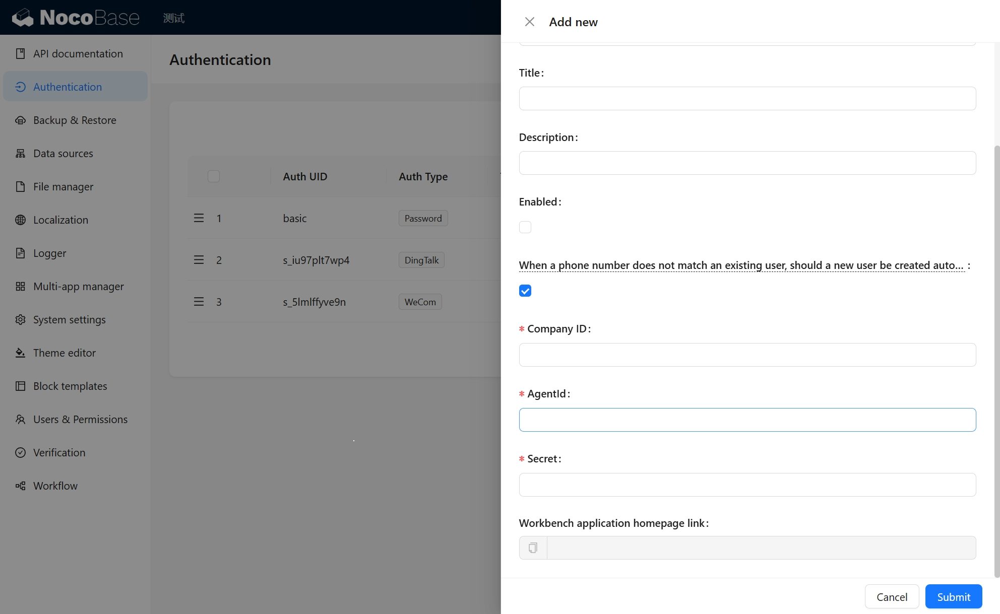

- When a phone number does not match an existing user, should a new user be created automatically - 当使用手机号匹配不到已有用户时，是否自动创建新用户。
- Company ID, AgentId 和 Secret - 填写上一步复制的信息。
- Workbench application homepage link - 工作台应用主页链接，复制并进入下一步。

## 在企业微信管理员后台配置企业微信应用首页

将复制的工作台应用主页链接填写到企业微信管理员后台。

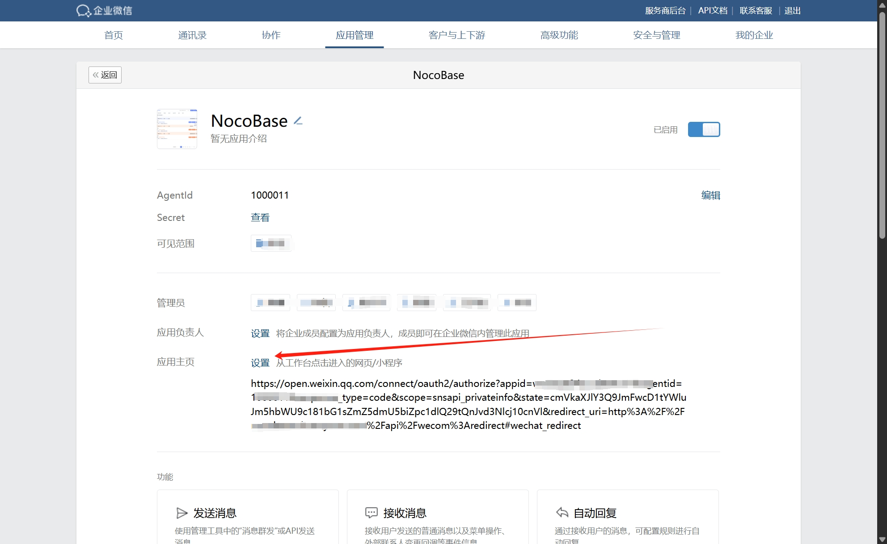

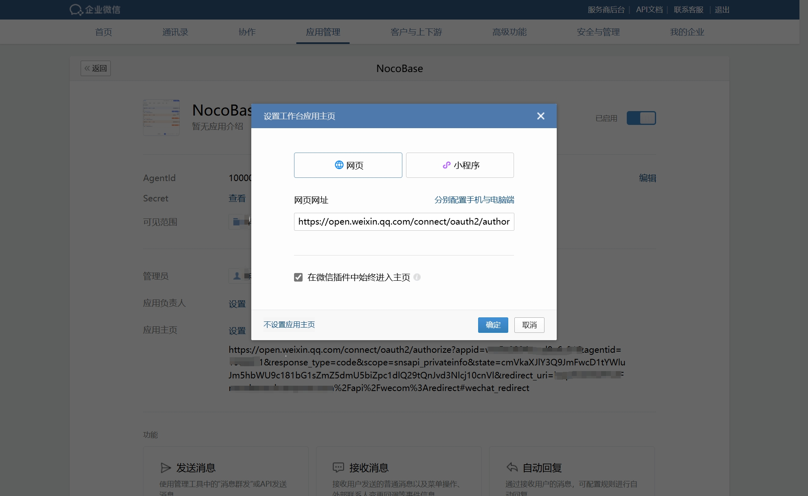

## 登录

访问登录页面，点击登录表单下方按钮发起第三方登录。

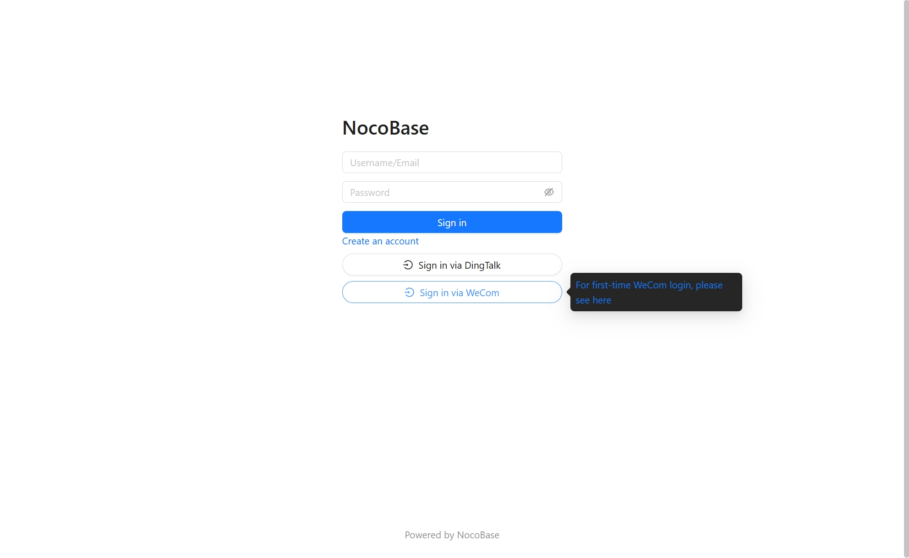

## 初次登录

初次登录时，请先在企业微信登录应用，当企业微信手机号匹配不到已有用户时，会自动创建新用户。

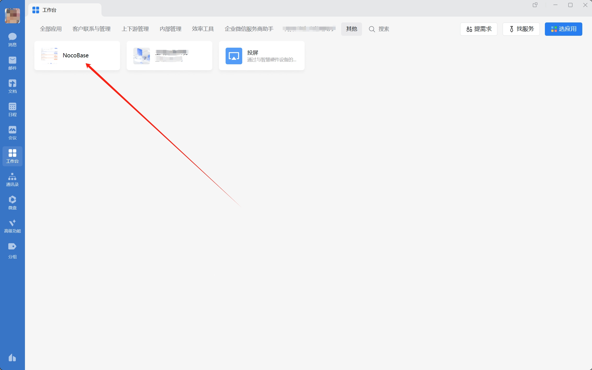
