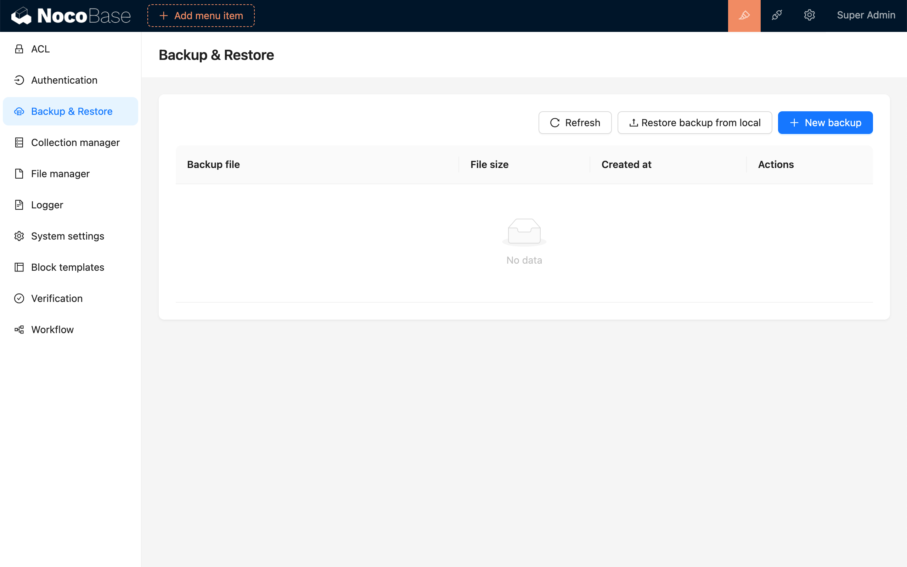
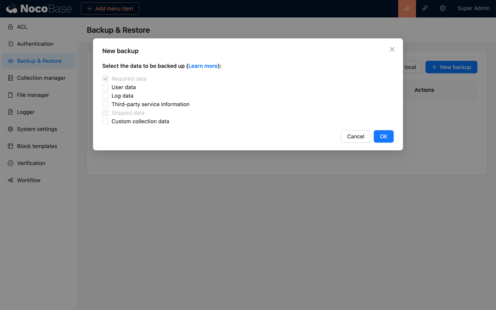
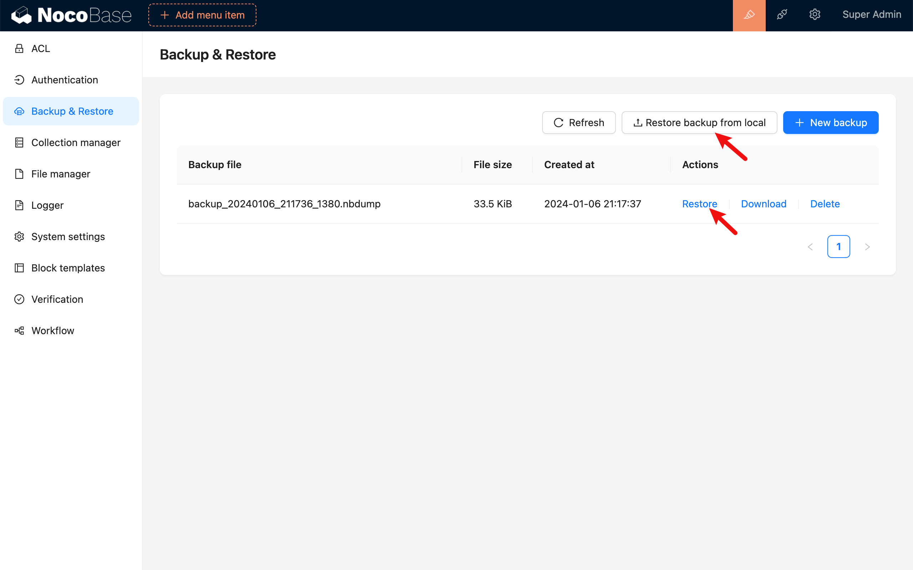
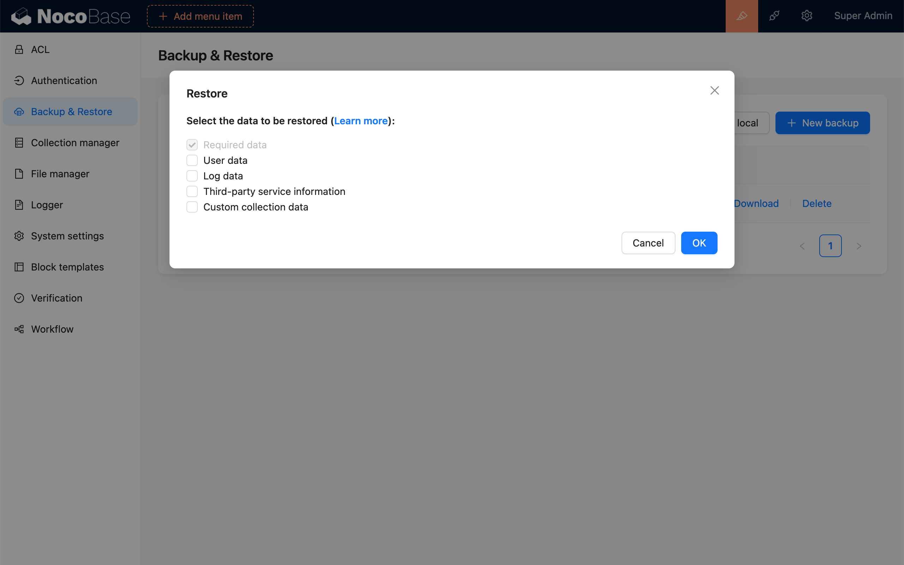
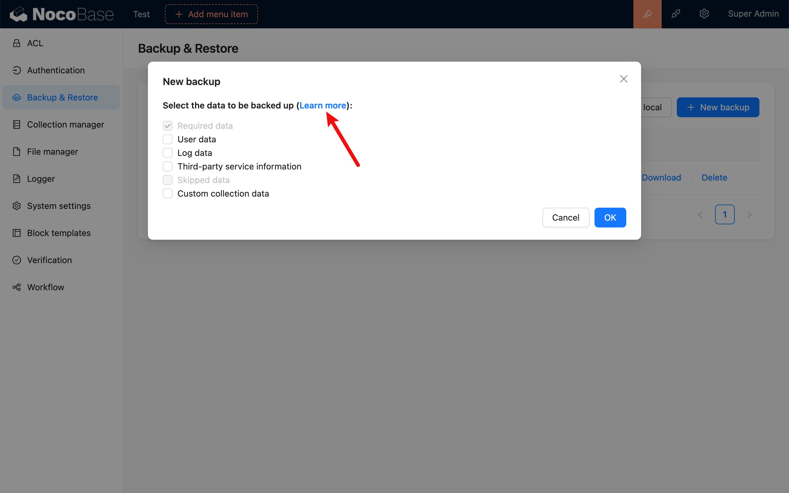
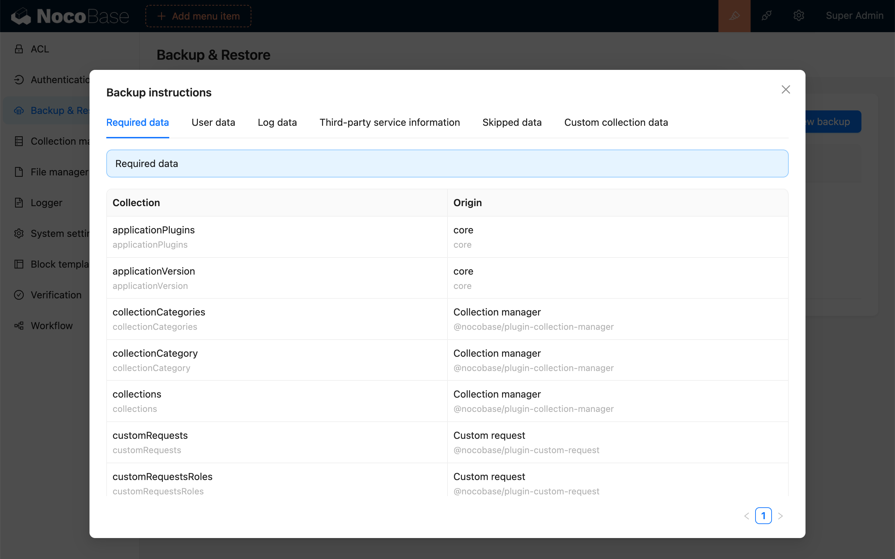

# Backup and Restore

<PluginInfo name="backup-restore"></PluginInfo>

## Introduction

The backup and restore plugin can be used for scenarios such as application replication, migration, and upgrade.

## Installation

This plugin is built-in and does not require manual installation or activation.

## User Instructions

### Creating a Backup

### Restore Backup

You can choose to upload a backup from your local device or click on a backup file to restore.

Select the data you need to restore, the selected data will completely overwrite the corresponding data table of the target application.

### Backup Instructions 

Click on "Learn more" to view the backup instructions.

Backup Instructions

Backup Groups

- Required Data: Essential data for system operation.
- Skipped Data: Data skipped and not backed up.
- User Data: Data related to users.
- Log Data: Data used to record some actions log.
- Third-party Service Information: Generally information about various service providers, such as file storage services, map services, and SMS service provider configuration information, etc.
- Custom Collection Data: Data of collections added through the collection manager.
- Unknown Data: Data without configured backup rules.

Note: You can choose the data you want to back up or restore by group. The selected data will completely overwrite when restoring.