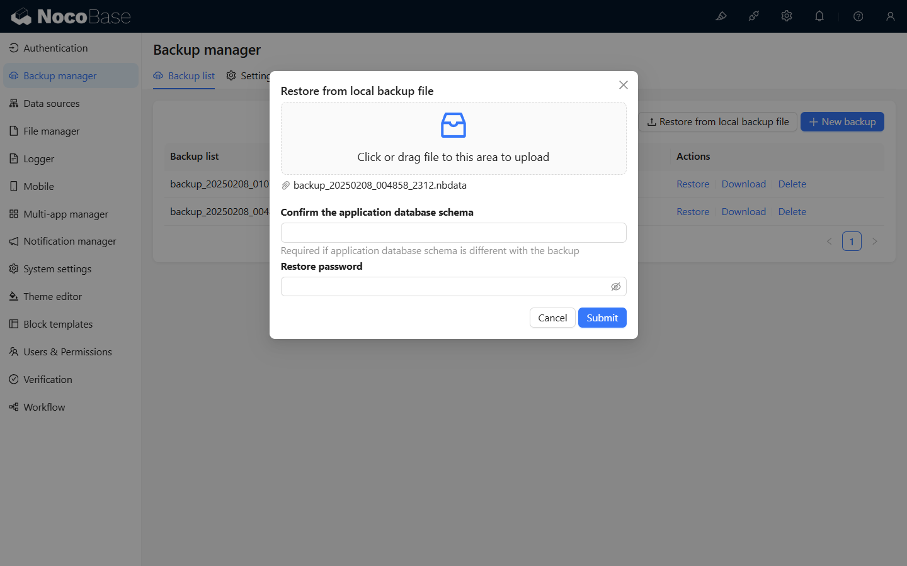

# Backups Manager

<PluginInfo licenseBundled="true" name="backups"></PluginInfo>

## Introduction

The NocoBase backup manager plugin provides features for fully backing up of the NocoBase database and user uploaded files, including backup's scheduling, downloading, deleting, and restoring operation.

## Installation

<embed src="./install.md"></embed>

## Usage Instructions

执行备份和还原操作需要数据库用户具备相应的权限。以下是不同数据库类型所需的最小权限要求：

| 数据库类型 | 备份 | 还原 |
|-----------|------|------|
| MySQL/MariaDB | `SELECT`、`SHOW VIEW`、`TRIGGER`、`LOCK TABLES`、`EVENT`、`SELECT ON mysql.servers` (开启 FDW 时需要) | `SELECT`、`SHOW VIEW`、`TRIGGER`、`LOCK TABLES`、`EVENT`、`CREATE`、`UPDATE`、`INDEX`、`DROP`、`INSERT`、`ALTER`、`CREATE ROUTINE`、`REFERENCES`、`CREATE VIEW`、`SUPER` (开启 FDW 时需要) |
| PostgreSQL | `SELECT`、`CONNECT`、`USAGE` | `CREATE`、`USAGE`、`CONNECT`、`DROP`、`ALTER`、`SELECT`、`INSERT`、`UPDATE`、`DELETE`、`TRUNCATE`、`REFERENCES`、`TRIGGER`、`SUPERUSER` (开启 FDW 时需要) |

### Create New Backup

Click the "New backup" button to create a new backup based on the backup configuration and display the backup status in the backup list.

### Restore Backup

Supports restoring backups from the backup list or uploading local backup files to restore backups.
Restore operations are not allowed in the following scenarios:

- When the current NocoBase version is lower than the NocoBase version in the backup file.
- When the current NocoBase database is inconsistent with the following configurations in the backup file:
  - dialect
  - underscored
  - table prefix
  - schema
- When the `Tolerant mode` is not enabled, and the database version when creating the backup is higher than the current application database version.

> **Restore is a full database operation. It is recommended to back up the current database before restoring a backup.**

#### Restore from the backup list

Click the "Restore" button of the backup item in the backup list, enter the backup file encryption password in the pop-up window, and click "Confirm" to restore the backup.

> Leave password empty for unencrypted backup.

> If you need to restore the backup to a lower version of the database, you need to enable the tolerant mode.

#### Restore from local backup file

Click the `Restore from local backup` button, select the local backup file in the pop-up window, enter the backup file encryption password, and click "Confirm" to restore the backup.

> Leave password empty for unencrypted backup.

> If you need to restore the backup to a lower version of the database, you need to enable the tolerant mode.

#### Download Backup File

Click the `Download` button of the backup item in the backup list to download the backup file.

#### Delete Backup

Click the `Delete` button of the backup item in the backup list to delete the backup file.

## Backup Settings

Switch to the "Settings" tab, modify the backup settings, and click `Save` to take effect.

### Backup Settings Description

- `Automatic backup`: When enable `Run automatic backup on the cron schedule`, you can set automatic backups at specified times.
- `Maximum number of backups`: Set the maximum number of locally saved backup files. After exceeding the number, the earliest backup files will be automatically deleted.
- `Sync backup to cloud storage`: Set the cloud storage location where the backup files are automatically uploaded after successful backup, only support cloud storage.
- `Backup local storage files`: Whether to include files uploaded by users to the server's local storage (storage/uploads) in the backup.
- `Restore password`: If a restore password is set, it must be entered when restoring the backup.

> **Please keep the restore password safe. Forgetting the password will make it impossible to restore the backup file.**
