# Data Dictionary

<YouChaoYunPluginInfo name="data-dictionary" commercial=true></YouChaoYunPluginInfo>

## Why Use Data Dictionary?

### Usage Scenarios

- There is a need to maintain consistency within the system for specific data, such as contract management, and it is desirable to define a fixed number of contract states that users can choose to use in order to achieve the established management objectives for subsequent statistical analysis.
- As an enumeration of data used to achieve specific functions, such as: CRM system implementation, according to the upstream and downstream company categories into customers, suppliers, you can reuse the same data definition, block template, you only need to type in the list of customers, suppliers, sales contracts, and procurement contracts.
- Defining a data dictionary with reference to relevant standards can realize data reuse with other heterogeneous systems. For example, housing construction departments in various provinces and cities have their own real-name system for labor services, and the Ministry of Housing and urban-rural development defines a set of data dictionary standards, so that the data of provinces and cities can be interoperable.

### Compared To The Built-in Selection Fields:

- One definition, many uses
- No administrator privileges are required, and end users can maintain data
- Provide richer features
- Scalability in the future

### Features:

- Support for tree dictionaries
  For example: GB/T 2261.2-2003, personal basic information classification and code-marital status
  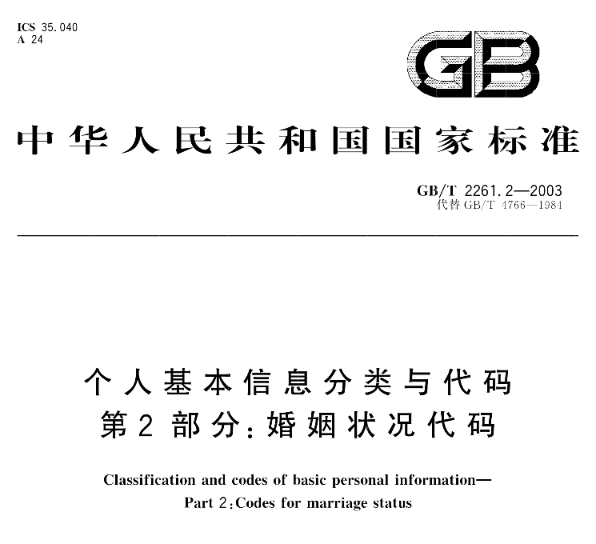
  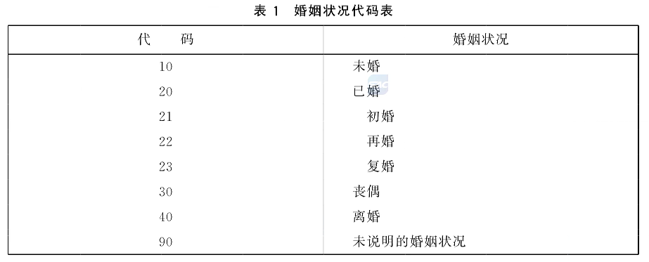

- Support for more color choices
- Provide valid/invalid controls that do not affect historical data

## Usage Instructions

Data Dictionary Maintenance: dictionary types, dictionary data

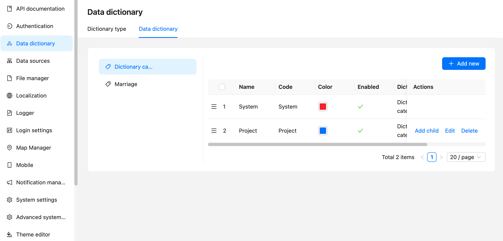

Fields add:
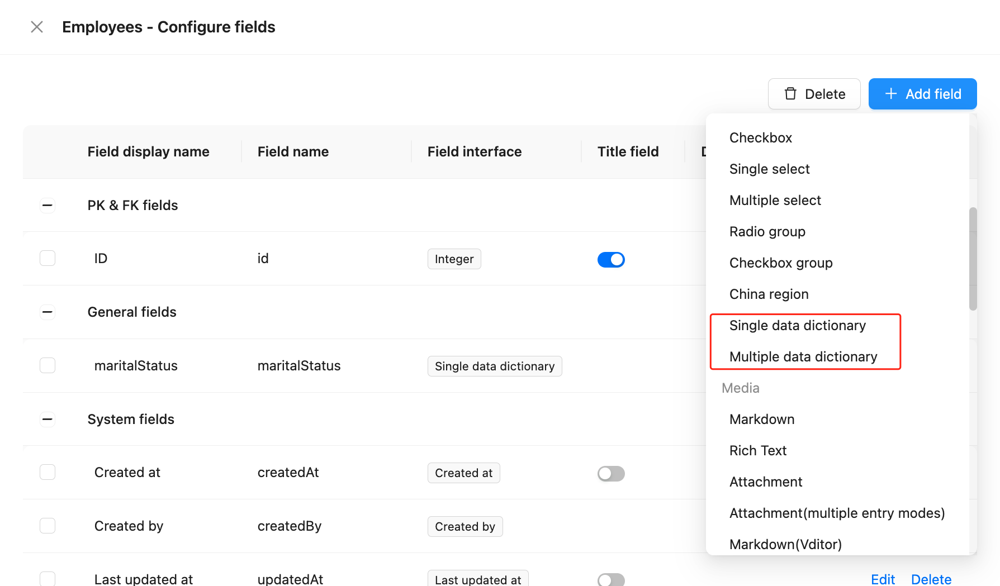

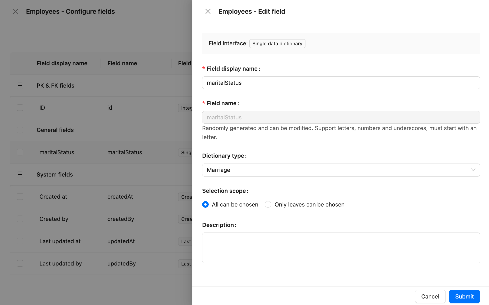

## Post-use Effects

Table block
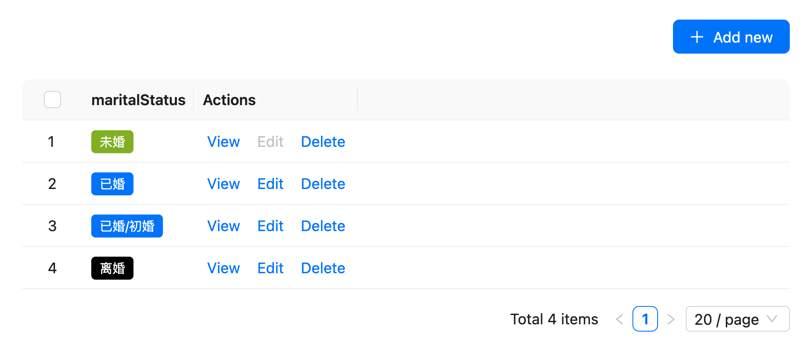

Configuration items: 1. Field components (tag, colored text, text) ; 2. Whether to display the parent
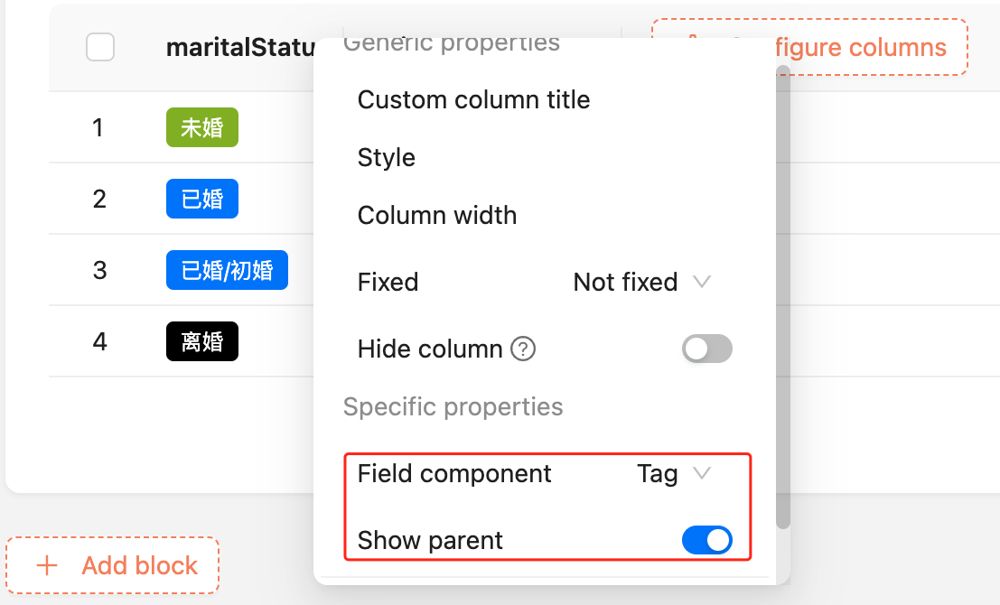

Add and edit block
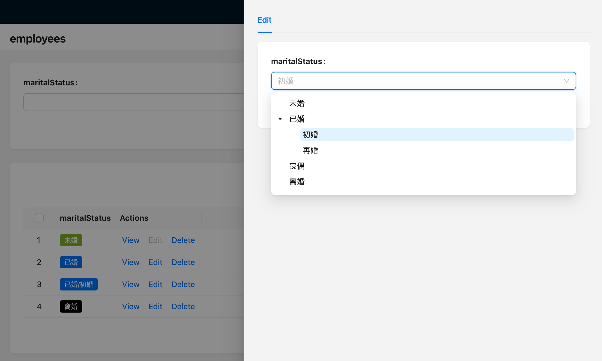

Details block
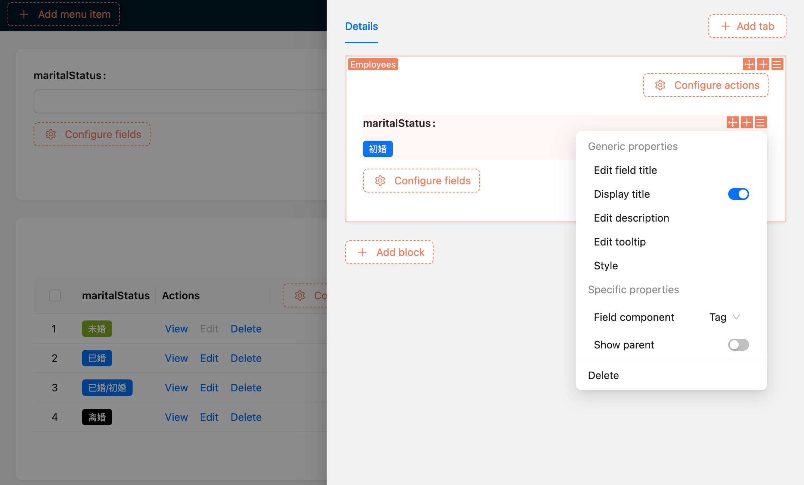

Linkage rules
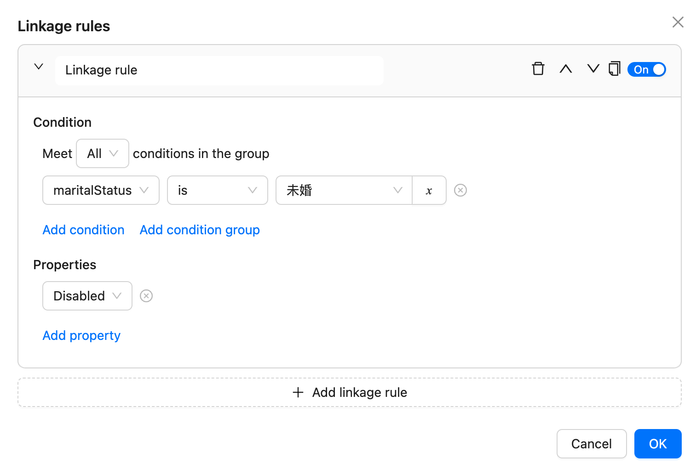

Data scope
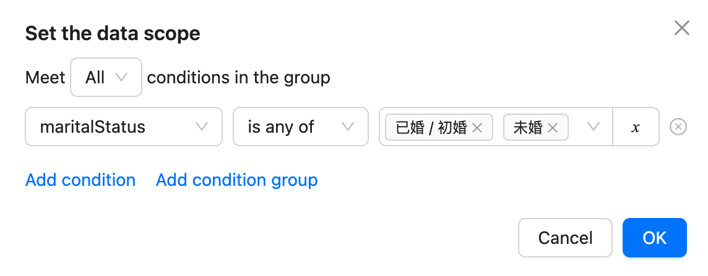

Filter block
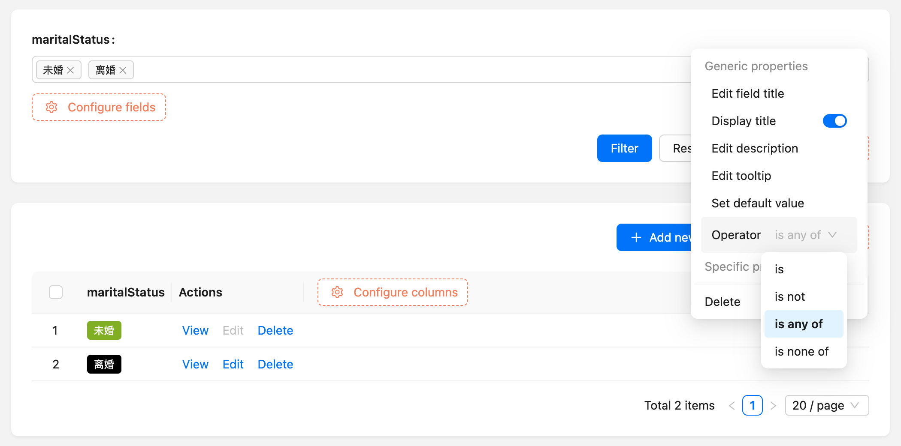

## Migration Of Historical Data

Developing...
