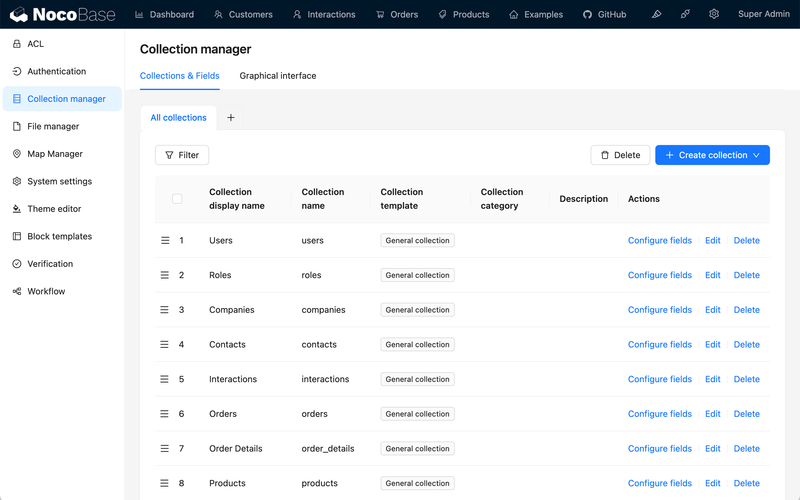
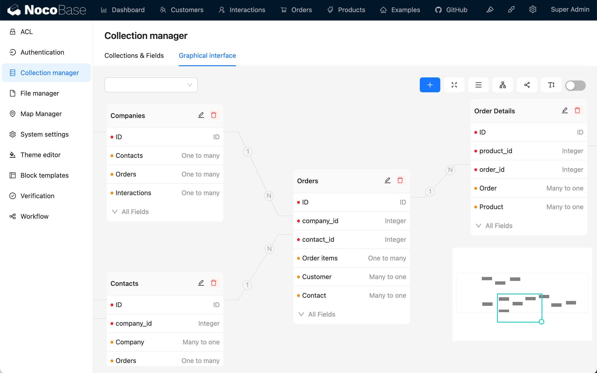
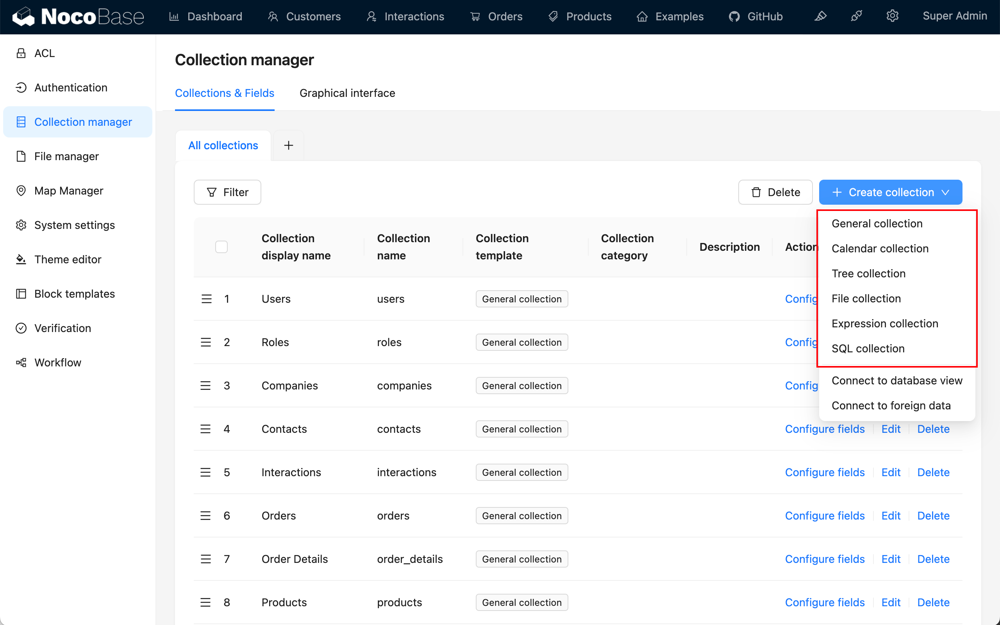
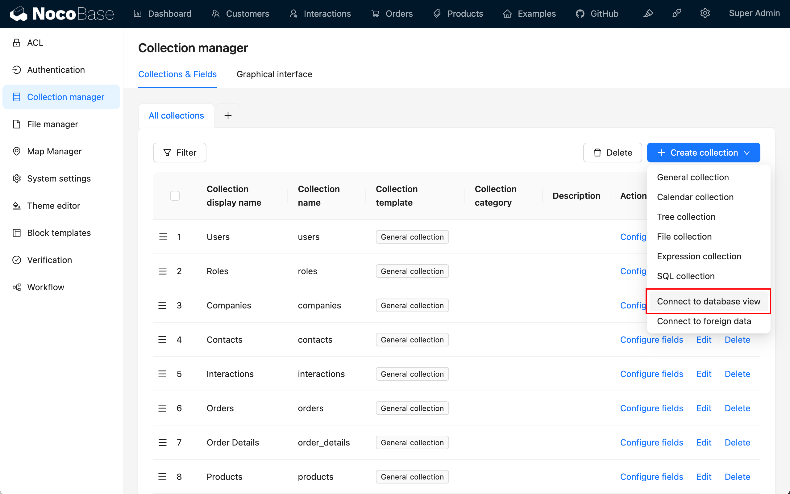
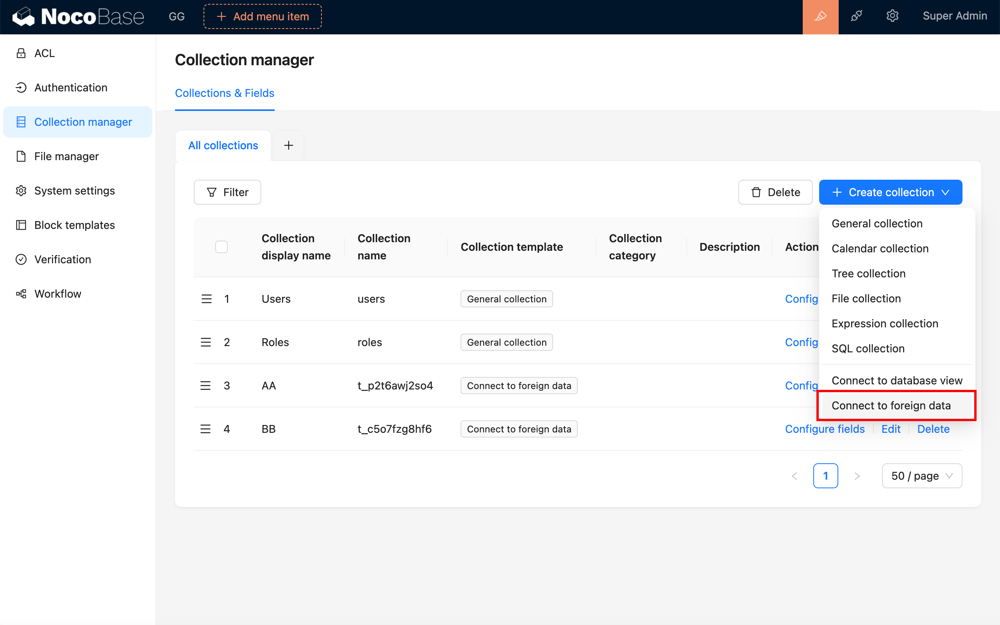
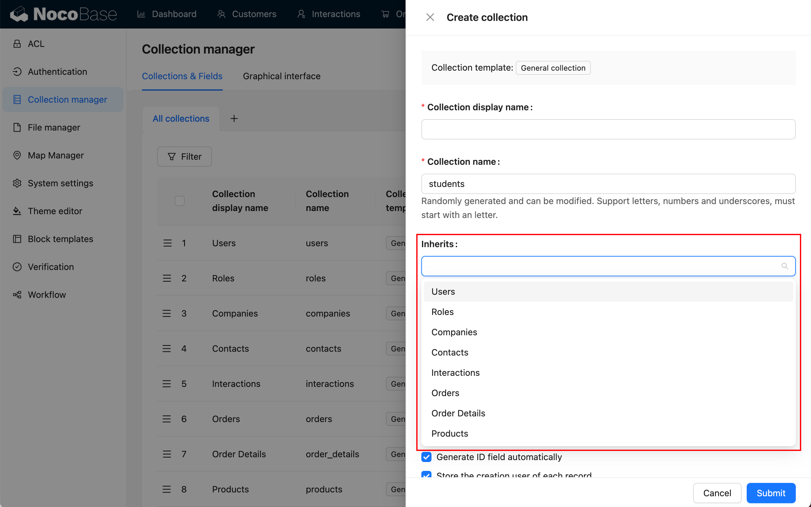
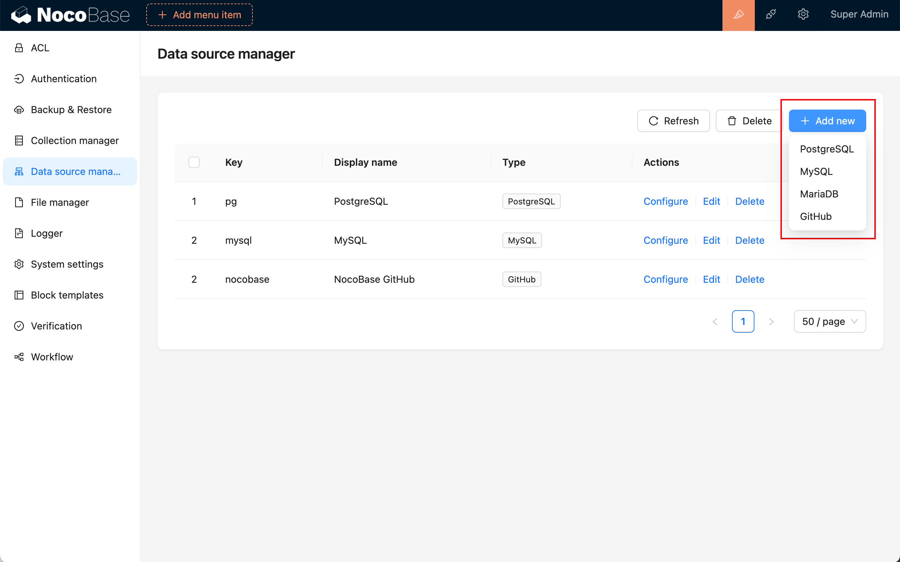

# Overview

Data modeling is the process of analyzing and abstracting various types of real-world data and their relationships during the design of a database. It aims to find the intrinsic connection and formalize it into a data model to establish the database structure of the information system. The data model is the foundation that drives NocoBase's work.

NocoBase's data modeling has the following features:

## Offers a simple collection management interface

Used to create various collections (data tables) or connect to existing collections (data tables)

## Provides a visualization interface like ER Diagrams

ER diagrams are used to extract entities and their relationships from user and business requirements. They provide an intuitive and easy-to-understand way to describe data models. With ER diagrams, we can better understand the main data entities in the system and their relationships.

## Provides a variety of field types

The NocoBase collection fields include two dimensions: "Data Type" and "UI Type":

- Data type (Field type): Used to define the kind, format, and structure of the data that the field can store;
- UI Type (Field interface): Refers to the type of control used to display and input field values in the user interface.

## Has imaginative collection templates

Used to predefine data models under certain structures. The currently supported collection templates include:

- Genaral collection: Built-in common system fields;
- Tree collection: Tree structure table, currently only supports adjacency table design;
- Calendar collection: Used to create event tables related to calendars;
- File collection: Used for the management of file storage;
- Expression collection: Used for dynamic expression scenarios in workflows;
- SQL collection: Not an actual database table, but quickly presents SQL queries in a structured manner.

## Supports connecting data table views

Provides a more flexible and higher-level way of data access, making analysis and reporting easier, enhancing the usability and maintainability of data.

## Supports FDW technology

"FDW" is the acronym for "Foreign Data Wrapper". FDW is a database technology that allows database systems to directly access and query data from external data sources (used as local tables) without copying the data to the local database. This technology makes it easy to integrate and query data from different sources in the database.

## Supports collection inheritance

You can create a parent collection and derive child collection from that parent collection. The child collection will inherit the structure of the parent collection, and can also define its own columns. This design pattern helps organize and manage data with similar structures but possible differences.

Here are some common features of support for inheritable collections:

- Parent Collection: The parent collection contains common columns and data, defining the basic structure of the entire inheritance hierarchy.
- Child Collection: The child collection inherits the structure of the parent collection, but can also define its own columns. This allows each child collection to have the common properties of the parent collection while containing attributes specific to the subclass.
- Querying: When querying, you can choose to query the entire inheritance hierarchy, just the parent collection, or a specific child collection. This allows different levels of data to be retrieved and processed as needed.
- Inheritance Relationship: An inheritance relationship is established between the parent collection and the child collection, meaning that the structure of the parent collection can be used to define consistent attributes, while allowing the child collection to extend or override these attributes.

This design pattern helps to reduce data redundancy, simplify the database model, and make the data easier to maintain. However, it needs to be used with caution as inheritable collections can increase the complexity of queries, especially when dealing with the entire inheritance hierarchy. Databases that support inheritable collections generally provide specific syntax and tools to manage and query these collection structures.

## Supports external data sources

It can connect to various external data sources. Currently supported data sources include common relational databases like MySQL, MariaDB, and PostgreSQL. In addition, more types of data sources can be expanded through plugins and can be any common databases, or platforms providing API (SDK).

