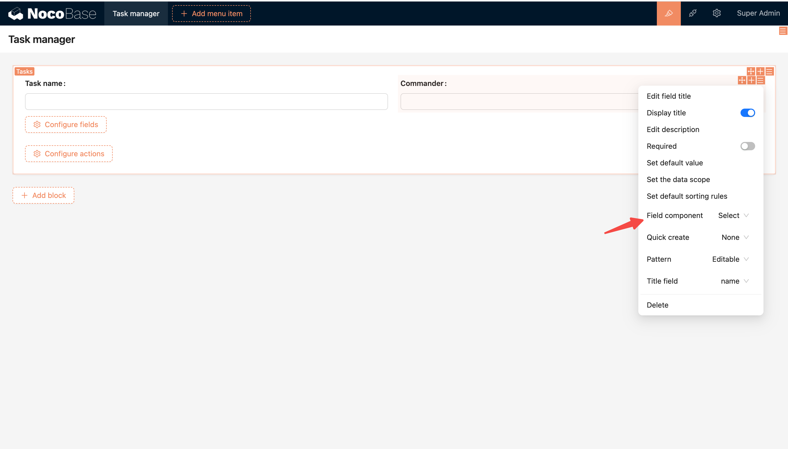
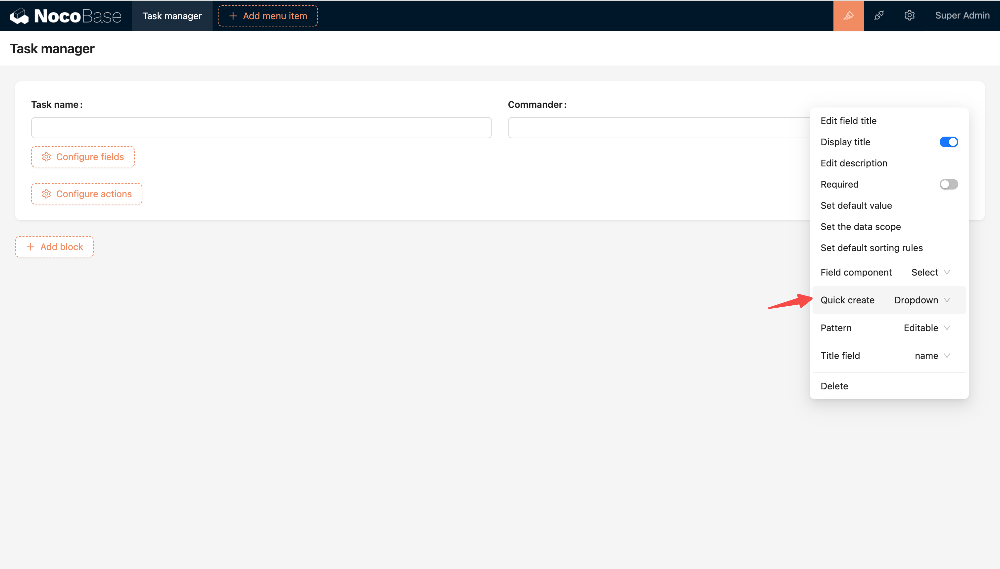
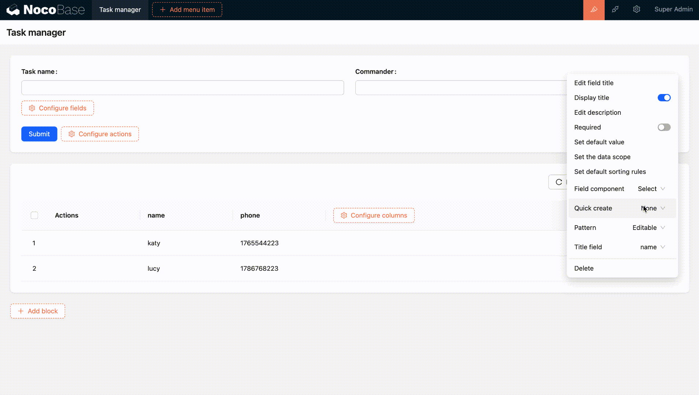
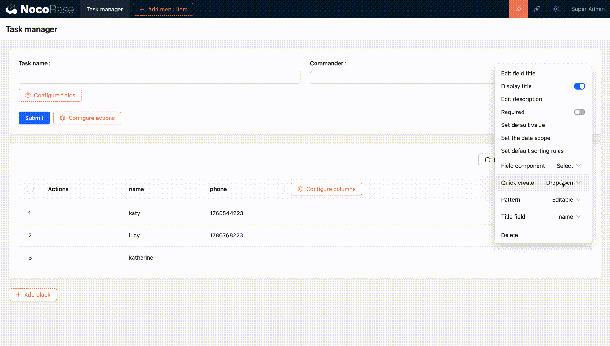

# 下拉选择器

下拉选择器是关系字段组件的常用组件，除了目标表为文件表的所有关系字段，编辑状态下的默认组件均为下拉选择器，支持从目标表选择已有数据关联或添加新数据后关联。

如图在任务管理应用中,任务表有关系字段「负责人」（多对一）

- 选择关联数据，从目标表的已有数据中选择关联

- 新增数据后关联

直接为目标表新建数据后进行关联，目前有两种新建方式（下拉菜单/弹窗添加）

下拉菜单添加，创建成功后自动选中创建的数据，需要配置标题字段

示例如下

弹窗添加：创建成功后会自动选中创建的数据

在很多场景中，希望通过关系选择器带出关联数据，而下拉选择器只能带出目标表中的简单字段，关系的关系数据则要通过配置数据选择器来带出
