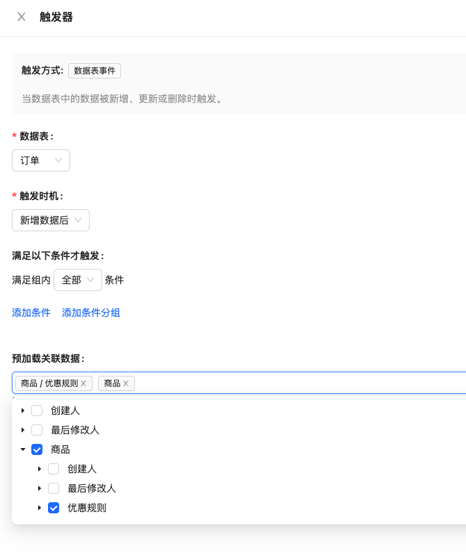
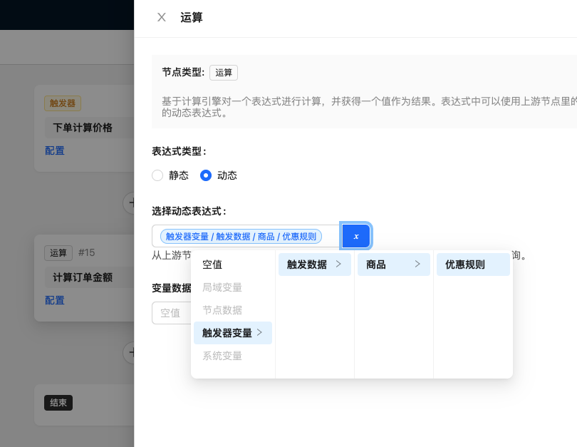
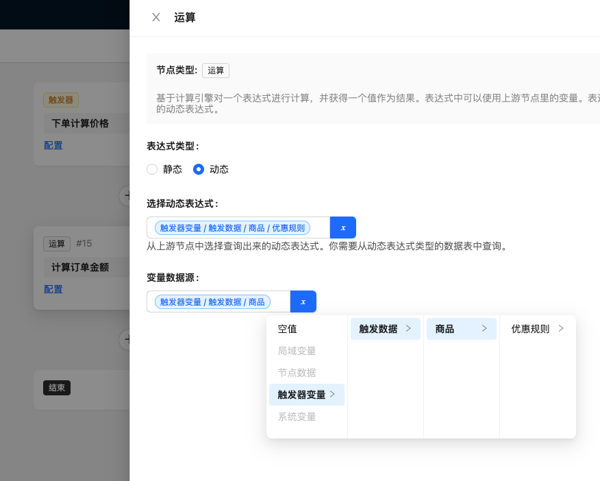

# 表达式表使用

## 基本概念

区别于数据表中针对全表统一的公式字段，动态表达式的可以针对每行数据进行不同公式的计算。动态表达式计算目前**只在工作流中支持**。

表达式模板表用于存储针对同一类数据不同的公式，与需要参与计算的数据表通常为一对多关系（普通数据表 belongsTo 表达式表）：

m:1 只是通常的用法，但实际上普通数据表与表达式表的关系是可以任意建立的，一行数据对多个表达式通常还需要其他区分字段，或者是在循环中对一行数据做多种计算的场景。

表达式表三个字段的含义：

- **数据表**：相当于函数的参数，在表达式中可用的变量字段来源，即只能基于一个数据表的字段进行计算配置；
- **计算引擎**：目前可选 mathjs 和 formulajs，推荐使用 formulajs。
- **表达式**：相当于函数的内容，计算时将根据配置执行得到一个结果。

## 示例

以商品下单过程中根据不同商品进行不同优惠规则的最终价格计算举例。

1. 建立商品表：

| 字段名   | 类型                    |
| -------- | ----------------------- |
| 商品名   | 文本                    |
| 商品原价 | 数字                    |
| 优惠规则 | belongsTo（优惠规则表） |

1. 建立优惠规则表（使用表达式表模板创建）：

| 字段名   | 类型                     |
| -------- | ------------------------ |
| 规则名称 | 文本                     |
| 数据表   | 单选（数据表）           |
| 计算引擎 | 单选（mathjs/formulajs） |
| 表达式   | 文本                     |

1. 创建优惠规则：

| ID  | 名称     | 数据表 | 计算引擎 | 表达式               |
| --- | -------- | ------ | -------- | -------------------- |
| 1   | 八折商品 | 商品   | formula  | {{商品.价格}} \* 0.8 |
| 2   | 九折商品 | 商品   | formula  | {{商品.价格}} \* 0.9 |

1. 创建商品，并关联优惠规则：

| ID  | 商品名称      | 价格 | 优惠规则 ID |
| --- | ------------- | ---- | ----------- |
| 1   | iPhone 14 Pro | 7999 | 2           |
| 2   | iPhone 13 Pro | 5999 | 1           |

1. 创建工作流，订单创建时触发：

1. 创建一个运算节点，配置动态表达式为触发数据/商品/优惠规则：

配置变量数据源为触发数据中的商品：

1. 增加一个更新数据节点，配置更新订单总价为计算节点的结果：
   
2. 创建订单触发工作流，再查看订单列表，核对价格：

| 订单商品      | 订单商品 / 原价 | 优惠规则 | 总价                 |
| ------------- | --------------- | -------- | -------------------- |
| iPhone 14 Pro | 7999            | 九折     | 7999 \* 0.9 = 7199.1 |
| iPhone 13 Pro | 6999            | 八折     | 6999 \* 0.8 = 5599.2 |
