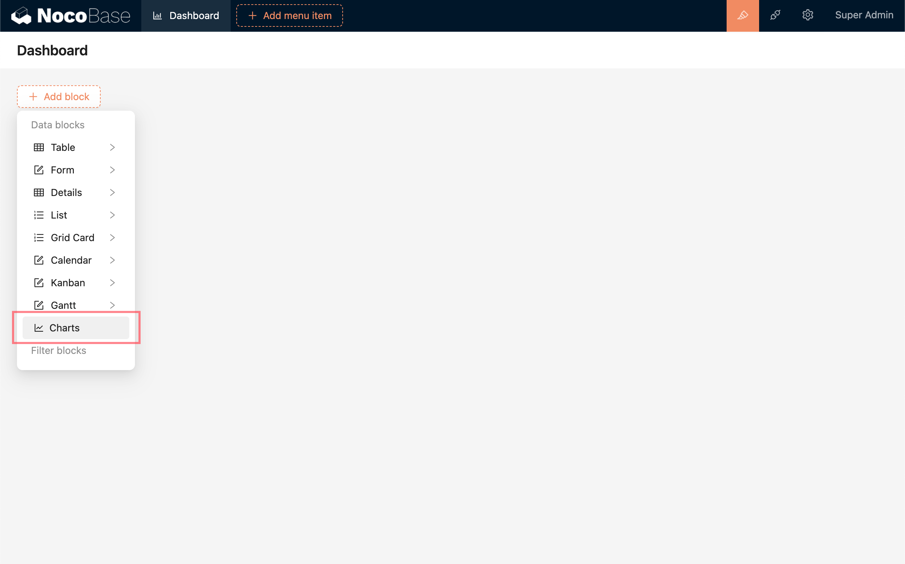
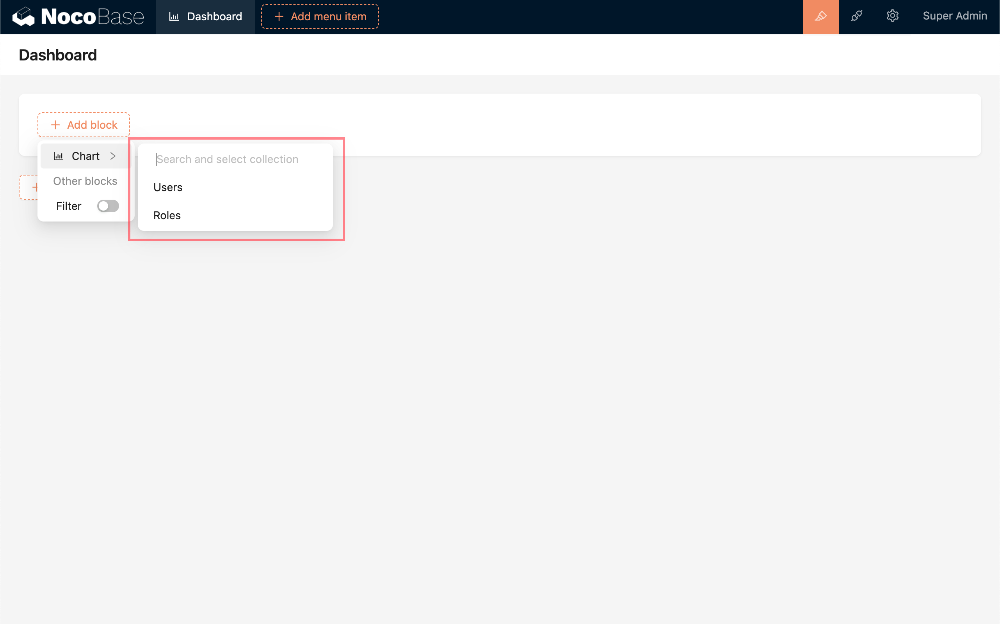
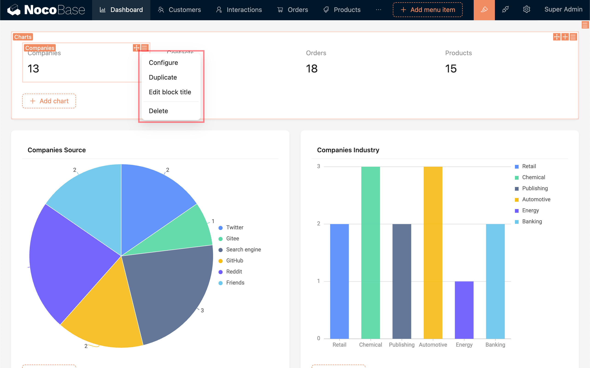

# 图表区块

<PluginInfo name="data-visualization"></PluginInfo>

图表区块是一个用于组织多个图表的面板。

## 添加

点击“添加区块” (Add block) - “图表” (Charts)，可以创建可以空白的图表区块。

在图表区块中点击“添加区块” (Add block) - “图表” (Chart)，选择对应的数据表 (Collection), 可以创建和配置图表。有查看权限的数据表才可以用于配置图表，否则将会在选项中被隐藏。

## 配置

- 图表区块中的图表可以像普通区块一样，在图表区块中，自由拖拽和组织。
- 点击“配置” (Configure) 按钮，可以对当前图表进行修改。
- 点击“复制” (Duplicate) 按钮，可以快速复制当前图表。
- 可以“编辑区块标题” (Edit block title)，给当前图表添加标题说明。

