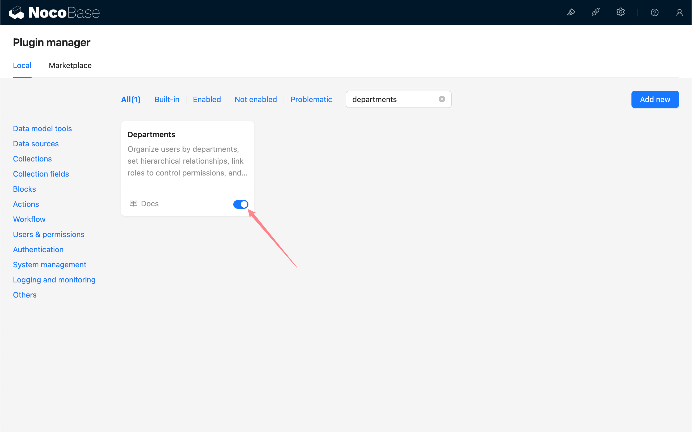

# Departments

:::info{title=Tip}
This feature is provided by the commercial plugin plugin-departments, please see [NocoBase Commercial Plugins](https://www.nocobase.com/commercial.html) for details.
:::

## Introduction

The departments plugin supports organizing users in the form of departments in NocoBase, setting up superior-subordinate relationships. You can control a group of users' permissions by binding roles to departments. It supports using department information as variables for workflows and expressions and other places that support setting variables.

## Installation

This plugin is a commercial plugin, which needs to be uploaded and activated through the plugin manager.

