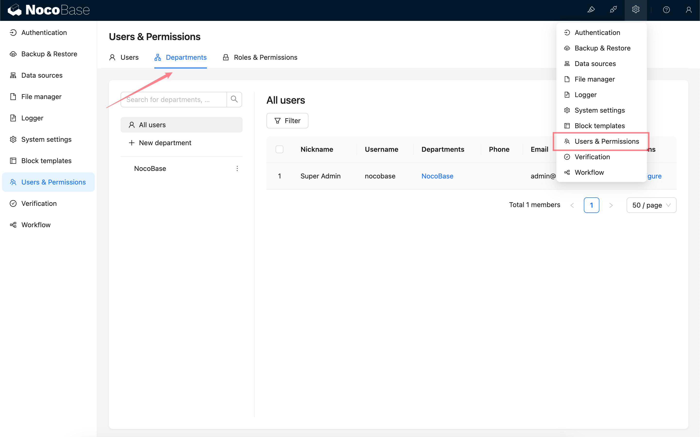
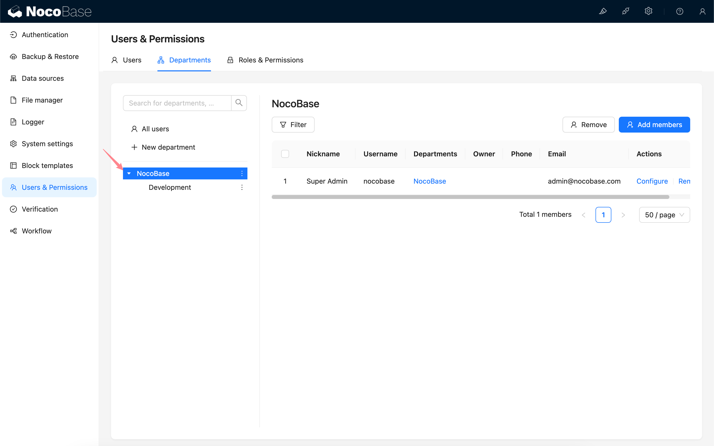
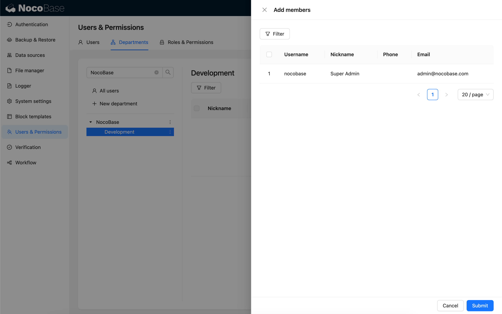
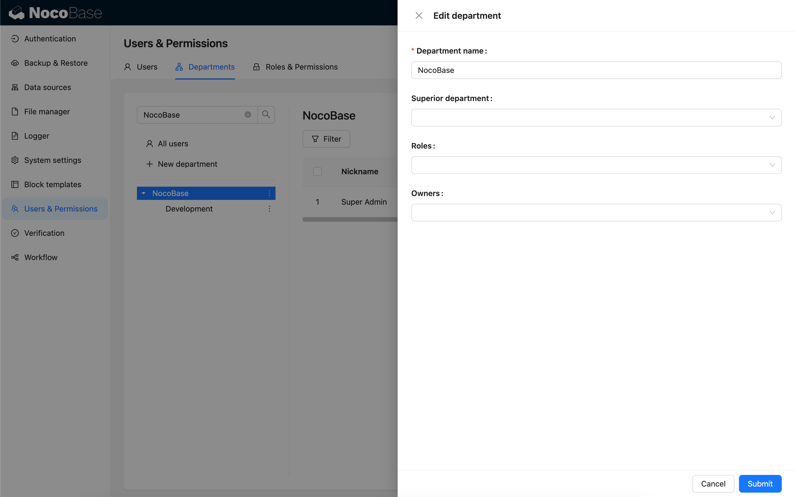

# 部门

## 介绍

部门插件支持在 NocoBase 中以部门的形式来组织用户，设定上下级关系。可以通过给部门绑定角色来控制一组用户的权限。支持将部门信息作为变量用于工作流和表达式等支持设置变量的地方。

## 安装

:::info{title=提示}
该插件为商业插件，请查看 [NocoBase 商业版本](https://www.nocobase.com/commercial-cn)了解详情。
:::

## 使用说明

### 激活插件

### 部门管理

### 新建部门

### 新建子部门

### 查看部门成员列表

### 搜索用户和部门

按照用户昵称、用户名、手机、邮箱搜索用户，按照部门名称搜索部门。

### 给部门添加成员

一个用户可以同时加入多个部门，加入的第一个部门默认为主属部门，一个用户只有一个主属部门。

已经是部门成员的用户不会出现在用户选择列表中。

### 编辑部门

### 修改上级部门

在编辑部门的表单中修改上级部门字段，当前部门和当前部门的下级部门不可选。

### 设置部门负责人

在编辑部门的表单中点击负责人字段选择部门成员成为负责人，支持多选，已经是部门负责人的成员将不会出现在成员选择列表中。

### 给用户配置部门

除了给部门添加成员，还可以从用户视角，给用户配置部门。

已经加入的部门不可选。

### 修改主属部门

