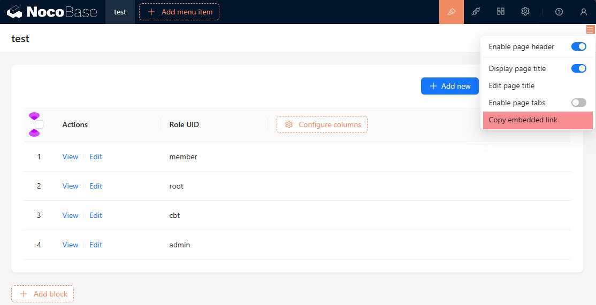
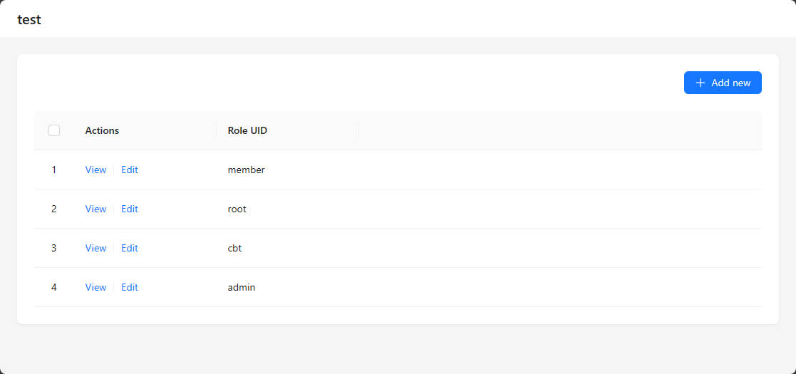

# Embedding

## Introduction

This plugin is used to embed NocoBase blocks into other websites or applications.

## Installation

:::info{title=Note}
This plugin is a commercial plugin. Please refer to [NocoBase Commercial Version](https://www.nocobase.com/commercial-en) for details.
:::

## Instructions for Use

After installing the plugin, in design mode, there will be an option to *Copy Embed Link* in the block's settings menu.

Clicking on it will provide a link that can be opened separately, for example `https://xxx.com/embed/qs087rz4o2b`.

If you want to embed NocoBase blocks in other websites or applications, user authentication is required, and the `token` needs to be appended to the link, for example `https://xxx.com/embed/qs087rz4o2b?token=xxx`. For detailed information about user authentication, please refer to [User Authentication](/handbook/auth).
