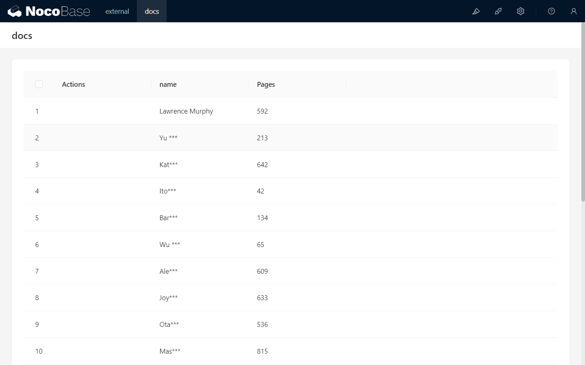

# Mask

<PluginInfo name="field-mask"></PluginInfo>

## Introduction

Sensitive data in the system (such as personal identification information, credit card numbers, phone numbers, email addresses, etc.) needs to be protected to prevent unauthorized access or leakage. When transmitted or displayed, such data should be masked, and the original data should be shown only when necessary.

## Permission Control

Users can be granted the "Allow original text display" permission through the `Users & Permissions -> Roles & Permissions -> Data sources -> Data masking permissions` page. Users with this permission can view the original data of masked fields.

## Features

In data tables, masked fields are displayed in masked form by default. If the current user has the permission to display original text, clicking on the masked field will reveal the original data.

In edit forms, masked fields are also displayed as masked string. If the user has permission to display original text, the original text will be shown when getting input focus, allowing the user to edit it. Once the field loses focus, the data will be shown as masked again.

When exporting data, users with permission to display original text will see the original data in the export. Otherwise, the exported data will remain masked.

## Field Configuration

### Data Types
Currently, only string and number data types are supported.

### Masking Rules

#### Predefined Masking Rules:
- `******`: The data is masked as six asterisks.
- `***abc`: The data is masked as three asterisks followed by the last three characters of the original data.
- `**ab**`: The data is masked with two asterisks at the beginning and end, showing the middle two characters of the original data.
- `abc***`: The data is masked as the first three characters of the original data followed by three asterisks.

#### Custom Masking Rules
If predefined rules do not meet your needs, you can choose Custom to define your own masking rule.
Custom rules follow these conventions:
- `*` represents a placeholder, which outputs a specific number of * characters when masked.
- Other characters means any other original data.

Examples:
- `a*a*a*` will mask `123456` as  `1*3*5*`
- `a****a` will mask `123456789` as `1**9`
- `33***333` will mask `asdfghjkl` as `as***kl`

## Example

To be added
