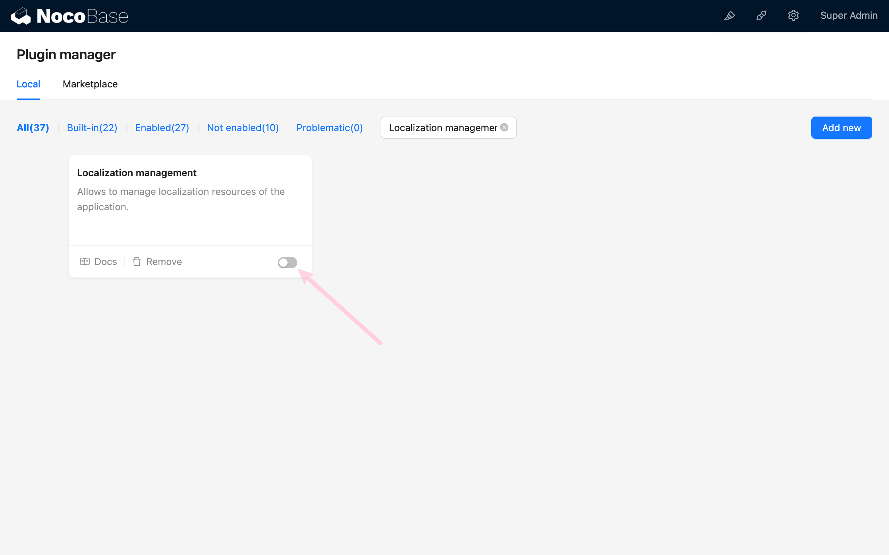
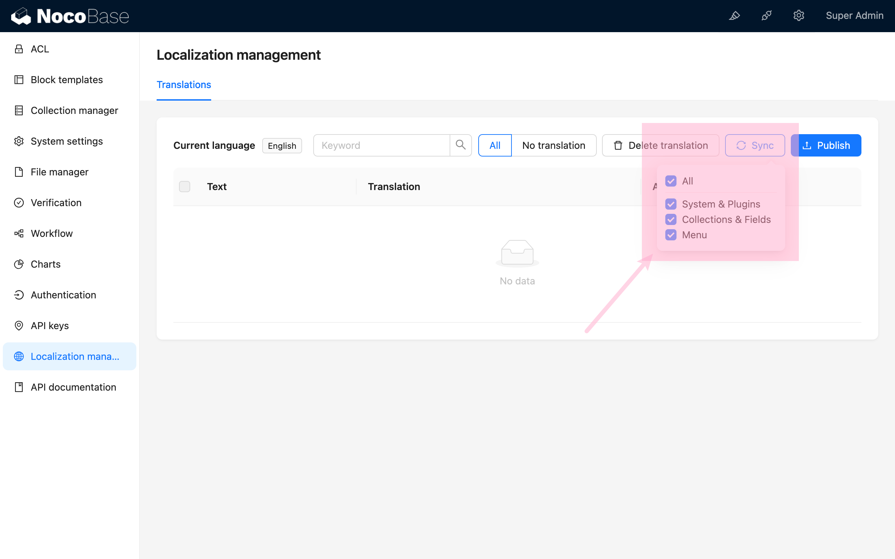
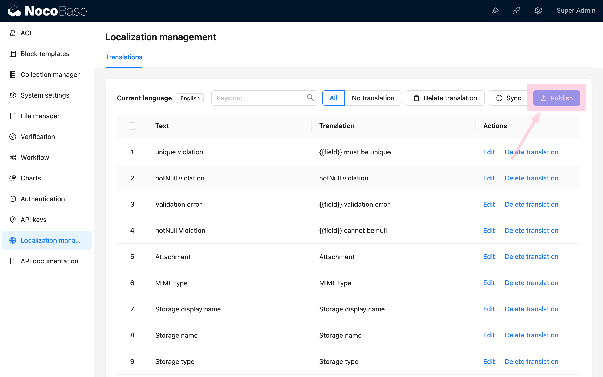
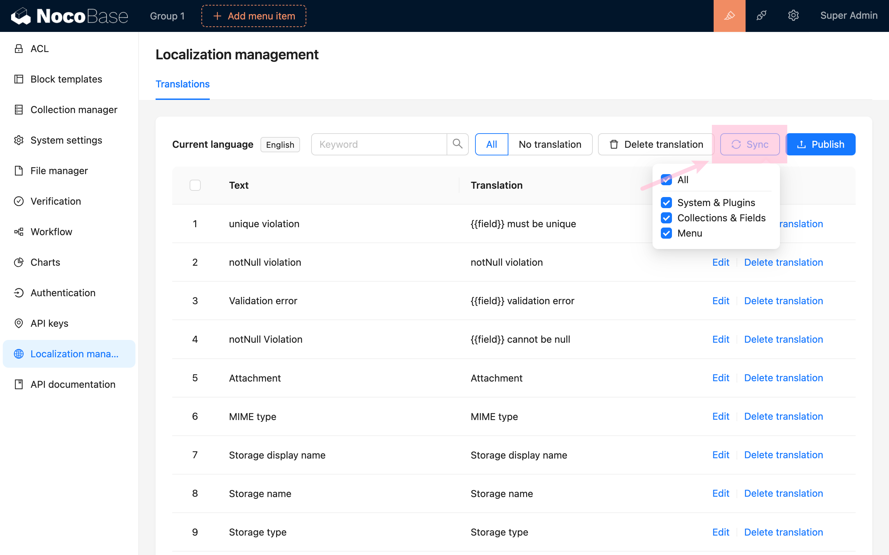

# Localization Management

<PluginInfo name="localization-management"></PluginInfo>

## Introduction

The Localization Management plugin is designed to assist in managing and implementing the localization process for NocoBase. It translates NocoBase's menus, data tables, fields, and all plugins to adapt to the language and culture of a specific region.

## Installation

This is a built-in plugin, so no additional installation is required.

## User Manual

### Activating the Plugin

### Localization Management

### Synchronizing Translation Entries

After synchronization, it will list all the translatable entries for the current language.

### Publishing

After completing the translation, you need to click the "Publish" button to make the changes take effect.

### Translating Other Languages

Enable other languages in "System Settings," such as Simplified Chinese.

Switch to that language.

Synchronize the entries.

Translate and publish.

