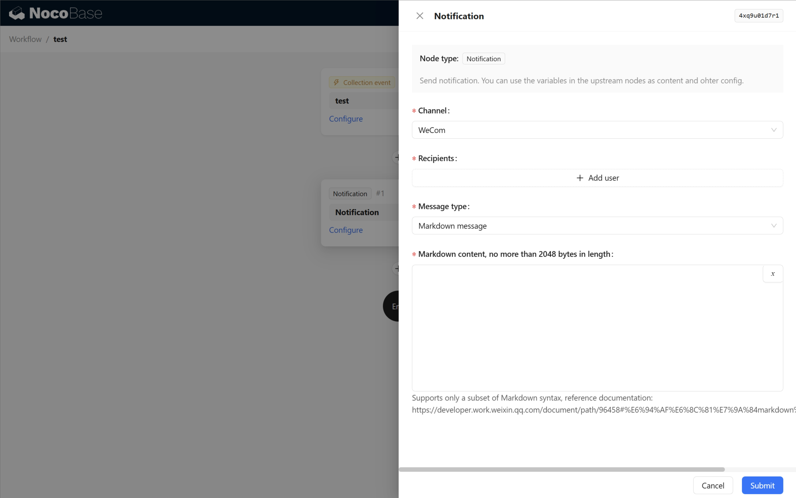
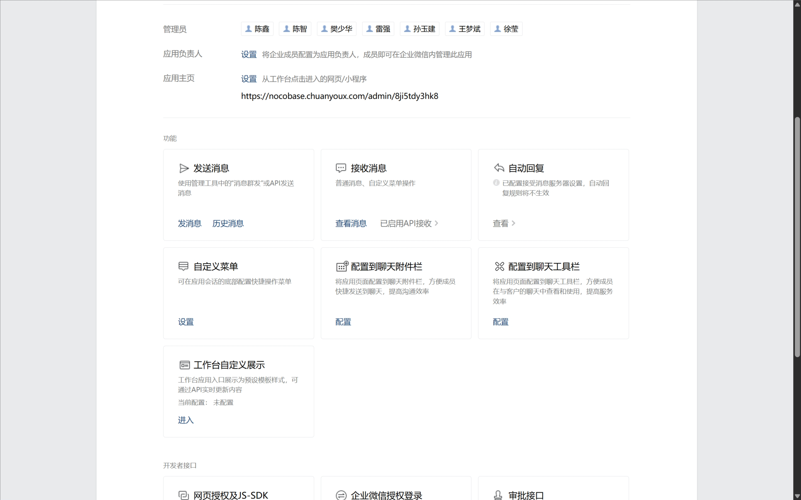

# Notification: WeCom

<PluginInfo commercial="true" name="auth-wecom"></PluginInfo>

## Introduction

Send notifications through the WeCom channel.

## User Manual

### Install and enable the auth-wecom plugin, and configure wecom authentication

[auth: wecom](https://docs.nocobase.com/plugins/auth-wecom)

### WeCom channel configuration

- Authenticator - Authenticator, Configured WeCom authenticator

### Workflow notification configuration

The WeCom channel currently supports three types of messages in workflow notifications: Text card message, Markdown message, and Template card message - Text notice. For details on each message type, please refer to [the documentation](https://developer.work.weixin.qq.com/document/path/90236).

#### Text card message

WeCom documentation：[Text card message](https://developer.work.weixin.qq.com/document/path/90236#%E6%96%87%E6%9C%AC%E5%8D%A1%E7%89%87%E6%B6%88%E6%81%AF)

#### Markdown message

WeCom documentation：[Markdown message](https://developer.work.weixin.qq.com/document/path/90236#markdown%E6%B6%88%E6%81%AF)

#### Template card message - text notice

Before using template card messages, you need to set up a message callback first.

Go to the WeCom application management backend and find the message reception configuration.

After entering the configuration page, generate the Token and EncodingAESKey.

Open the system and set up the synchronization of WeCom user data.

The basic configuration parameters should be consistent with the selected WeCom authentication configuration. Enter the Token and EncodingAESKey generated in the WeCom application backend, enable the settings, and submit to save. After saving, reopen the configuration information, copy the directory callback notification link, and paste it into the URL field of the message reception configuration in the Enterprise WeCom configuration, then save the message reception settings.

After completing the above steps, you can then configure the notifications.

WeCom documentation：[Template card message - text notice](https://developer.work.weixin.qq.com/document/path/90236#%E6%96%87%E6%9C%AC%E9%80%9A%E7%9F%A5%E5%9E%8B)

