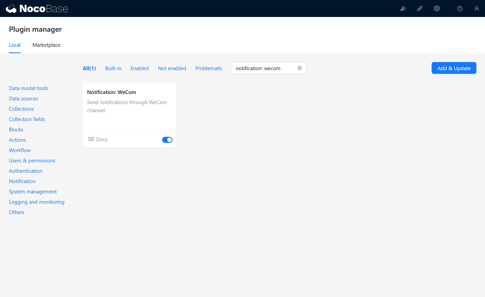
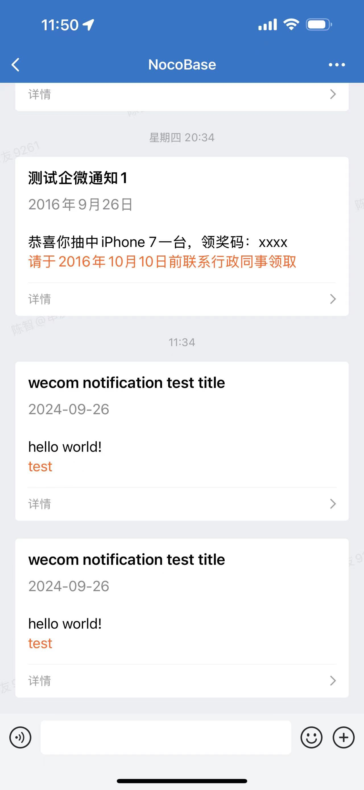

# 通知：企业微信

<PluginInfo name="notification-wecom"></PluginInfo>

## Introduction

Send notifications through the WeCom channel.

## Installation

## User Manual

### Install and enable the auth-wecom plugin, and configure wecom authentication

[auth: wecom](https://docs.nocobase.com/plugins/auth-wecom)

### WeCom channel configuration

### Workflow notification configuration

### Example

#### Notification configuration

#### Notification

