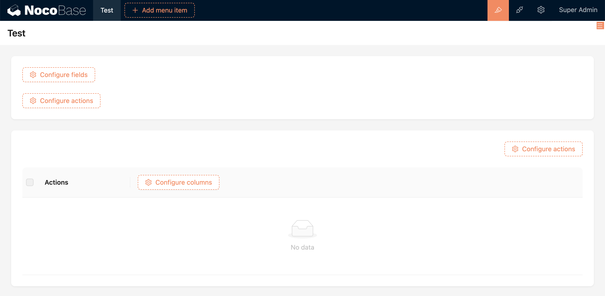
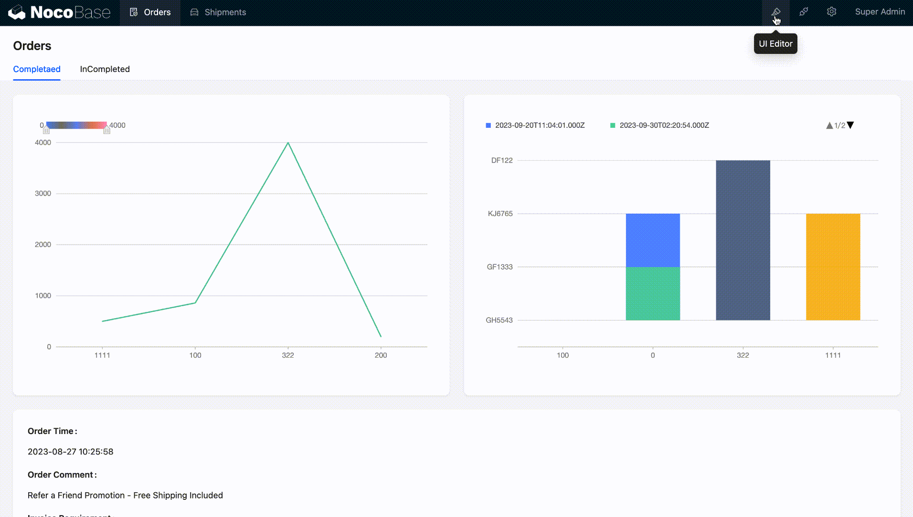

# Block

Blocks are carriers of content. They can be placed in a Page, a Modal dialog, or a Drawer, and multiple blocks can be freely dragged and arranged.

## Adding Blocks

Blocks can be placed in a Page, Modal dialog, or Drawer.

### Blocks in a Page

Currently, the types of blocks in a page include: Data Blocks, Filter Blocks, and Other Blocks.

### Blocks in a Popup (Modal or Drawer)

Popups come in two forms: Modals and Drawers, and, like pages, can also have blocks added to them. The difference is that blocks in popups are generally used for adding, editing, or viewing individual records. The types of blocks include Data Blocks and Other Blocks.

## Block Designer

Every block has three small icons in the upper right corner, from left to right they are:

1. Drag Layout
2. Quick Add Block
3. Block Configuration

Simple blocks have all their configuration items concentrated in "Block Configuration," such as Markdown.

Complex data type blocks will also provide separate embedded "Configure Fields" and "Configure Actions".

Besides, there is also the potential for more nested possibilities, such as Chart Blocks.

## Block Layout

Multiple blocks can adjust the layout by dragging.

## Block Templates

A data type block can be saved as a template, so it can be directly copied or referenced when adding blocks later. For example, a data table form, which is used for both adding and editing data. That form can be saved as a template and referenced in the interfaces for adding and editing data.

### Add and Use Templates

Save the data block as a block template (only data type blocks have this configuration item).

When adding a block, choose to duplicate or reference a template.

### The Difference Between duplicating and Referencing

Duplicating creates a new block based on the block template; adjustments to the block do not affect the template; referencing directly uses the block template, adjustments to the block will change the template, and all blocks that reference the current template will be affected.

## Block Types

