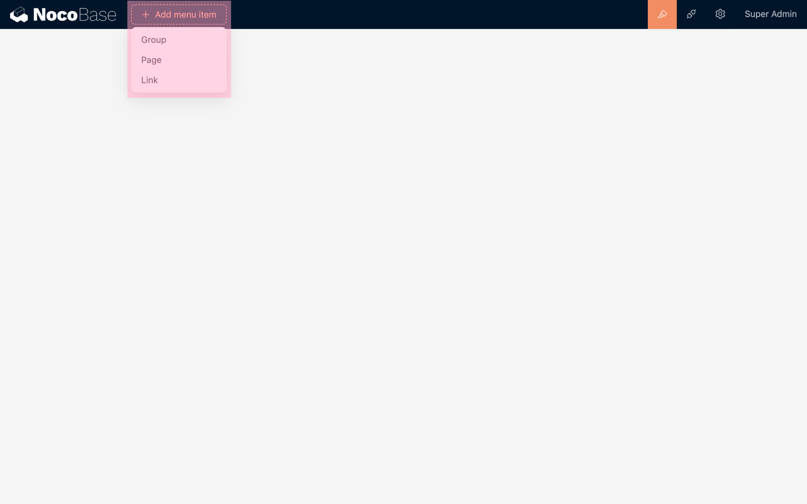
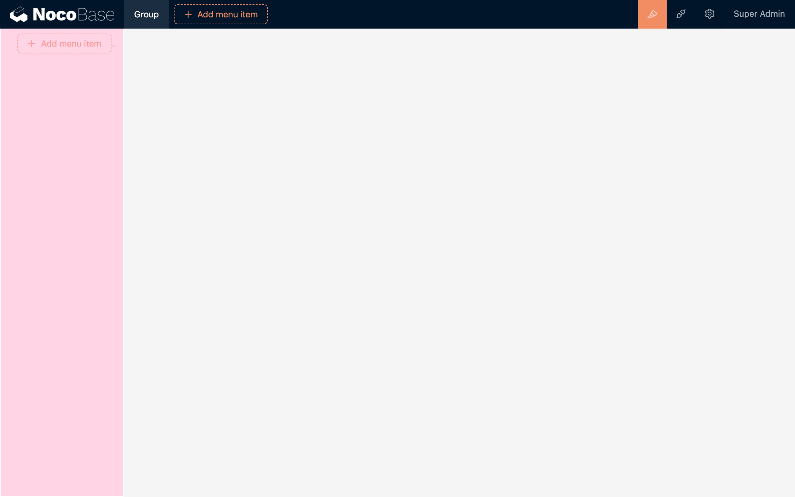
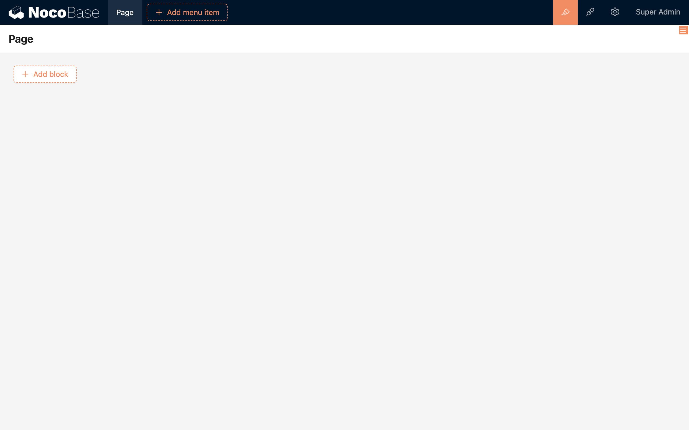
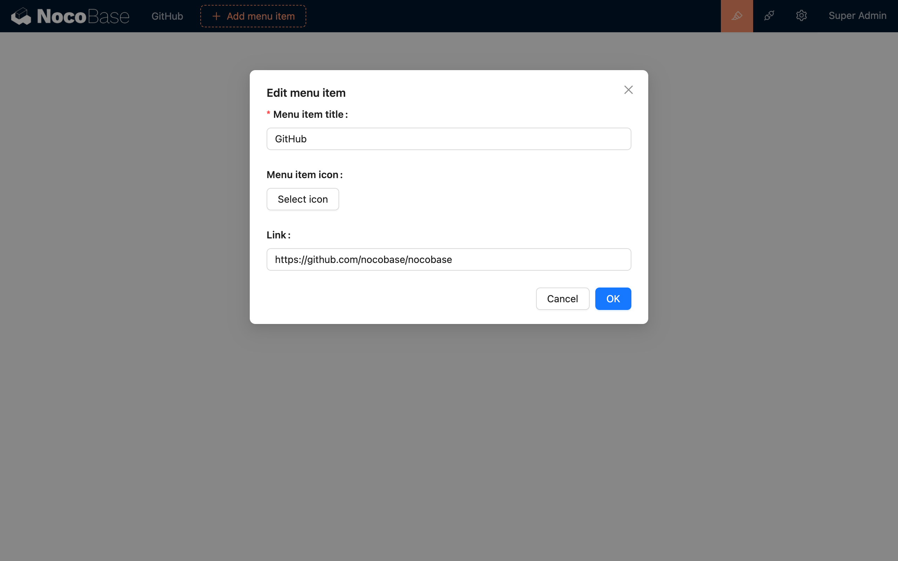
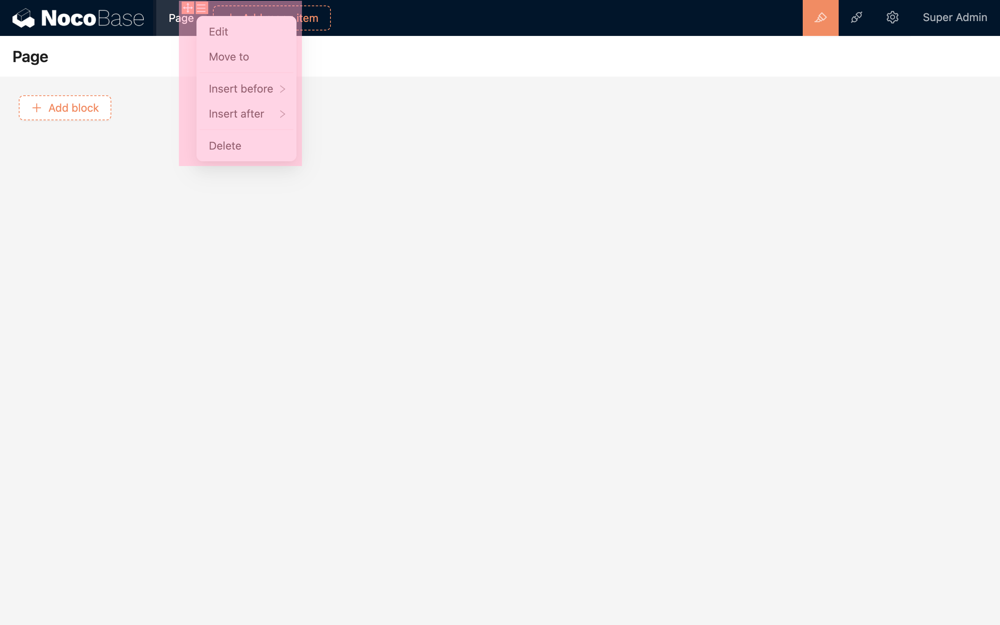
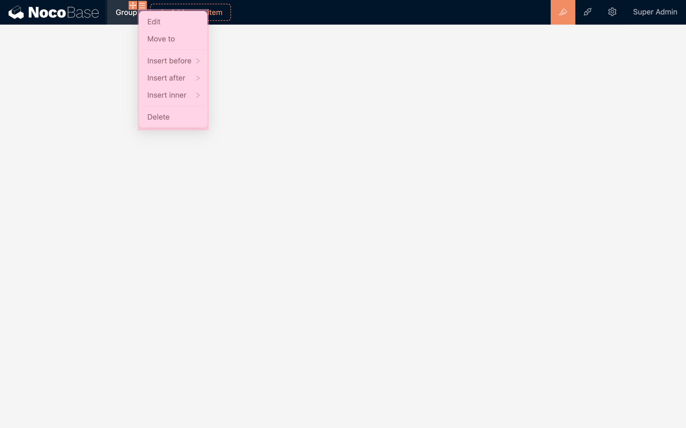

# Menu

Menus are used to organize pages and external links. In the default page layout template of NocoBase, the menu is located at the top and on the left side. Among them, the top is the primary menu, and the left side is for secondary and infinitely nested sub-menus.

## Types of Menu Items

NocoBase has three built-in types of menu items:

- Group
- Page
- Link

### Group

"Group" is used to group menu items, which can be located at the top or on the left side. Within a group, you can continue to create sub-groups, meaning the menu can have an infinite hierarchy.

### Page

A page can serve as a container for blocks, housing a variety of blocks. (See [Pages](./pages/index.md))

### Link

Links can redirect to third-party URLs.

## Configuring the Menu

After entering the interface configuration mode, there are two icons in the upper right corner of the menu item:

- Drag to move
- Menu item configuration

### Menu Item Configuration

- Edit: Includes the menu item's title, icon, etc.
- Move to: In addition to dragging to move, you can also quickly move a menu item via "Move to", allowing you to move a menu item to the front, back, or inside of another menu item.
- Insert before
- Insert after
- Insert inner (Only for group types)
- Delete