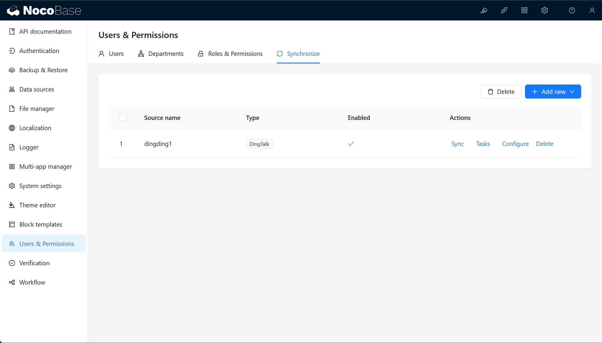

# User Guide

## User Data Source Management

The user data synchronization plugin provides a management interface in the configuration center.

## Activate User Data Source

Only activated data sources will display the sync and task buttons.

## Synchronize User Data

After clicking the sync button, synchronization will start immediately.

After clicking the task button, you can view the list of synchronization tasks.

In the task list, you can retry failed tasks by clicking on them to restart synchronization.

## User Data Source Type

Currently supported data source types include:

- DingTalk, expanded by [dingtalk-auth plugin](../auth-dingtalk/index.md)
- WeCom, expanded by [wecom-auth plugin](../auth-wecom/index.md)

In addition, you can also expand user data source by yourself, refer to the [Developer's Guide](./dev/guide.md).