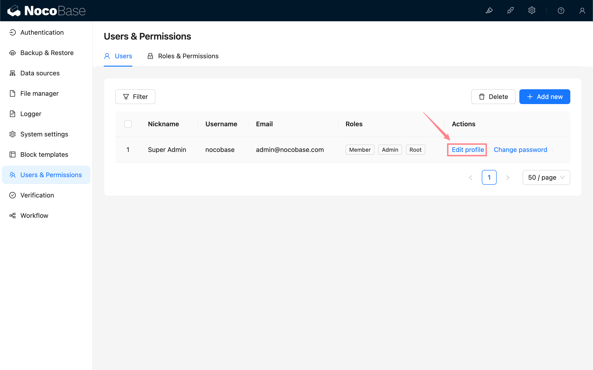
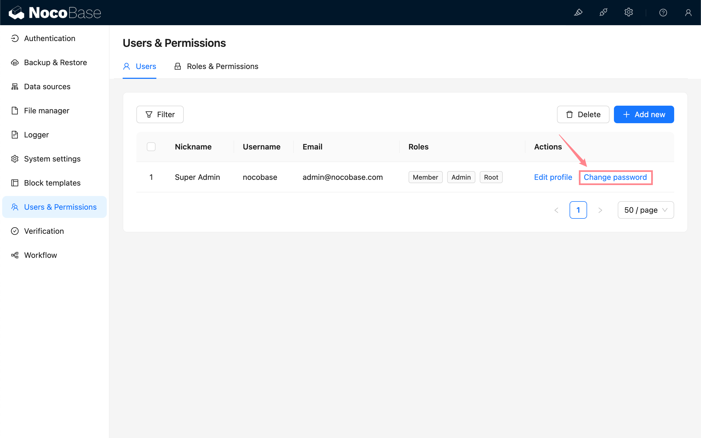

# Users

<PluginInfo name="users"></PluginInfo>

## Introduction

The users plugin provides a basic user model and a user management interface.

## Installation

Built-in plugin, no separate installation required.

## Usage Instructions

### User Management

This plugin provides a user management interface in the configuration center. After application initialization, an undeletable super admin account will be added. The super admin has Root permissions and can access all resources.

In addition, you can also add various different blocks of the users collection to manage users, such as table blocks:

### Add User

### Modify User Profile

### Change User Password

