# 自定义变量节点

可在流程中声明变量，或为已声明的变量赋值，通常用于在流程中保存一些临时数据。

## 安装

:::info{title=提示}
该插件为商业插件，请查看 [NocoBase 商业版本](https://www.nocobase.com/commercial-cn)了解详情。
:::

## 使用手册

### 创建节点

在工作流配置界面中，点击流程中的加号（“+”）按钮，添加“变量”节点：

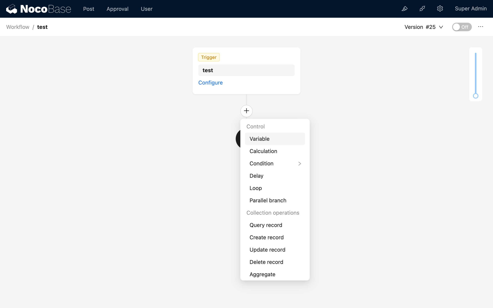

### 配置节点

#### 模式

变量节点与程序中的变量类似，需要先声明，之后才能使用和被赋值。所以在创建变量节点时，需要选择变量的模式，有两种模式可供选择：

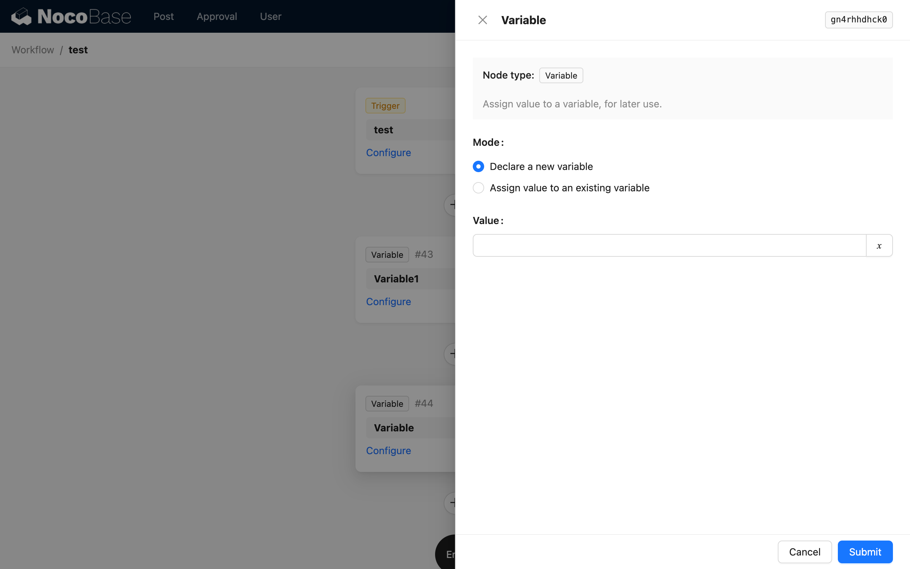

- 声明新变量：创建一个新变量。
- 对已有变量赋值：对之前流程已声明的变量进行赋值，相当于修改变量的值。

当创建的节点是流程中的首个变量节点时，仅可以选择声明模式，因为此时还没有任何变量可供赋值。

选择为已声明的变量赋值时，还需要选择目标变量，即声明变量的节点：

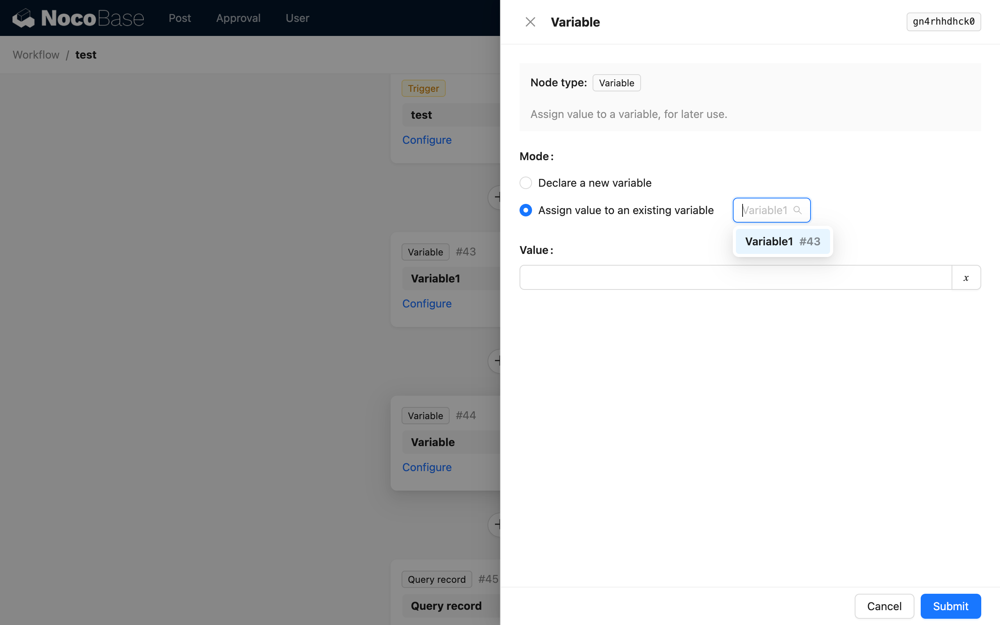

#### 值

变量的值可以是任意类型，可以是常量，如字符串、数字、逻辑值和日期等，也可以是流程中的其他变量。

在声明模式下，设置变量值相当于为变量赋初始值。

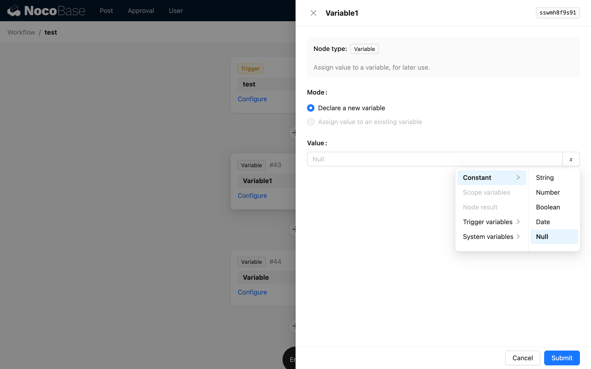

在赋值模式下，设置变量值相当于修改已声明的目标变量的值为一个新值，在后续使用中取值也将取得这个新值。

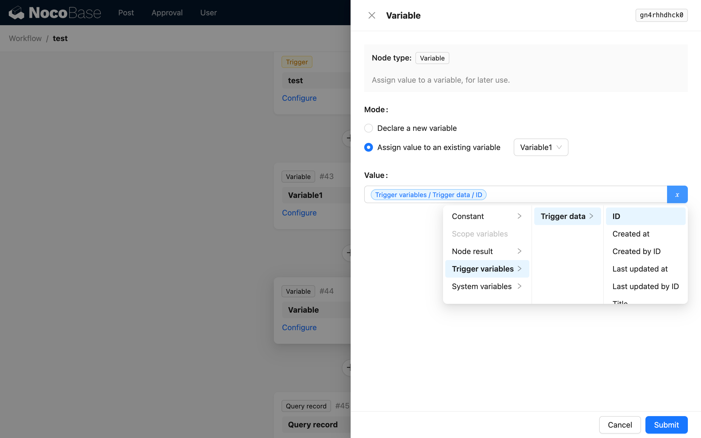

### 使用变量的值

在变量节点的后续节点中，从“节点变量”分组中选择已声明的变量，即可使用该变量的值。例如在查询节点中，使用变量的值作为查询条件：

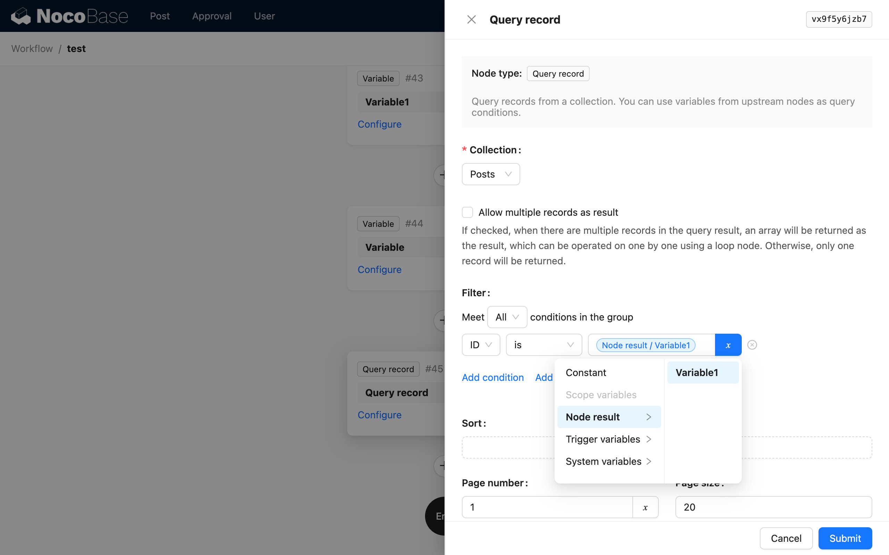

### 示例

变量节点更有用的场景是在一些分支中，将某些新值与之前的值计算或合并（类似编程中的 `reduce`/`concat` 等），在分支结束后再使用。以下用循环分支和变量节点实现一个拼接收件人字符串的示例。

首先创建一个数据表触发的工作流，在“文章”数据更新时触发，并预加载相关的“作者”关系数据（用于获取收件人）：

然后创建一个变量节点，用于储存收件人字符串：

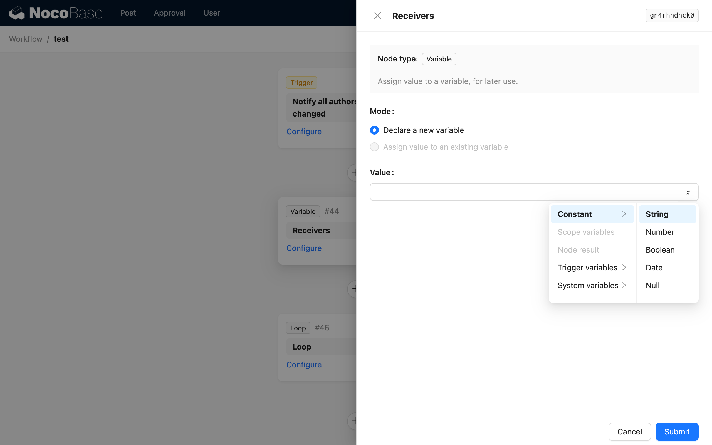

接下来创建一个循环分支节点，用于遍历文章的作者，将其收件人拼接到收件人变量中：

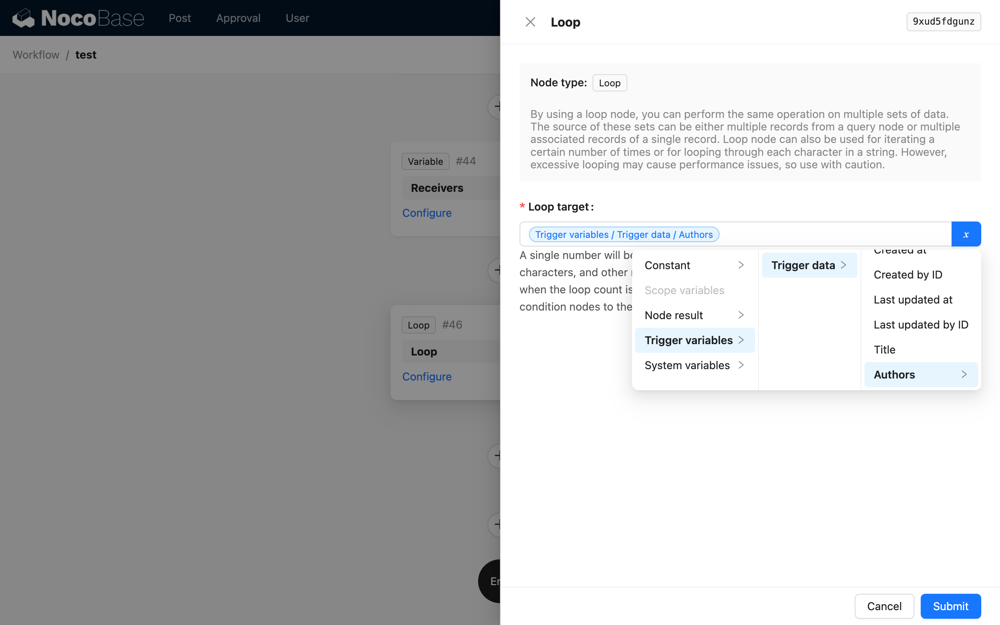

在循环分支中，先创建一个计算节点，用于将当前作者与已储存的作者字符串进行拼接：

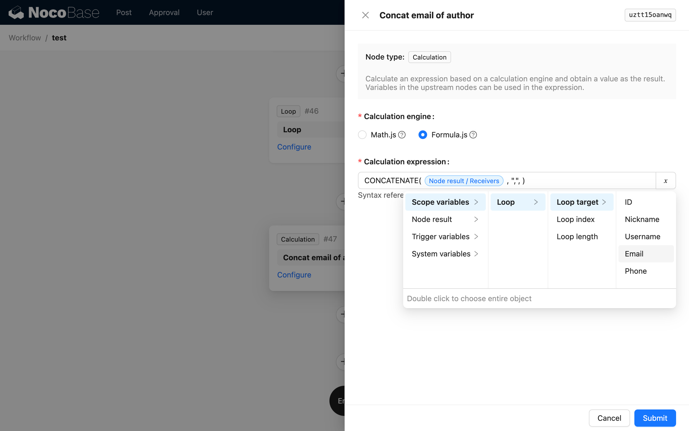

在计算节点后再创建一个变量节点，选择赋值模式，赋值目标选择收件人变量节点，值选择计算节点的结果：

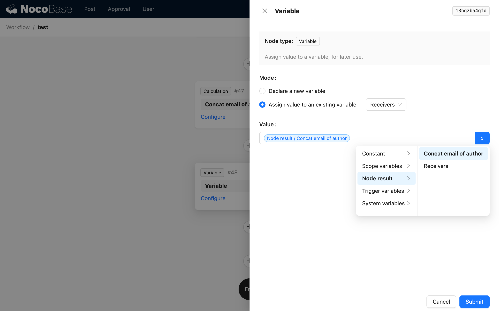

这样在循环分支结束后，收件人变量中就储存了所有文章作者的收件人字符串。然后就可以在循环后使用 HTTP 请求节点调用邮件发送接口，将收件人变量的值作为收件人参数传递给接口：

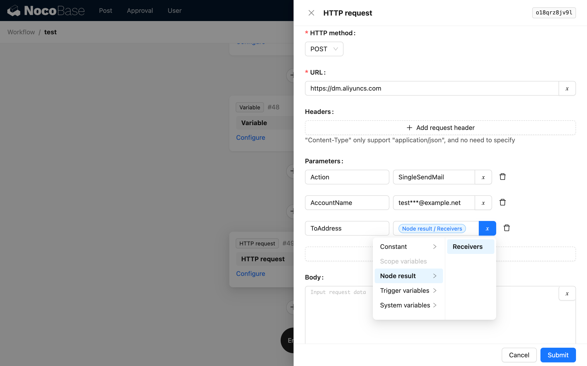

至此，一个简单的邮件群发功能就通过循环和变量节点实现了。
