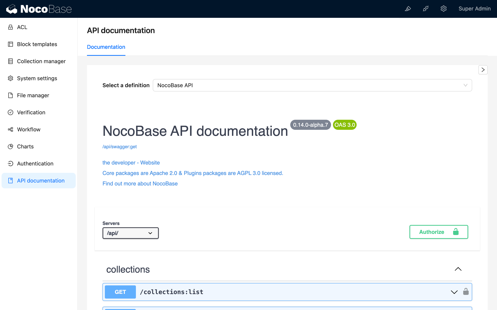

# API 文档

## 介绍

## 安装

## 使用说明

### 访问 API 文档页面

http://localhost:13000/admin/settings/api-doc/documentation



### 文档概览


- 总 API 文档：`/api/swagger:get`
- 内核 API 文档：`/api/swagger:get?ns=core`
- 所有插件 API 文档：`/api/swagger:get?ns=plugins`
- 每个插件的文档：`/api/swagger:get?ns=plugins/{name}`
- 用户自定义 collections 的 API 文档：`/api/swagger:get?ns=collections`
- 指定 `${collection}` 及相关 `${collection}.${association}` 资源：`/api/swagger:get?ns=collections/{name}`

## 开发指南

### 如何为插件编写 swagger 文档

在插件 `src` 文件夹里添加 `swagger/index.ts` 文件，内容如下：

```typescript
export default {
  info: {
    title: 'NocoBase API - Auth plugin',
  },
  tags: [],
  paths: {},
  components: {
    schemas: {},
  },
};
```

详细编写规则请参考 [Swagger 官方文档](https://swagger.io/docs/specification/about/)
