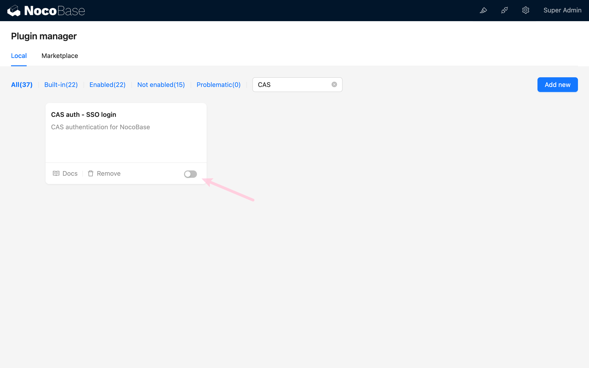
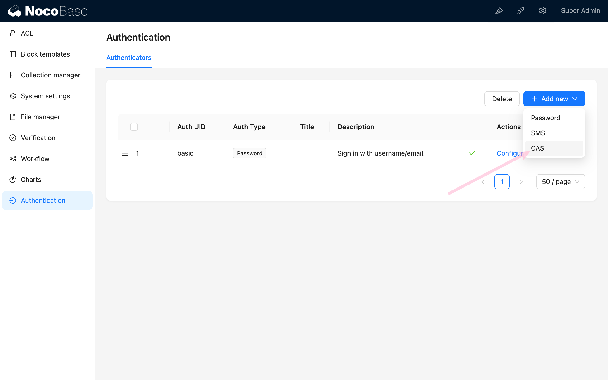
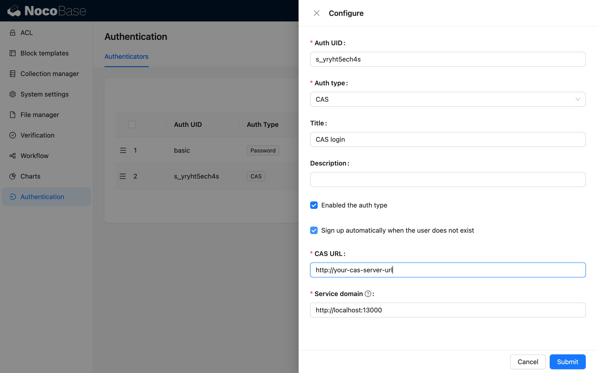
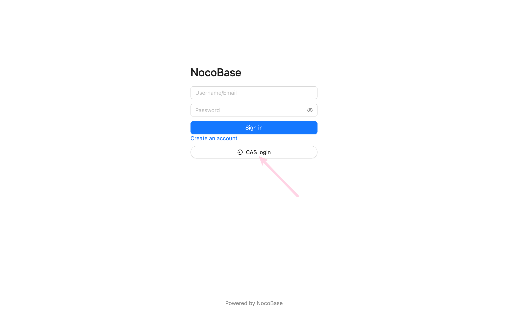

# CAS 认证

## 介绍

CAS (Central Authentication Service) 是一种单点登录协议，它允许用户在一个应用程序中进行身份验证，然后在不需要重新登录的情况下访问其他应用程序。

## 安装

## 使用手册

### 激活插件

### 添加 CAS 认证

访问用户认证管理页面

http://localhost:13000/admin/settings/auth/authenticators

添加 CAS 认证方式

配置 CAS 并激活

### 访问登录页

http://localhost:13000/signin

