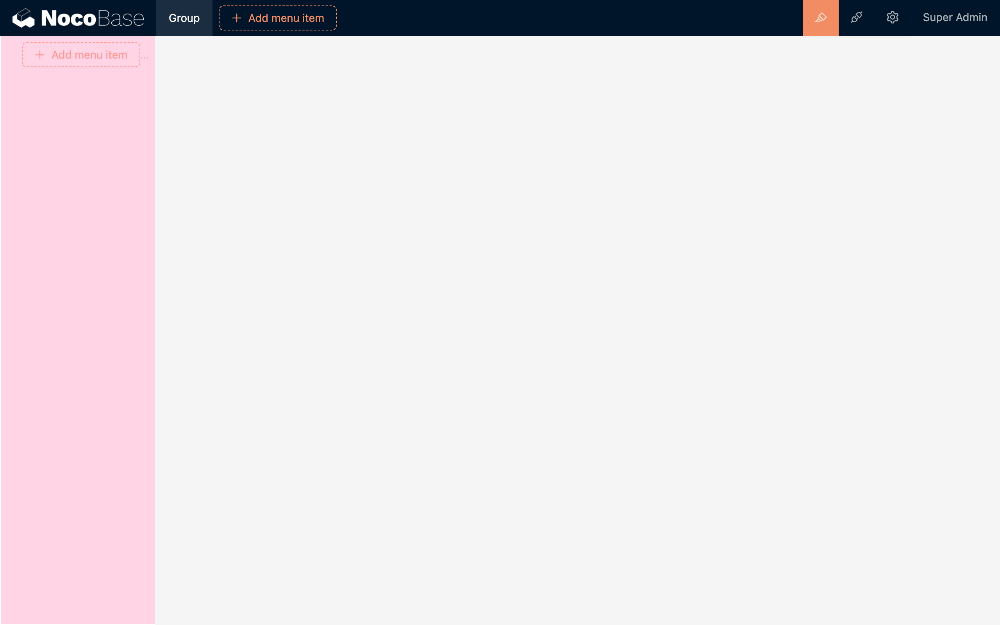
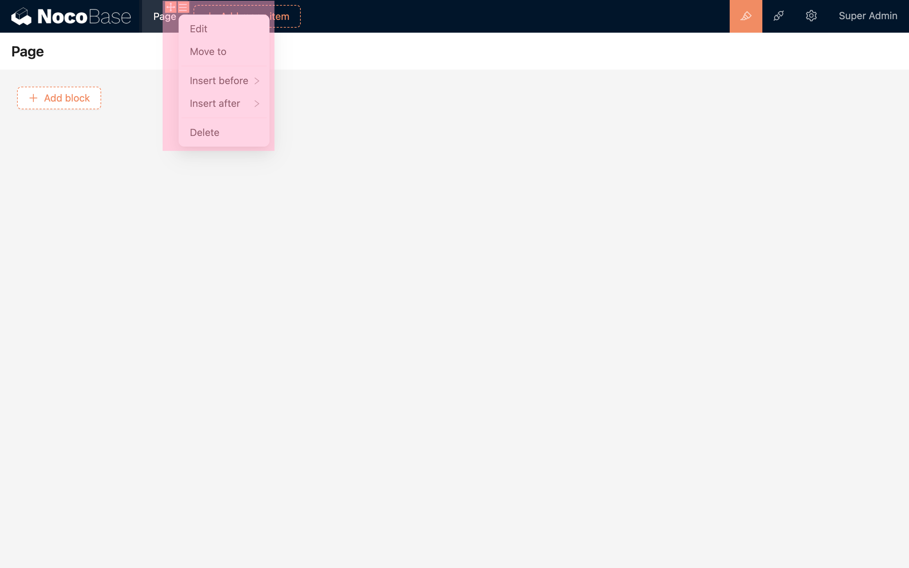

# 菜单

## 菜单项类型

内置三种菜项类型：

- 分组
- 页面
- 链接

### 分组

使用分组时，左侧会多出一个子菜单

### 页面

页面可以用于添加各种区块

### 链接

用于 URL 跳转

## 菜单项设计器

在菜单项的右上角有两个图标，分别是：

- 拖拽移动
- 菜单项配置

### 菜单项配置

- 编辑：包括菜单项的标题、图标等
- 移动到：除了拖拽移动以外，也可以通过「移动到」快速的移动菜单项
- 在前面插入
- 在后面插入
- 在里面插入（仅限于分组类型）
- 删除
