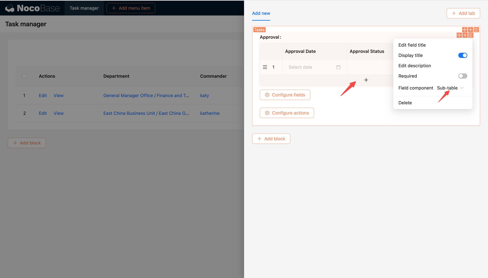
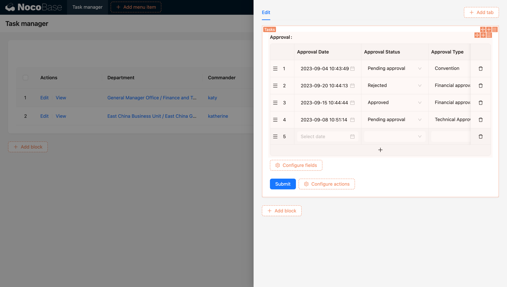
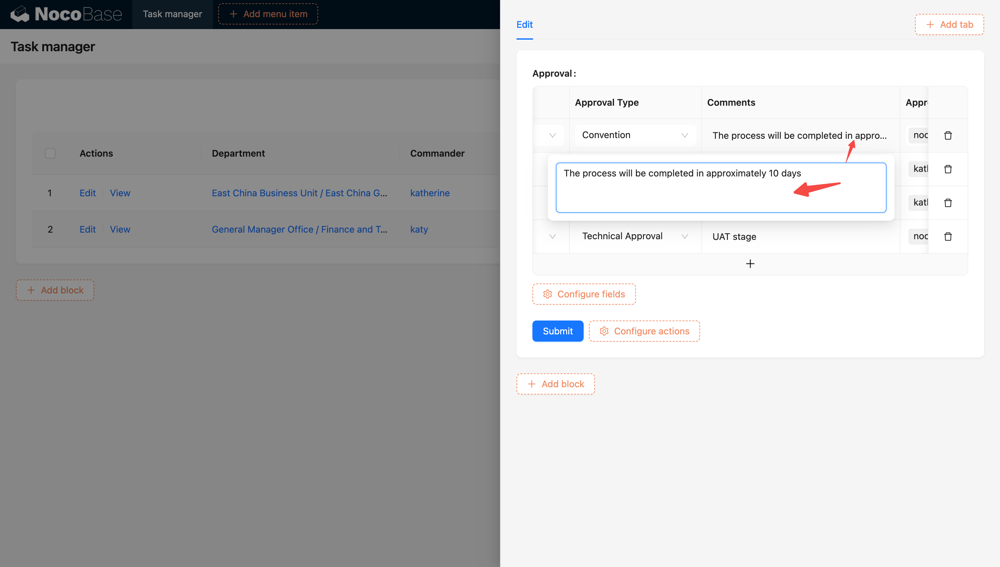
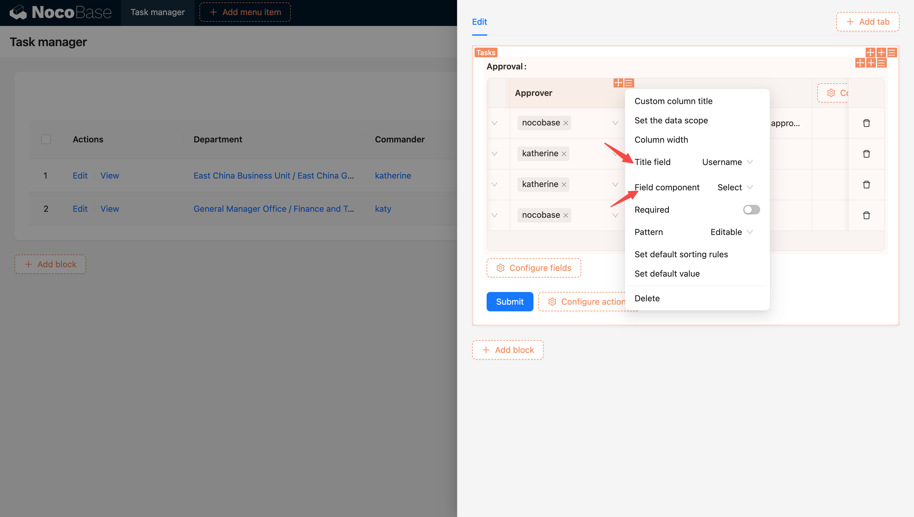
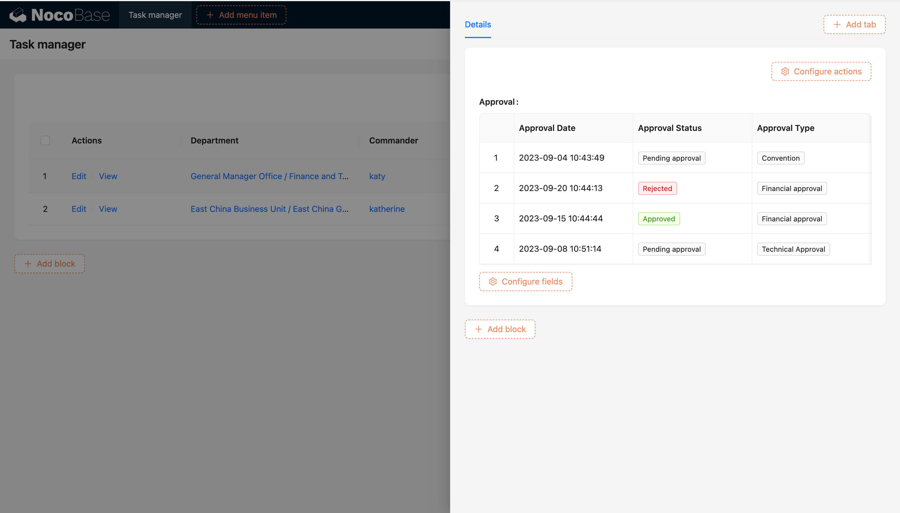

# 子表格

子表格以表格形式展示**一对多或多对多**关系记录。它提供了一种清晰、结构化的方式来展示和管理关联数据，每一行代表一个关联记录，每列代表关联记录的不同字段。

在任务管理应用模型中，任务表中有关系字段「审批纪录」（一对多）。

1. 编辑下的子表格

子表格中字段会根据不同字段类型展示不同组件，而大字段（富文本，Json,多行文本等字段）则通过悬浮弹窗编辑

子表格中关系字段默认组件是下拉选择器（可调整为数据选择器/子表单（弹窗））

1. 详情下的子表格

