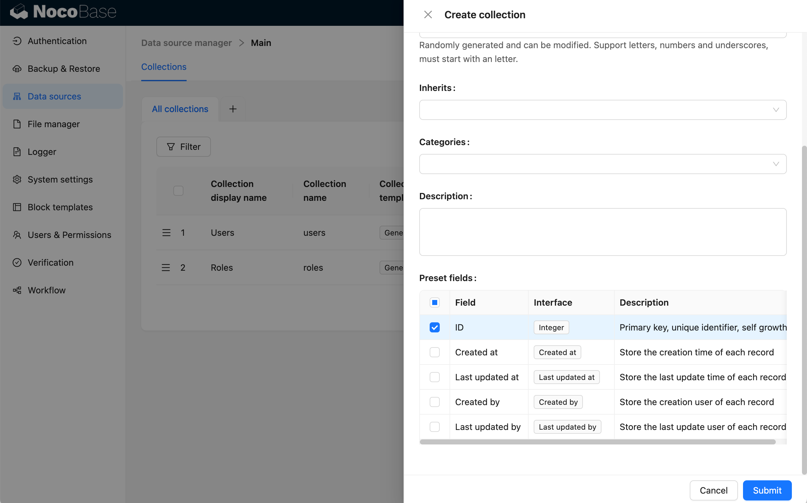
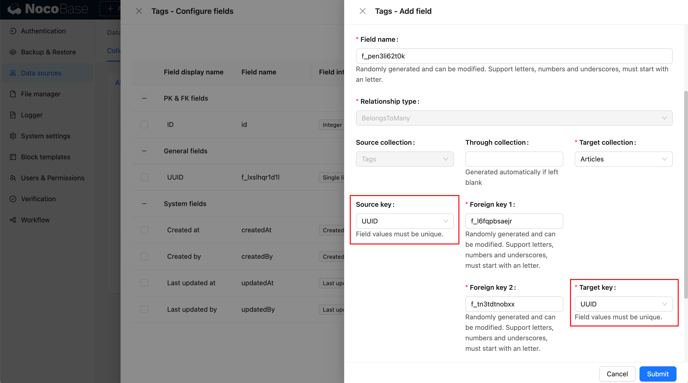
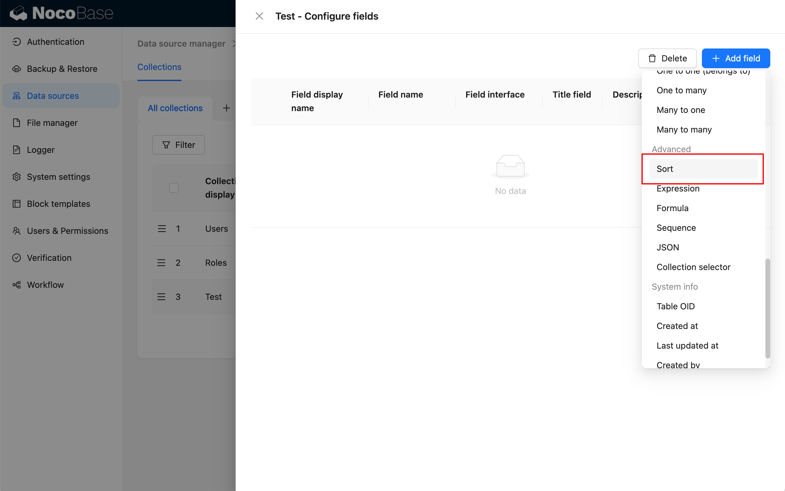
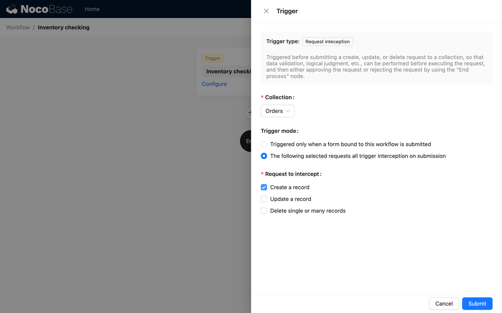

# v0.20: 2024-03-03

## New Features

### Support for Multiple Data Sources

Added the "[Data Source Manager](/handbook/data-source-manager)" plugin, used to manage all data tables and fields for data sources. The Data Source Manager plugin provides a centralized interface for managing data sources and does not provide the capability to access data sources. It needs to be used in conjunction with various data source plugins. Currently supported data sources include:

- [Main Database](/handbook/data-source-main): NocoBase main database, supporting relational databases such as MySQL, PostgreSQL, SQLite, etc.
- [External MySQL Data Source](/handbook/data-source-external-mysql): Access an existing MySQL database as a data source.
- [External MariaDB Data Source](/handbook/data-source-external-mariadb): Access an existing MariaDB database as a data source.
- [External PostgreSQL Data Source](/handbook/data-source-external-postgres): Access an existing PostgreSQL database as a data source.

In addition, more data sources can be extended, which can be common types of databases or platforms that provide APIs (SDKs).


### Adjustment to Data Table Management

Moved the original "Data Table Management" to "Data Source > Main Database > Configuration".


### Support for Non-ID Fields as Primary and Relationship Constraints

When creating a table, you can choose not to create an ID field.



Integer fields can be used as primary keys.


Single-line text fields can also be used as primary keys.


Relationship constraints support selecting other fields with Unique indexes set as non-primary key fields.



### Adjustment to Drag-and-Drop Sorting

Added a "Sort" type field. Sorting fields are no longer automatically generated when creating tables and need to be manually created.



When selecting a field as a group, grouping will be done before sorting.


When sorting in table drag-and-drop, you need to select the sorting field.


When creating a Kanban block, you need to select the sorting field.


### Adjustment to User and Permission Interfaces

Added user management interface and unified user and role management under one menu.


Adjusted the role management interface to facilitate the management of user-associated roles, permissions, departments, etc.


Moved the original "Operation Permissions" to the "Data Source" tab.


### Department Plugin

### Workflow: Approval

The approval plugin provides dedicated workflow types (triggers) "Initiate Approval" and "Approval" nodes for this process. Combined with NocoBase's unique custom data tables and custom blocks, various approval scenarios can be quickly and flexibly created and managed.

Approval configuration


Approval process


Further details can be found in the documentation: [Workflow Approval](/handbook/workflow-approval)

### Workflow: End Process Node

This node immediately ends the current execution of the workflow when executed and ends with the status configured in the node. It is typically used for specific logic flow control, to exit the current workflow after meeting certain logical conditions, without continuing with subsequent processing. It can be likened to the return command in programming languages, used to exit the currently executing function.


Further details can be found in the documentation: [End Process Node](/handbook/workflow/manual/nodes/end)

### Workflow: Custom Variable Node

Variables can be declared in the workflow or assigned values to previously declared variables, typically used to store temporary data in the workflow. It is suitable for scenarios where calculation results need to be stored for later use outside the branch (such as loops, parallelism, etc.).


Further details can be found in the documentation: [Custom Variable Node](/handbook/workflow-variable)

### Workflow: Request Interceptor

The request interceptor plugin provides a mechanism to intercept operations on forms, where the interception event is triggered after the corresponding form operation is submitted and before it is processed. If a "End Process" node is executed in the subsequent process flow after triggering, or if other nodes fail to execute (errors or other incomplete executions), the form operation will be intercepted, otherwise the scheduled operation will be executed normally. It can be used for business validation or logic checks to approve or intercept client-submitted create, update, and delete operations.



Further details can be found in the documentation: [Request Interceptor](/handbook/workflow-request-interceptor)

### Workflow: Response Message Node

The response message node is used to provide feedback to the client with custom messages in specific types of workflows (such as request interception and form events).

Node configuration


Prompt message


Further details can be found in the documentation: [Response Message Node](/handbook/workflow-response-message)

## Incompatible Changes

### Conflictingly Named APIs

In this kernel change, some new version APIs conflict with the old version names. These conflicting old version APIs will be retained in this version but will be uniformly suffixed with `_deprecated`.

| Original API           | Deprecated API                  | New API                                                                                                                |
| ---------------------- | ------------------------------- | ---------------------------------------------------------------------------------------------------------------------- |
| CollectionProvider     | CollectionProvider_deprecated   | [CollectionProvider](https://pr-3418.client.docs-cn.nocobase.com/core/data-source/collection-provider)                 |
| useCollection          | useCollection_deprecated        | [useCollection](https://pr-3418.client.docs-cn.nocobase.com/core/data-source/collection-provider#hooks)                |
| useCollectionField     | useCollectionField_deprecated   | [useCollectionField](https://pr-3418.client.docs-cn.nocobase.com/core/data-source/collection-field#hooks)              |
| useCollectionManager   | useCollectionManager_deprecated | [useCollectionManager](https://pr-3418.client.docs-cn.nocobase.com/core/data-source/collection-manager-provider#hooks) |
| useContext(CollectionManagerContext) | useCollectionManager_deprecated | [useCollectionManager](https://pr-3418.client.docs-cn.nocobase.com/core/data-source/collection-manager-provider#hooks) |

If you are using the above related APIs, you have two ways to change:

- Simple replacement: Replace the original API with the one suffixed with `_deprecated`, for example, replace `useCollection()` with `useRecord_deprecated()`.
- Use the new API according to the new documentation: Although the names of the new APIs are the same as the old APIs, there are differences in parameters and return values. You need to refer to the new documentation

 to adjust the corresponding code.

### Other APIs Requiring Adjustment

- `registerTemplate()` changed to `app.dataSourceManager.addCollectionTemplates()`
- `registerField()` changed to `app.dataSourceManager.addFeildInterfaces()`
- `registerGroup()` changed to `app.dataSourceManager.addFieldInterfaceGroups()`
- `useContext(CollectionManagerContext)` changed to `useCollectionManager_deprecated()`
- Extend collections using `ExtendCollectionsProvider`
- `RecordProvider` requires explicit passing of the parent parameter when needed

## Change Examples

### Collection Template Extension

#### Definition

Previously defined as an object, it now needs to be changed to a class. For example:

Before:

```typescript
import { ICollectionTemplate } from '@nocobase/client';

const calendar: ICollectionTemplate = {
  name: 'calendar',
  title: 'Calendar collection',
  order: 2,
  color: 'orange',
  // ...
}
```

Now:

```typescript
import { CollectionTemplate } from '@nocobase/client';

class CalendarCollectionTemplate extends CollectionTemplate {
  name = 'calendar';
  title = 'Calendar collection';
  order = 2;
  color = 'orange';
}
```

The original object properties become class members.

#### Registration

Previously registered through `registerTemplate`, now needs to be registered through the plugin's `dataSourceManager.addCollectionTemplates`. For example:

Before:

```typescript
import { registerTemplate } from '@nocobase/client';
import { calendar } from './calendar'

registerTemplate('calendar', calendar);
```

Now:

```typescript
import { Plugin } from '@nocobase/client';
import { CalendarCollectionTemplate } from './calendar'

export class CalendarPluginClient extends Plugin {
  async load() {
    this.app.dataSourceManager.addCollectionTemplates([CalendarCollectionTemplate]);
  }
}
```

### Field Interface Extension

#### Definition

Previously defined as an object, it now needs to be changed to a class. For example:

Before:

```typescript
import { IField } from '@nocobase/client';

const attachment: IField = {
  name: 'attachment',
  type: 'object',
  group: 'media',
  title: 'Attachment',
  // ...
}
```

Now:

```typescript
import { CollectionFieldInterface } from '@nocobase/client';

class AttachmentFieldInterface extends CollectionFieldInterface {
  name = 'attachment';
  type = 'object';
  group = 'media';
  title = 'Attachment';
  // ...
}
```

The original object properties become class members.

#### Registration

Previously registered through `registerField`, now needs to be registered through the plugin's `dataSourceManager.addFeildInterfaces` and does not require passing `CollectionManagerProvider` again. For example:

Before:

```diff
import { registerField } from '@nocobase/client';
import { attachment } from './attachment'

- registerField(attachment.group, 'attachment', attachment);

export const FileManagerProvider: FC = (props) => {
  return (
-   <CollectionManagerProvider interfaces={{ attachment }}>
      <SchemaComponentOptions scope={hooks} components={{ UploadActionInitializer }}>
        {props.children}
      </SchemaComponentOptions>
-   </CollectionManagerProvider>
  );
};
```

Now:

```typescript
import { Plugin } from '@nocobase/client';
import { AttachmentFieldInterface } from './attachment'

export class FilPlugin extends Plugin {
  async load() {
    this.app.dataSourceManager.addFeildInterfaces([AttachmentFieldInterface]);
  }
}
```

### Field Interface Group Extension

Previously registered through `registerGroup`, now needs to be registered through the plugin's `dataSourceManager.addFieldInterfaceGroups`. For example:

```diff
- import { registerGroup, Plugin } from '@nocobase/client';
+ import { Plugin } from '@nocobase/client';

- registerGroup('map', {
-        label: 'Map-based geometry',
-        order: 10
- })

export class MapPlugin extends Plugin {
  async load() {
+    this.app.dataSourceManager.addFieldInterfaceGroups({
+      map: {
+        label: generateNTemplate('Map-based geometry'),
+        order: 51,
+      },
+    });
  }
}
```

### `useContext(CollectionManagerContext)` Changed to `useCollectionManager_deprecated()`

```diff
- const ctx = useContext(CollectionManagerContext);
+ const ctx = useCollectionManager_deprecated();
```

### Extend Collections, Use `ExtendCollectionsProvider` Instead of `CollectionManagerProvider`

```diff
const Demo = () => {
-  <CollectionManagerProvider collections={[apiKeysCollection]}>
+  <ExtendCollectionsProvider collections={[apiKeysCollection]}>
...
-  </CollectionManagerProvider>
+  </ExtendCollectionsProvider>
}
```

### Changes to RecordProvider

Previously, when the parent property was not passed, the value of the last RecordProvider was automatically retrieved as the parent. Now, the parent needs to be explicitly passed, and when the parent is not passed, the value of the parent will be undefined.

```diff
- <RecordProvider record={recordData}>
+ <RecordProvider record={recordData} parent={parentRecordData}> 
...
</RecordProvider>
```

If there is no historical baggage, you can also directly use CollectionRecordProvider to replace.

```diff
- <RecordProvider record={recordData}>
+ <CollectionRecordProvider record={recordData} parent={parentRecordData}> 
...
- </RecordProvider>
+ </CollectionRecordProvider>
```

:::warning{title="Difference Between RecordProvider and CollectionRecordProvider"}
- RecordProvider is deprecated and will be removed in the future.
- RecordProvider carries the old RecordContext, while CollectionRecordProvider does not.
:::