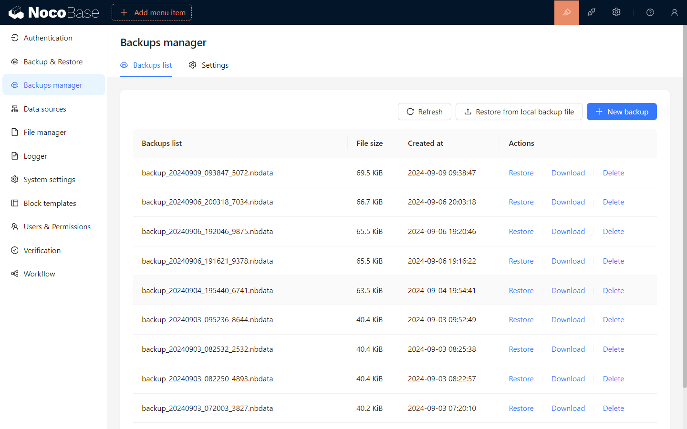
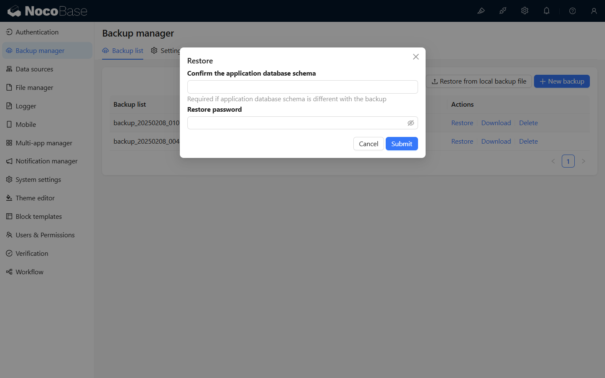
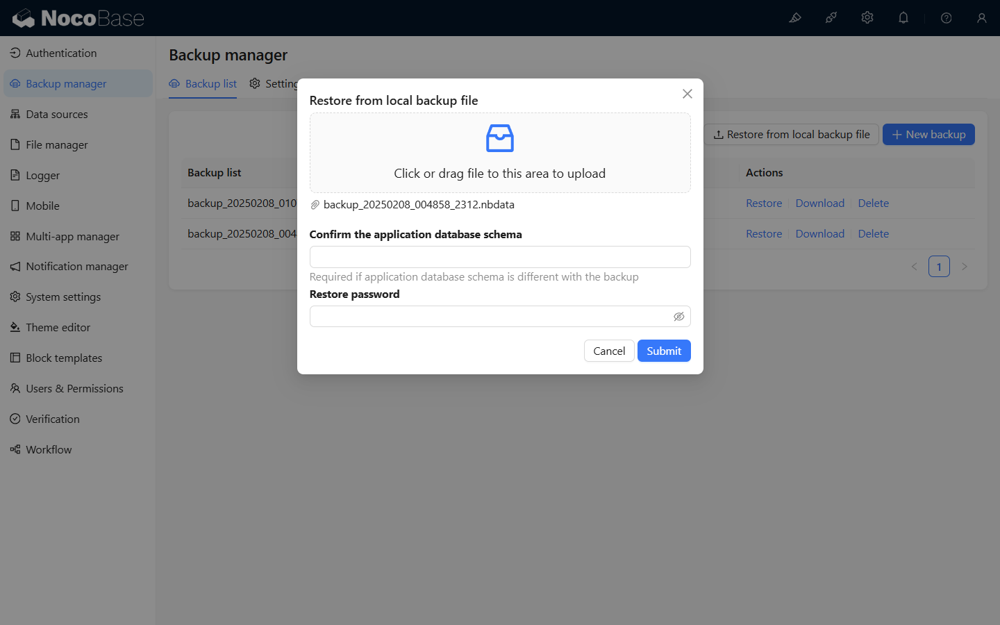
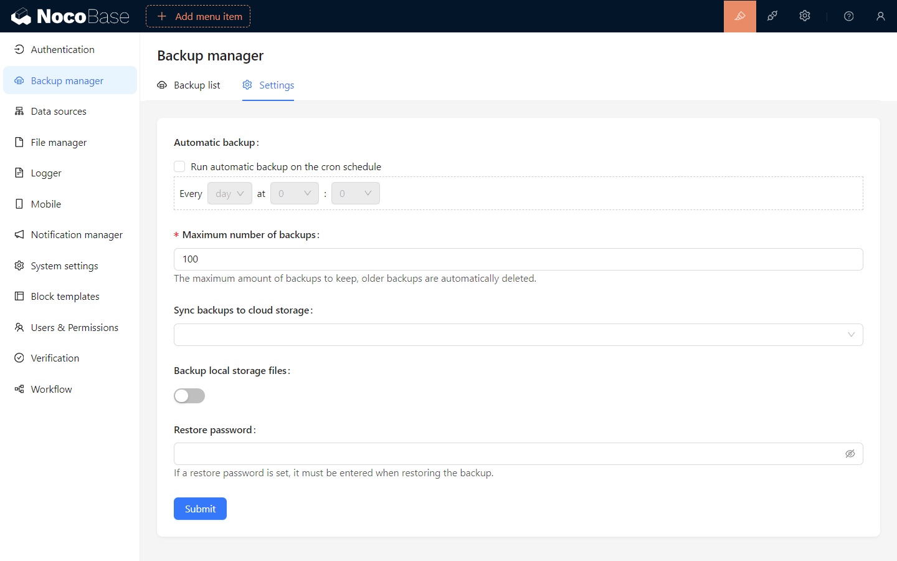

# Gestionnaire de sauvegardes

<PluginInfo licenseBundled="true" name="backups"></PluginInfo>

## Introduction

Le plugin de gestion des sauvegardes NocoBase offre des fonctionnalités pour la sauvegarde complète de la base de données NocoBase et des fichiers téléchargés par les utilisateurs, y compris la planification des sauvegardes, leur téléchargement, leur suppression et leur restauration.

## Installation

Ce plugin est intégré à la version professionnelle de NocoBase et ne nécessite pas d'installation manuelle. Veuillez consulter la [version commerciale](https://www.nocobase.com/en/commercial) pour plus de détails.

:::warning{title="Attention"}

- Ce plugin repose sur le client de base de données natif. Avant de l'utiliser, le client de base de données correspondant doit être installé dans l'environnement serveur de NocoBase.
  - [Installation du client PostgreSQL](./installation/postgres.md)
  - [Installation du client MySQL](./installation/mysql.md)
  - [Installation du client MariaDB](./installation/mariadb.md)
- Lors de la restauration, la version de la base de données cible ne doit pas être inférieure à la version de la base de données qui a créé la sauvegarde.
  :::

## Instructions d'utilisation

### Créer une nouvelle sauvegarde

Cliquez sur le bouton "Nouvelle sauvegarde" pour créer une nouvelle sauvegarde en fonction de la configuration de la sauvegarde et afficher le statut de la sauvegarde dans la liste des sauvegardes.

### Restaurer une sauvegarde

La restauration est possible depuis la liste des sauvegardes ou en téléchargeant un fichier de sauvegarde local pour restaurer la sauvegarde.

Les opérations de restauration ne sont pas autorisées dans les scénarios suivants :

- Lorsque la version actuelle de NocoBase est inférieure à la version de NocoBase dans le fichier de sauvegarde.
- Lorsque la base de données actuelle de NocoBase est incohérente avec les configurations suivantes dans le fichier de sauvegarde :
  - dialecte
  - souligné
  - préfixe de table
  - schéma
- Lorsque le mode `Tolérant` n'est pas activé, et que la version de la base de données lors de la création de la sauvegarde est plus récente que la version actuelle de la base de données de l'application.

> **La restauration est une opération complète de base de données. Il est recommandé de sauvegarder la base de données actuelle avant de restaurer une sauvegarde.**

#### Restaurer depuis la liste des sauvegardes

Cliquez sur le bouton "Restaurer" de l'élément de sauvegarde dans la liste des sauvegardes, entrez le mot de passe de chiffrement du fichier de sauvegarde dans la fenêtre contextuelle, puis cliquez sur "Confirmer" pour restaurer la sauvegarde.

> Laissez le mot de passe vide pour une sauvegarde non chiffrée.

> Si vous avez besoin de restaurer la sauvegarde sur une version inférieure de la base de données, vous devez activer le mode tolérant.

#### Restaurer depuis un fichier de sauvegarde local

Cliquez sur le bouton `Restaurer depuis une sauvegarde locale`, sélectionnez le fichier de sauvegarde local dans la fenêtre contextuelle, entrez le mot de passe de chiffrement du fichier de sauvegarde, puis cliquez sur "Confirmer" pour restaurer la sauvegarde.

> Laissez le mot de passe vide pour une sauvegarde non chiffrée.

> Si vous avez besoin de restaurer la sauvegarde sur une version inférieure de la base de données, vous devez activer le mode tolérant.

#### Télécharger le fichier de sauvegarde

Cliquez sur le bouton `Télécharger` de l'élément de sauvegarde dans la liste des sauvegardes pour télécharger le fichier de sauvegarde.

#### Supprimer la sauvegarde

Cliquez sur le bouton `Supprimer` de l'élément de sauvegarde dans la liste des sauvegardes pour supprimer le fichier de sauvegarde.

## Paramètres de sauvegarde

Passez à l'onglet "Paramètres", modifiez les paramètres de sauvegarde et cliquez sur `Sauvegarder` pour appliquer les modifications.

### Description des paramètres de sauvegarde

- **Sauvegarde automatique** : Lorsque l'option `Exécuter une sauvegarde automatique selon un planning cron` est activée, vous pouvez définir des sauvegardes automatiques à des moments spécifiques.
- **Nombre maximal de sauvegardes** : Définir le nombre maximal de fichiers de sauvegarde stockés localement. Une fois ce nombre dépassé, les fichiers de sauvegarde les plus anciens seront automatiquement supprimés.
- **Synchroniser la sauvegarde vers le stockage en cloud** : Définir l'emplacement du stockage en cloud où les fichiers de sauvegarde seront automatiquement téléchargés après une sauvegarde réussie. Cela ne prend en charge que le stockage en cloud.
- **Sauvegarder les fichiers locaux** : Définir si les fichiers téléchargés par les utilisateurs sur le stockage local du serveur (storage/uploads) doivent être inclus dans la sauvegarde.
- **Mot de passe de restauration** : Si un mot de passe de restauration est défini, il doit être saisi lors de la restauration de la sauvegarde.

> **Veuillez garder le mot de passe de restauration en sécurité. Oublier le mot de passe rendra impossible la restauration du fichier de sauvegarde.**
