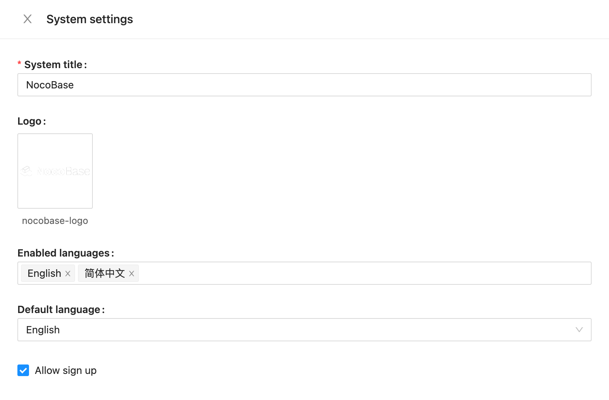

# Traductions

La langue par défaut de NocoBase est l'anglais. Actuellement l'anglais, le chinois simplifié, le japonnais, le russe et le turque sont supportés. Nous vous invitons chaleureusement à nous aider à traduire NocoBase dans d'autres langues, rendant ainsi le système accessible aux utilisateurs du monde entier !

## Localisation du système NocoBase

### Traduction de l'interface système et des plugins

#### Portée de la traduction
Remarque : Cela s'applique à l'interface système NocoBase et à la localisation des plugins, n'incluant pas d'autre contenu personnalisé (comme les tables de données, le contenu des blocs markdown).


#### Aperçu du contenu de localisation
NocoBase utilise Git pour gérer le contenu de localisation du système. Le dépôt principal est :
https://github.com/nocobase/locales

Les différentes langues sont nommées avec des fichiers JSON utilisant des abréviations de code de langue, comme `de-DE.json`, `fr-FR.json`, etc. La structure du fichier JSON est organisée par modules de plugin, stockant les traductions en paires clé-valeur, par exemple :

```json
{
  // Plugin client
  "@nocobase/client": {
    "(Fields only)": "(Fields only)",
    "12 hour": "12 hour",
    "24 hour": "24 hour"
    // ...autres paires clé-valeur
  },
  "@nocobase/plugin-acl": {
    // Paires clé-valeur pour ce plugin
  }
  // ...autres modules de plugin
}
```

Lors de la traduction, vous traduiriez progressivement vers une structure similaire à :

```json
{
  // Plugin client
  "@nocobase/client": {
    "(Fields only)": "(Champs uniquement)",
    "12 hour": "12 heures",
    "24 hour": "24 heures"
    // ...autres paires clé-valeur
  },
  "@nocobase/plugin-acl": {
    // Paires clé-valeur pour ce plugin
  }
  // ...autres modules de plugin
}
```

#### Synchronisation des traductions
Après avoir soumis une traduction, le système poussera automatiquement le contenu de localisation vers le dépôt de code.

### Traduction de la documentation et du manuel utilisateur

Le contenu de localisation de la documentation et du manuel utilisateur de NocoBase est stocké dans :
https://github.com/nocobase/docs

Pour les différentes localisations linguistiques, nous utilisons des répertoires de localisation supplémentaires directs, par exemple :
https://github.com/nocobase/docs/blob/main/docs/en-US/


Lors de la traduction de documents, vous devez également prêter attention aux modifications de texte du répertoire :
https://github.com/nocobase/docs/blob/main/docs/config/


Emplacement des modifications de texte des composants globaux dans la documentation :
https://github.com/nocobase/docs/blob/main/.dumi/theme/builtins/

Par exemple, le texte d'information du plugin :
https://github.com/nocobase/docs/blob/main/.dumi/theme/builtins/PluginInfo.tsx


### Localisation du site web

Le contenu de localisation du site web NocoBase (y compris les pages du site web et tout le texte) est stocké dans :
https://github.com/nocobase/website

Si vous avez besoin d'ajouter une nouvelle langue, veuillez vous référer aux pages de langue existantes :
- Pages en anglais : https://github.com/nocobase/website/blob/main/src/en/
- Pages en chinois : https://github.com/nocobase/website/blob/main/src/cn/
- Pages en japonais : https://github.com/nocobase/website/blob/main/src/ja/


Adresses de modification du style global :
- Anglais : https://github.com/nocobase/website/blob/main/src/layouts/BaseEN.astro
- Chinois : https://github.com/nocobase/website/blob/main/src/layouts/BaseCN.astro
- Japonais : https://github.com/nocobase/website/blob/main/src/layouts/BaseJA.astro


Adresse de localisation des composants globaux du site web :
https://github.com/nocobase/website/tree/main/src/components


## Comment commencer à traduire

Si vous souhaitez contribuer à une nouvelle traduction de langue pour NocoBase, veuillez suivre ces étapes :

1. Pour l'interface système, clonez le dépôt https://github.com/nocobase/locales, créez un nouveau fichier JSON de langue basé sur les fichiers de langue existants
2. Pour la documentation, clonez le dépôt https://github.com/nocobase/docs, créez un nouveau répertoire de langue et commencez à traduire
3. Pour le site web, clonez le dépôt https://github.com/nocobase/website, créez de nouvelles pages de langue en vous référant aux pages de langue existantes

Après avoir terminé votre traduction, veuillez la soumettre à NocoBase via une Pull Request. Nous examinerons et fusionnerons votre contribution. Pour la localisation du système, vous verrez les nouvelles langues dans la configuration du système, où vous pourrez configurer les langues à afficher pour que les utilisateurs puissent choisir.


## Informations historiques

Les fichiers de langue NocoBase sont situés aux emplacements suivants :

```shell
packages/core/**/src/locale
packages/plugins/**/src/locale
```

La traduction du noyau NocoBase se trouve principalement ici :

https://github.com/nocobase/nocobase/tree/main/packages/core/client/src/locale

Veuillez copier le fichier en_US.ts, nommez-le avec le nom de la langue que vous souhaitez ajouter, puis traduisez les chaînes qu'il contient. Une fois la traduction terminée, veuillez la soumettre à NocoBase via pull request et nous l'ajouterons à la liste des langues. Ensuite, vous verrez les nouvelles langues dans la configuration du système, où vous pourrez configurer les langues que vous souhaitez afficher pour que les utilisateurs puissent choisir.



## Codes de langue supportés et progrès de localisation

Le tableau suivant répertorie les langues disponibles et les progrès de localisation pour votre référence :

| Nom de culture linguistique | Nom d'affichage | Progrès | Contributeurs |
| ---------------------------------------------------------------------------------------------------------------------------- | -------------------- | --- | --- |
| ar-EG                                                                                                                        | العربية              |     |     |
| az-AZ                                                                                                                        | Azərbaycan dili      |     |     |
| bg-BG                                                                                                                        | Български            |     |     |
| bn-BD                                                                                                                        | Bengali              |     |     |
| by-BY                                                                                                                        | Беларускі            |     |     |
| ca-ES                                                                                                                        | Сatalà/Espanya       |     |     |
| cs-CZ                                                                                                                        | Česky                |     |     |
| da-DK                                                                                                                        | Dansk                |     |     |
| [de-DE](https://github.com/nocobase/locales/blob/main/de-DE.json "https://github.com/nocobase/locales/blob/main/de-DE.json") | Deutsch              |     |     |
| el-GR                                                                                                                        | Ελληνικά             |     |     |
| en-GB                                                                                                                        | English(GB)          |     |     |
| [en-US](https://github.com/nocobase/locales/blob/main/en-US.json "https://github.com/nocobase/locales/blob/main/en-US.json") | English              |     |     |
| [es-ES](https://github.com/nocobase/locales/blob/main/es-ES.json "https://github.com/nocobase/locales/blob/main/es-ES.json") | Español              |     |     |
| et-EE                                                                                                                        | Estonian (Eesti)     |     |     |
| fa-IR                                                                                                                        | فارسی                |     |     |
| fi-FI                                                                                                                        | Suomi                |     |     |
| fr-BE                                                                                                                        | Français(BE)         |     |     |
| fr-CA                                                                                                                        | Français(CA)         |     |     |
| [fr-FR](https://github.com/nocobase/locales/blob/main/fr-FR.json "https://github.com/nocobase/locales/blob/main/fr-FR.json") | Français             |     |     |
| ga-IE                                                                                                                        | Gaeilge              |     |     |
| gl-ES                                                                                                                        | Galego               |     |     |
| he-IL                                                                                                                        | עברית                |     |     |
| hi-IN                                                                                                                        | हिन्दी               |     |     |
| hr-HR                                                                                                                        | Hrvatski jezik       |     |     |
| hu-HU                                                                                                                        | Magyar               |     |     |
| hy-AM                                                                                                                        | Հայերեն              |     |     |
| id-ID                                                                                                                        | Bahasa Indonesia     |     |     |
| is-IS                                                                                                                        | Íslenska             |     |     |
| [it-IT](https://github.com/nocobase/locales/blob/main/it-IT.json "https://github.com/nocobase/locales/blob/main/it-IT.json") | Italiano             |     |     |
| [ja-JP](https://github.com/nocobase/locales/blob/main/ja-JP.json "https://github.com/nocobase/locales/blob/main/ja-JP.json") | 日本語                  |     |     |
| ka-GE                                                                                                                        | ქართული              |     |     |
| kk-KZ                                                                                                                        | Қазақ тілі           |     |     |
| km-KH                                                                                                                        | ភាសាខ្មែរ            |     |     |
| kn-IN                                                                                                                        | ಕನ್ನಡ                |     |     |
| [ko-KR](https://github.com/nocobase/locales/blob/main/ko-KR.json "https://github.com/nocobase/locales/blob/main/ko-KR.json") | 한국어                  |     |     |
| ku-IQ                                                                                                                        | کوردی                |     |     |
| lt-LT                                                                                                                        | lietuvių             |     |     |
| lv-LV                                                                                                                        | Latviešu valoda      |     |     |
| mk-MK                                                                                                                        | македонски јазик     |     |     |
| ml-IN                                                                                                                        | മലയാളം               |     |     |
| mn-MN                                                                                                                        | Монгол хэл           |     |     |
| ms-MY                                                                                                                        | بهاس ملايو           |     |     |
| nb-NO                                                                                                                        | Norsk bokmål         |     |     |
| ne-NP                                                                                                                        | नेपाली               |     |     |
| nl-BE                                                                                                                        | Vlaams               |     |     |
| nl-NL                                                                                                                        | Nederlands           |     |     |
| pl-PL                                                                                                                        | Polski               |     |     |
| [pt-BR](https://github.com/nocobase/locales/blob/main/pt-BR.json "https://github.com/nocobase/locales/blob/main/pt-BR.json") | Português brasileiro |     |     |
| pt-PT                                                                                                                        | Português            |     |     |
| ro-RO                                                                                                                        | România              |     |     |
| [ru-RU](https://github.com/nocobase/locales/blob/main/ru-RU.json "https://github.com/nocobase/locales/blob/main/ru-RU.json") | Русский              |     |     |
| si-LK                                                                                                                        | සිංහල                |     |     |
| sk-SK                                                                                                                        | Slovenčina           |     |     |
| sl-SI                                                                                                                        | Slovenščina          |     |     |
| sr-RS                                                                                                                        | српски језик         |     |     |
| sv-SE                                                                                                                        | Svenska              |     |     |
| ta-IN                                                                                                                        | Tamil                |     |     |
| th-TH                                                                                                                        | ภาษาไทย              |     |     |
| tk-TK                                                                                                                        | Turkmen              |     |     |
| [tr-TR](https://github.com/nocobase/locales/blob/main/tr-TR.json "https://github.com/nocobase/locales/blob/main/tr-TR.json") | Türkçe               |     |     |
| [uk-UA](https://github.com/nocobase/locales/blob/main/uk-UA.json "https://github.com/nocobase/locales/blob/main/uk-UA.json") | Українська           |     |     |
| ur-PK                                                                                                                        | Oʻzbekcha            |     |     |
| vi-VN                                                                                                                        | Tiếng Việt           |     |     |
| [zh-CN](https://github.com/nocobase/locales/blob/main/zh-CN.json "https://github.com/nocobase/locales/blob/main/zh-CN.json") | 简体中文                 |     |     |
| zh-HK                                                                                                                        | 繁體中文（香港）             |     |     |
| [zh-TW](https://github.com/nocobase/locales/blob/main/zh-TW.json "https://github.com/nocobase/locales/blob/main/zh-TW.json") | 繁體中文（台湾）             |     |     |
