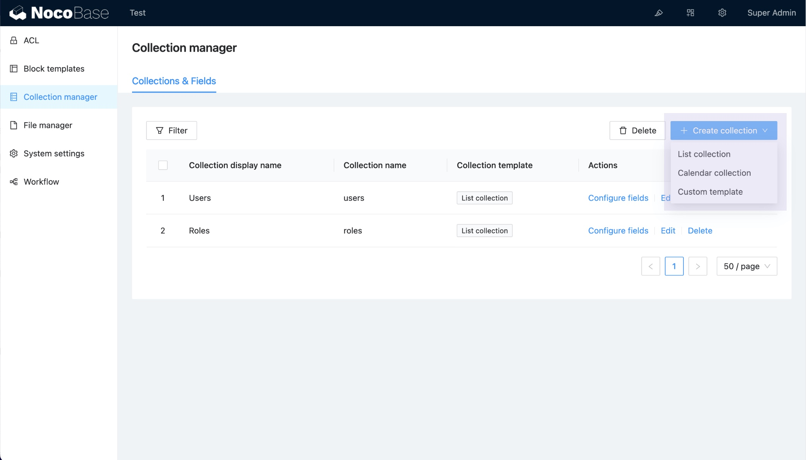

# v0.9.0 : **Modèles de Collection**



## Pourquoi avons-nous besoin de modèles de collection ?

Les modèles de collection offrent une manière standardisée et réutilisable de définir et configurer différents types de collections de données. Grâce aux modèles de collection, vous pouvez simplifier et unifier le processus de création et de configuration des collections, ce qui rend la gestion et la construction des données sur NocoBase plus efficace et cohérente. Les modèles prennent en charge la personnalisation des types de champs, des configurations de champs et des paramètres optionnels, ce qui améliore la flexibilité et l'extensibilité du système.

## Explication des paramètres de configuration

L'interface `ICollectionTemplate` est la structure principale de configuration pour les modèles de collection, vous permettant de définir les propriétés du modèle, les champs configurables et les types de champs disponibles. Voici une explication détaillée de l'interface `ICollectionTemplate` :

```ts
interface ICollectionTemplate {
  name: string;  // Nom du modèle, requis
  title?: string;  // Titre du modèle, généralement utilisé pour l'affichage dans l'UI
  /** Tri */
  order?: number;  // Ordre d'affichage du modèle
  /** Configuration par défaut */
  default?: CollectionOptions;  // Paramètres par défaut
  /** Paramètres de CollectionOptions configurables via l'UI (champs du formulaire de création ou d'édition de Collection) */
  configurableProperties?: Record<string, ISchema>;  // Définition des champs configurables
  /** Types de champs disponibles pour ce modèle */
  availableFieldInterfaces?:
    | AvailableFieldInterfacesInclude  // Champs inclus
    | AvailableFieldInterfacesExclude;  // Champs exclus
}

interface AvailableFieldInterfacesInclude {
  include?: any[];  // Types de champs à afficher
}

interface AvailableFieldInterfacesExclude {
  exclude?: any[];  // Types de champs à exclure
}

interface CollectionOptions {
  /**
   * Génération automatique de l'id
   * @default true
   * */
  autoGenId?: boolean;  // Si true, l'ID est généré automatiquement (par défaut true)
  /** Créé par */
  createdBy?: boolean;  // Si true, l'auteur de la création est enregistré
  /** Dernière mise à jour par */
  updatedBy?: boolean;  // Si true, l'auteur de la dernière mise à jour est enregistré
  /** Date de création */
  createdAt?: boolean;  // Si true, la date de création est enregistrée
  /** Date de mise à jour */
  updatedAt?: boolean;  // Si true, la date de la dernière mise à jour est enregistrée
  /** Tri activé */
  sortable?: boolean;  // Si true, le tri est activé pour la collection
  /* Structure d'arbre */
  tree?: string;  // Support pour les structures de type arbre
  /* Journalisation */
  logging?: boolean;  // Si true, l'enregistrement des logs est activé
  /** Héritage */
  inherits: string | string[];  // Hérite des champs d'autres collections
  /* Liste des champs */
  fields?: FieldOptions[];  // Configuration des champs
}
```

### Explication des principaux champs

- **name** : Identifiant unique du modèle.
- **title** : Titre du modèle, utilisé pour l'affichage dans l'interface utilisateur, non requis.
- **order** : Paramètre de tri, permet de contrôler l'ordre d'affichage du modèle dans l'interface.
- **default** : Configuration par défaut du modèle, incluant la génération automatique de l'ID, les valeurs par défaut des champs, etc.
- **configurableProperties** : Paramètres configurables via l'interface utilisateur. Ces champs permettent à l'utilisateur de personnaliser les configurations du modèle.
- **availableFieldInterfaces** : Configuration des types de champs disponibles pour ce modèle, en incluant ou excluant certains types de champs.

## Exemple

Imaginons que nous souhaitons créer un modèle sans génération automatique de l'ID, avec seulement les champs `title` et `name` configurables.

```ts
import { collectionConfigurableProperties } from '@nocobase/client';

{
  default: {
    autoGenId: false,  // Désactiver la génération automatique de l'ID
    fields: [],  // Aucun champ par défaut
  },
  configurableProperties: {
    ...collectionConfigurableProperties('name', 'title'),  // Configurer uniquement 'name' et 'title'
  },
}
```

### Exemple complet du plugin

Vous pouvez consulter l'exemple complet d'un plugin personnalisé pour les modèles de collection à l'adresse suivante : [samples/custom-collection-template](https://github.com/nocobase/nocobase/tree/feat/collection-templates/packages/samples/custom-collection-template).
