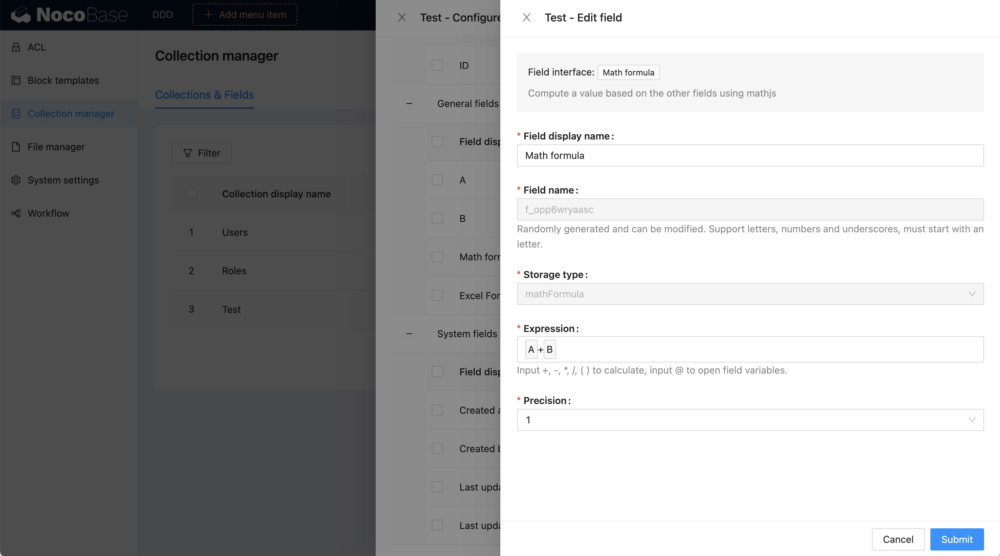

# v0.9.0 : Plugin de Formules de Champ

NocoBase propose actuellement deux plugins pour la gestion des formules de calculs dans les champs de données :

- `@nocobase/plugin-math-formula-field` : Formules Mathématiques
- `@nocobase/plugin-excel-formula-field` : Formules Excel (merci à [azriel46d](https://github.com/nocobase/nocobase/pull/906) pour cette contribution)

## Formule Mathématique

Le plugin **Math Formula** est basé sur [Math.js](https://mathjs.org/), un puissant moteur de calcul qui prend en charge des expressions mathématiques complexes, incluant des calculs symboliques, une large gamme de fonctions et de constantes intégrées, ainsi que des solutions pour gérer différents types de données comme les nombres, grands nombres, nombres complexes, fractions, unités et matrices.

### Exemple d'utilisation

```ts
import { evaluate } from 'mathjs';

// Expressions de test
evaluate('1.2 * (2 + 4.5)'); // 7.8
evaluate('12.7 cm to inch'); // 5 inch
evaluate('sin(45 deg) ^ 2'); // 0.5
evaluate('9 / 3 + 2i'); // 3 + 2i
evaluate('det([-1, 2; 3, 1])'); // -7
```

**Capture d'écran :** Formule mathématique dans NocoBase


## Formule Excel

Le plugin **Excel Formula** est basé sur [Formula.js](https://formulajs.info/), une bibliothèque JavaScript qui émule les formules d'Excel. Il permet l’utilisation de fonctions similaires à celles que l’on trouve dans une feuille de calcul Excel, offrant ainsi une flexibilité pour effectuer des calculs et manipulations de données de manière simple.

### Exemple d'utilisation

```ts
SUM(-5, 15, 32); // 42
IF(true, 'Hello!', 'Goodbye!'); // Hello!
```

**Capture d'écran :** Formule Excel dans NocoBase

