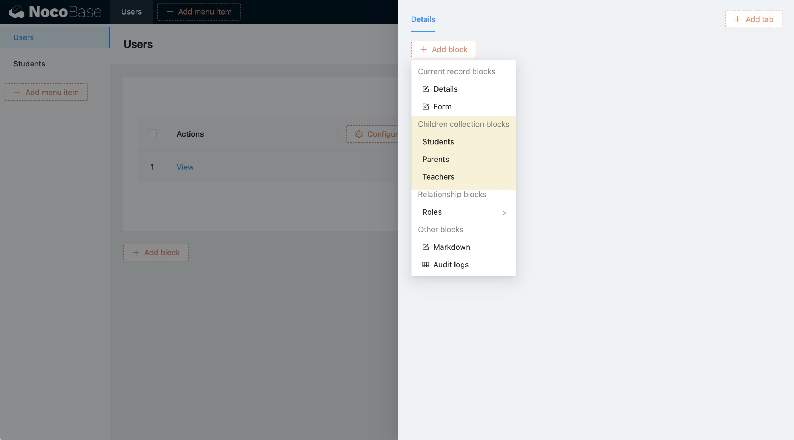

# v0.9.0 : Héritage des tables de données

L'héritage des tables de données est basé sur la syntaxe [INHERITS de PostgreSQL](https://www.postgresql.org/docs/current/tutorial-inheritance.html) et n'est disponible que lorsque NocoBase est installé avec une base de données PostgreSQL.

## Exemple

Commençons par un exemple. Supposons que nous devions créer un système de gestion scolaire avec trois types d'utilisateurs : étudiants, parents et enseignants.

Sans l'héritage, nous devrions créer une table pour chaque type d'utilisateur :

- Étudiant : Nom, Âge, Sexe, Numéro de carte d'identité
- Parent : Nom, Âge, Sexe, Profession, Niveau d'études
- Enseignant : Nom, Âge, Sexe, Ancienneté, Marié

Avec l'héritage des tables de données, nous pouvons extraire les informations communes :

- Utilisateur : Nom, Âge, Sexe
- Étudiant : Numéro de carte d'identité
- Parent : Profession, Niveau d'études
- Enseignant : Ancienneté, Marié

Voici le diagramme ER (Entité-Relation) :


**Note** : Les ID des tables enfants et des tables parentes partagent la même séquence.

## Configurer l'héritage des tables de données

Le champ `Inherits` permet de sélectionner la table parent à hériter.


Exemple de configuration via le code :

```ts
db.collection({
  name: 'users',
});

db.collection({
  name: 'students',
  inherits: 'users',
});
```

### Points importants :

- La table héritée ne peut pas être choisie de manière arbitraire. La clé primaire doit être une séquence unique, par exemple un UUID ou une séquence auto-incrémentée partagée par toutes les tables de l'héritage.
- Le paramètre `Inherits` ne peut pas être modifié après sa configuration.
- Si une relation d'héritage existe, la table parent ne peut pas être supprimée.

## Liste des champs des tables de données

La liste des champs des tables de données affichera les champs hérités de la table parent. Ces champs parent ne peuvent pas être modifiés, mais peuvent être réécrits (Override).


### Points à retenir lors de la réécriture des champs parent :

- Un champ dans la table enfant avec le même nom que le champ parent est considéré comme une réécriture.
- Le type du champ réécrit doit être cohérent avec le type du champ parent.
- Les paramètres des champs de relation, à l'exception de la collection cible, doivent rester identiques.

## Bloc des sous-tableaux de la table parent

Dans le bloc de la table parent, il est possible de configurer des blocs pour les tables enfants.



## Nouvelle configuration des champs hérités de la table parent

Lorsqu'une table héritée est présente, les champs hérités de la table parent seront configurables.


