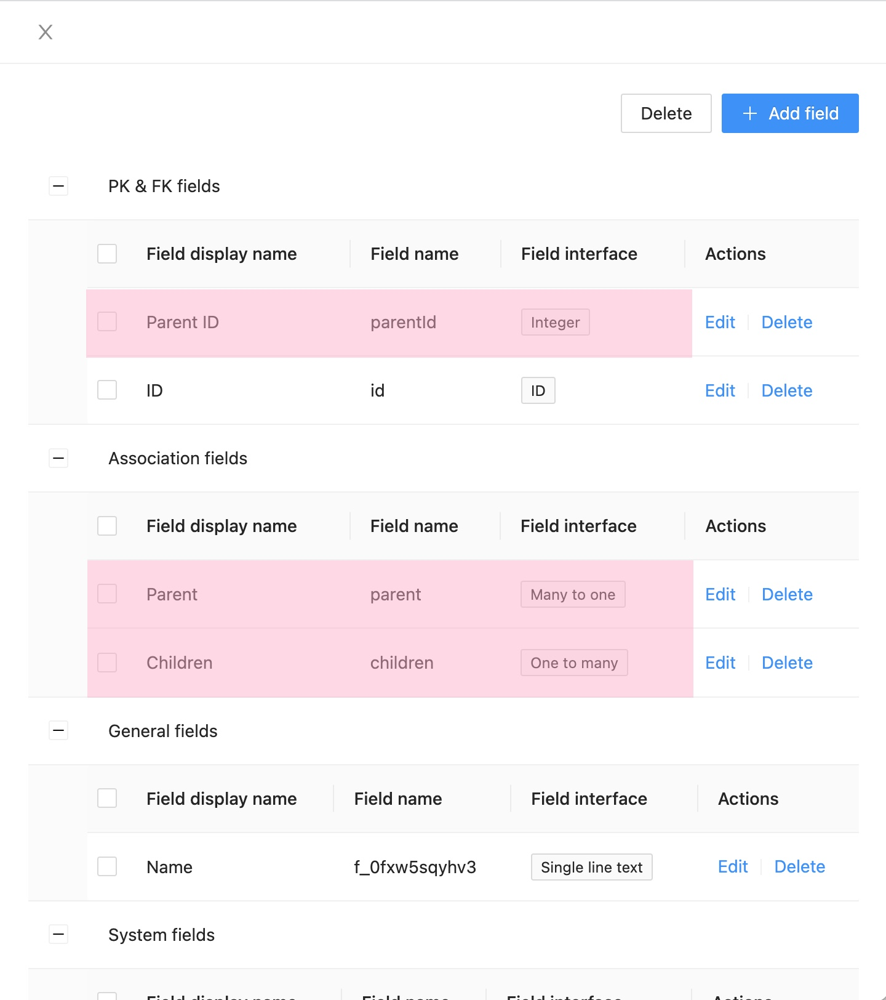
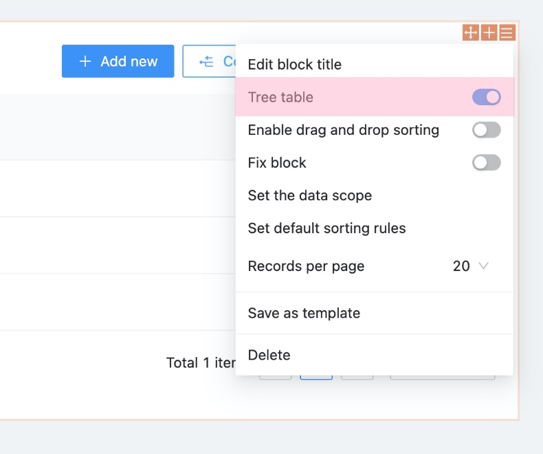
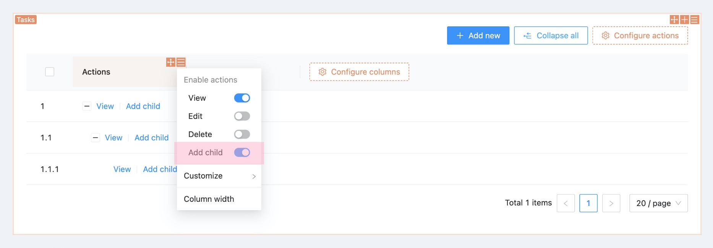

# Collection Arborescente (Tree Collection)

## Options de la collection

```ts
{
  name: 'categories',
  tree: 'adjacency-list',
  fields: [
    {
      type: 'belongsTo',
      name: 'parent',
      treeParent: true,
    },
    {
      type: 'hasMany',
      name: 'children',
      treeChildren: true,
    },
  ],
}
```

## Interface Utilisateur (UI)

### Créer une collection arborescente


### Champs par défaut



### Bloc Tableau



### Ajouter un enfant



### Développer/Réduire


