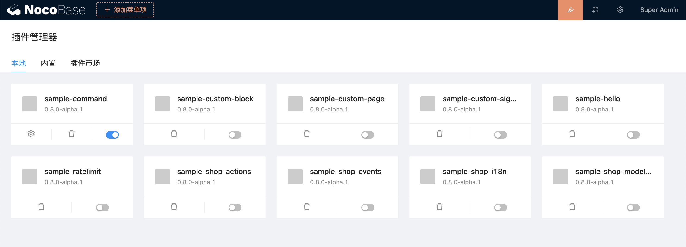

# v0.8 : 2022-11-01

Avec la version v0.8, NocoBase introduit un **gestionnaire de plugins** et une **documentation de développement** plus complète. Voici les principaux changements apportés.

## Améliorations de l'interface (coin supérieur droit)

- **UI Editor**
- **Plugin Manager**
- **Settings Center**
- **Personal Center**


## Nouveau gestionnaire de plugins

La version v0.8 introduit un gestionnaire de plugins puissant pour gérer les plugins de manière sans code.

### Flux du gestionnaire de plugins


### Interface du gestionnaire de plugins

Actuellement, il est principalement utilisé pour désactiver, activer et supprimer des plugins locaux. Les plugins intégrés ne peuvent pas être supprimés.



### Commandes du gestionnaire de plugins

Outre la possibilité d'activer et de désactiver des plugins depuis l'interface sans code, vous pouvez également gérer les plugins de manière plus complète via la ligne de commande.

```bash
# Créer un plugin
yarn pm create hello
# Enregistrer le plugin
yarn pm add hello
# Activer le plugin
yarn pm enable hello
# Désactiver le plugin
yarn pm disable hello
# Supprimer le plugin
yarn pm remove hello
```

Note : La publication et la mise à jour des plugins seront prises en charge dans les prochaines versions.

```bash
# Publier le plugin
yarn pm publish hello
# Mettre à jour le plugin
yarn pm upgrade hello
```

Pour plus d'exemples de plugins, consultez [packages/samples](https://github.com/nocobase/nocobase/tree/main/packages/samples).

## Changements relatifs aux plugins

### Structure du répertoire d'un plugin

```
|- /hello
  |- /src
    |- /client      # Plugin côté client
    |- /server      # Plugin côté serveur
  |- client.d.ts
  |- client.js
  |- package.json   # Informations sur le package du plugin
  |- server.d.ts
  |- server.js
```

### Spécification du nom du plugin

Un plugin NocoBase est également un package NPM. La règle de correspondance entre le nom du plugin et le nom du package NPM est `${PLUGIN_PACKAGE_PREFIX}-${pluginName}`.

`PLUGIN_PACKAGE_PREFIX` est le préfixe du package du plugin, et peut être personnalisé dans le fichier `.env`. [Cliquez ici pour la description de `PLUGIN_PACKAGE_PREFIX`](https://www.notion.so/api/env#plugin_package_prefix).

Par exemple, un projet nommé `my-nocobase-app` ajoutant le plugin `hello` aura le nom du package `@my-nocobase-app/plugin-hello`.

La configuration de `PLUGIN_PACKAGE_PREFIX` se fait comme suit :

```bash
PLUGIN_PACKAGE_PREFIX=@nocobase/plugin-,@nocobase/preset-,@my-nocobase-app/plugin-
```

La correspondance entre le nom du plugin et le nom du package est la suivante :

- Plugin `users` → nom du package `@nocobase/plugin-users`
- Plugin `nocobase` → nom du package `@nocobase/preset-nocobase`
- Plugin `hello` → nom du package `@my-nocobase-app/plugin-hello`

### Cycle de vie du plugin

La version v0.8 introduit un cycle de vie plus complet pour les plugins.

```typescript
import { InstallOptions, Plugin } from '@nocobase/server';

export class HelloPlugin extends Plugin {
  afterAdd() {
    // Après l'ajout du plugin via pm.add
  }

  beforeLoad() {
    // Avant le chargement de tous les plugins, généralement utilisé pour enregistrer des classes et des écouteurs d'événements
  }

  async load() {
    // Charger la configuration
  }

  async install(options?: InstallOptions) {
    // Logique d'installation
  }

  async afterEnable() {
    // Après l'activation
  }

  async afterDisable() {
    // Après la désactivation
  }

  async remove() {
    // Logique de suppression
  }
}

export default HelloPlugin;
```

### Entrées pour les plugins côté client et côté serveur

Le cycle de vie du plugin est contrôlé par le serveur.

```typescript
import { Application } from '@nocobase/server';

const app = new Application({
  // ...
});

class MyPlugin extends Plugin {
  afterAdd() {}
  beforeLoad() {}
  load() {}
  install() {}
  afterEnable() {}
  afterDisable() {}
  remove() {}
}

app.plugin(MyPlugin, { name: 'my-plugin' });
```

Le côté client du plugin existe en tant que `Context.Provider` (similaire au middleware côté serveur).

```typescript
import React from 'react';
import { Application } from '@nocobase/client';

const app = new Application({
  apiClient: {
    baseURL: process.env.API_BASE_URL,
  },
  dynamicImport: (name: string) => {
    return import(`../plugins/${name}`);
  },
});

// Lorsque vous visitez la page /hello, cela affiche "Hello world!"
const HelloProvider = React.memo((props) => {
  const location = useLocation();
  if (location.pathname === '/hello') {
    return <div>Hello world!</div>;
  }
  return <>{props.children}</>;
});
HelloProvider.displayName = 'HelloProvider';

app.use(HelloProvider);
```

## Code métier personnalisé

Les plugins de la version v0.7 n'étaient pas entièrement complétés, et le code métier personnalisé était souvent dispersé dans `packages/app/client` et `packages/app/server`, ce qui compliquait les mises à jour et la maintenance. La version v0.8 recommande maintenant d'organiser ce code sous forme de packages de plugins et d'utiliser `yarn pm` pour gérer les plugins.

## Documentation plus complète

- **Welcome** : Une vue rapide de NocoBase
- **Manual** : Apprenez-en davantage sur les fonctionnalités principales de NocoBase
- **Plugin Development Tutorial** : Approfondissez le développement de plugins
- **API Reference** : Consultez l'API lors du développement de plugins
- **Client Components Library** (en préparation) : Fournit des exemples et l'utilisation des composants NocoBase

## Plus d'exemples de plugins

- [command](https://github.com/nocobase/nocobase/tree/develop/packages/samples/command)
- [custom-block](https://github.com/nocobase/nocobase/tree/develop/packages/samples/custom-block)
- [custom-page](https://github.com/nocobase/nocobase/tree/develop/packages/samples/custom-page)
- [custom-signup-page](https://github.com/nocobase/nocobase/tree/develop/packages/samples/custom-signup-page)
- [hello](https://github.com/nocobase/nocobase/tree/develop/packages/samples/hello)
- [ratelimit](https://github.com/nocobase/nocobase/tree/develop/packages/samples/ratelimit)
- [shop-actions](https://github.com/nocobase/nocobase/tree/develop/packages/samples/shop-actions)
- [shop-events](https://github.com/nocobase/nocobase/tree/develop/packages/samples/shop-events)
- [shop-i18n](https://github.com/nocobase/nocobase/tree/develop/packages/samples/shop-i18n)
- [shop-modeling](https://github.com/nocobase/nocobase/tree/develop/packages/samples/shop-modeling)

## Autres nouvelles fonctionnalités

- Importation depuis Excel
- Mise à jour et édition en masse
- Collections graphiques
- Historique d'exécution des workflows
- Champ JSON
