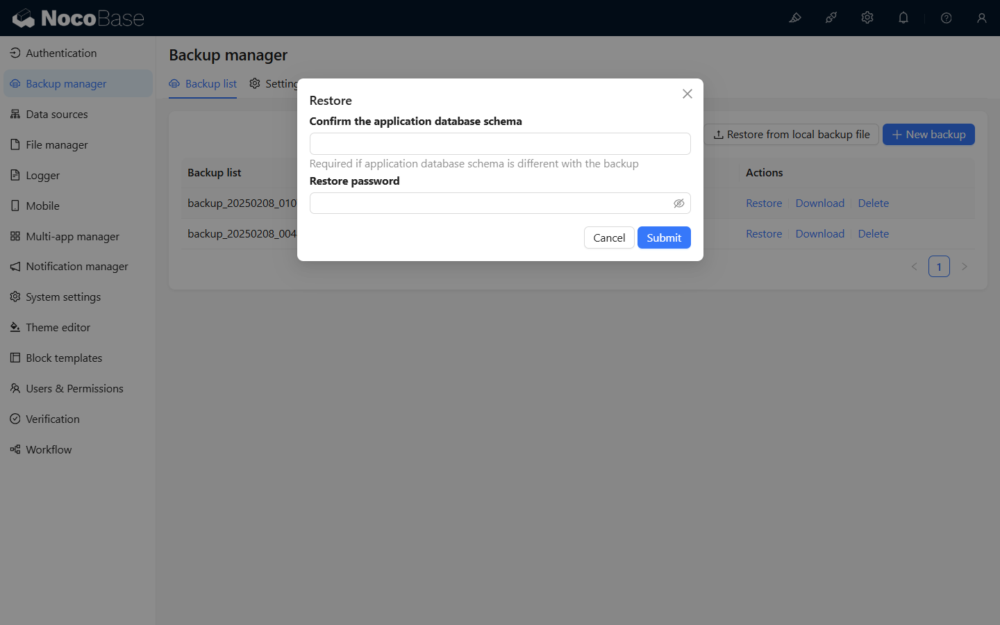
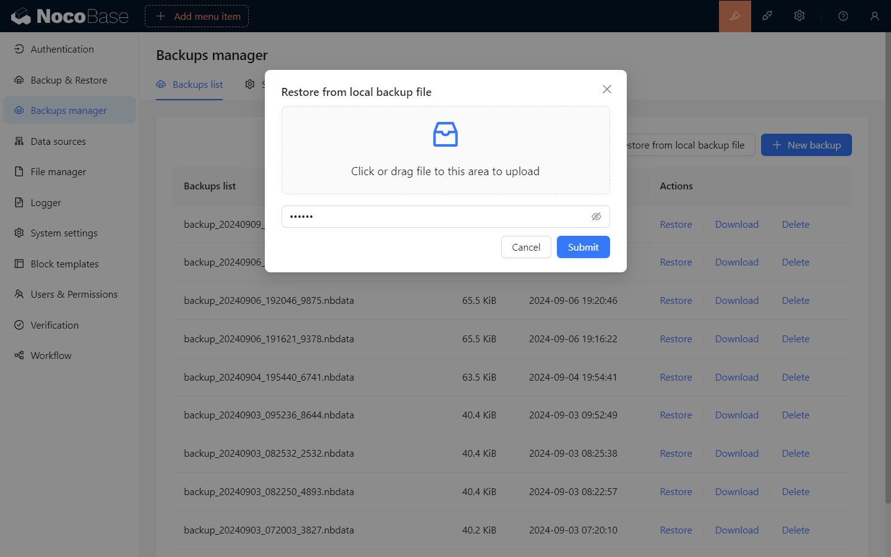

# バックアップマネージャー

<PluginInfo licenseBundled="true" name="backups"></PluginInfo>

## 概要

NocoBaseバックアップマネージャープラグインは、NocoBaseデータベースおよびユーザーがアップロードしたファイルの完全バックアップ、定期バックアップ、バックアップのダウンロード、削除、復元などの機能を提供します。

## インストール

<embed src="./install.md"></embed>

## 使用説明書

### 新規バックアップの作成

「新規バックアップ」ボタンをクリックすると、バックアップ設定に基づいて新しいバックアップが作成され、バックアップリストにバックアップ状況が表示されます。

### バックアップの復元

バックアップリストからバックアップを復元することや、ローカルバックアップファイルのアップロードによる復元をサポートしています。以下の状況では復元操作を実行できません：
- 現在のNocoBaseバージョンがバックアップファイルのNocoBaseバージョンよりも低い場合。
- 現在のNocoBaseデータベースがバックアップファイルの以下の設定と一致しない場合：
  - データベースタイプ (dialect)
  - フィールド設定 (underscored)
  - テーブルプレフィックス (table prefix)
  - テーブル構造 (schema)

> **バックアップと復元はデータベースの全量操作であり、復元の前に現在のデータベースのバックアップを取ることをお勧めします。**

#### バックアップリストからの復元

バックアップリスト内のバックアップ項目の「復元」ボタンをクリックし、ポップアップウィンドウにバックアップファイルの暗号化パスワードを入力して、復元を確認します。
> 暗号化されていないバックアップファイルにはパスワードを入力する必要はありません。

> バックアップ・ファイルをより低いバージョンのデータベースにリストアする必要がある場合は、フォールト・トレランス・モードを有効にする必要があります。

#### ローカルバックアップファイルの復元

「ローカルからバックアップを復元」ボタンをクリックし、ポップアップウィンドウでローカルバックアップファイルを選択します。次に、バックアップファイルの暗号化パスワードを入力し、確認してバックアップを復元します。
> 暗号化されていないバックアップファイルには、パスワードの入力は不要です。

> バックアップ・ファイルをより低いバージョンのデータベースにリストアする必要がある場合は、フォールト・トレランス・モードを有効にする必要があります。

#### バックアップファイルのダウンロード

バックアップリストのバックアップ項目の「ダウンロード」ボタンをクリックすると、バックアップファイルをダウンロードできます。

#### バックアップの削除

バックアップリストのバックアップ項目の「削除」ボタンをクリックすると、バックアップファイルを削除できます。

## バックアップ設定

「設定」タブに切り替え、バックアップ設定を変更した後、保存をクリックすると設定が適用されます。

### バックアップ設定の説明

- `自動バックアップ`: 「Cron に基づいて自動バックアップを実行」を有効にすると、指定した時間に自動でバックアップが行われます。
- `最大バックアップ数`: バックアップファイルのローカル保存の最大数を設定し、超過した場合はローカルで最も古いバックアップファイルが自動的に削除されます。
- `バックアップファイルをクラウドストレージに同期`: バックアップファイルが成功した後、自動でアップロードされるクラウドストレージを設定します。
- `ローカルストレージファイルのバックアップ`: ユーザーがサーバーのローカルストレージにアップロードしたファイル (storage/uploads) をバックアップに含めるかどうかを選択します。
- `復元パスワード`: 復元パスワードを設定した場合、バックアップを復元する際にそのパスワードが必要です。

> **復元パスワードは大切に保管してください。パスワードを忘れるとバックアップファイルを復元できなくなります。**
