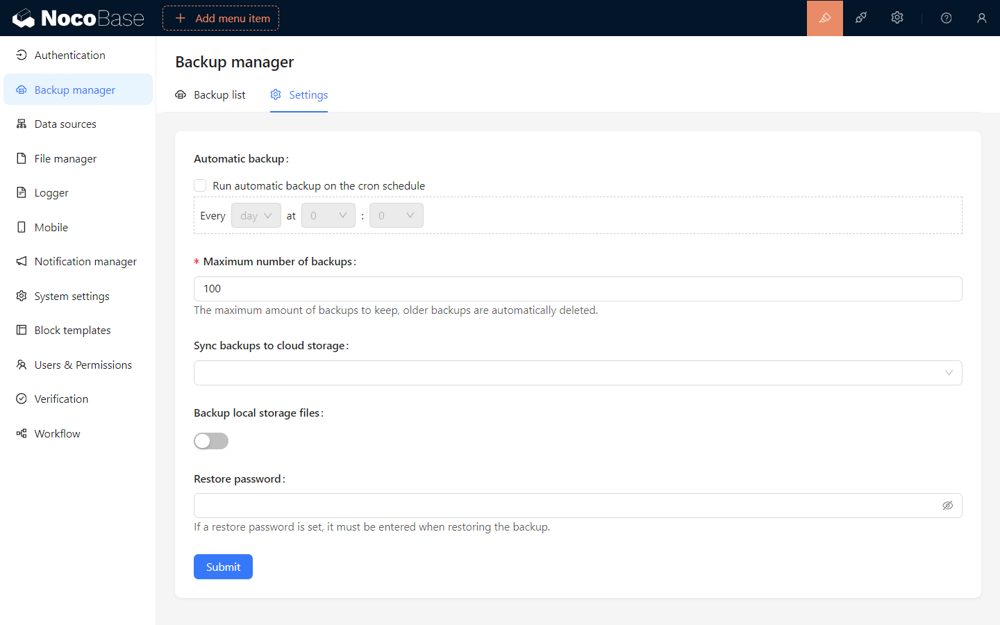

# バックアップマネージャー

<PluginInfo name="backups"></PluginInfo>

## 概要

NocoBaseバックアップマネージャープラグインは、NocoBaseデータベースおよびユーザーがアップロードしたファイルの完全バックアップ、定期バックアップ、バックアップのダウンロード、削除、復元などの機能を提供します。

## インストール

このプラグインはNocoBaseプロフェッショナル版に組み込まれており、別途インストールする必要はありません。詳細については<a target="_blank" href="https://www.nocobase.com/cn/commercial">商用版</a>をご覧ください。

:::warning{title=注意}
- 本プラグインはデータベースのネイティブクライアントに基づいて実装されており、使用前にNocoBaseサーバーの実行環境に対応するデータベースクライアントをインストールする必要があります。
  - [Postgresデータベースクライアントのインストール](./installation/postgres.md)
  - [MySQLデータベースクライアントのインストール](./installation/mysql.md)
  - [MariaDBデータベースクライアントのインストール](./installation/mariadb.md)
- 復元操作を行う際、対象データベースのバージョンはバックアップを作成したデータベースのバージョン以上である必要があります。
:::

## 使用説明書

### 新規バックアップの作成

「新規バックアップ」ボタンをクリックすると、バックアップ設定に基づいて新しいバックアップが作成され、バックアップリストにバックアップ状況が表示されます。

### バックアップの復元

バックアップリストからバックアップを復元することや、ローカルバックアップファイルのアップロードによる復元をサポートしています。以下の状況では復元操作を実行できません：
- 現在のNocoBaseバージョンがバックアップファイルのNocoBaseバージョンよりも低い場合。
- 現在のNocoBaseデータベースがバックアップファイルの以下の設定と一致しない場合：
  - データベースタイプ (dialect)
  - フィールド設定 (underscored)
  - テーブルプレフィックス (table prefix)
  - テーブル構造 (schema)

> **バックアップと復元はデータベースの全量操作であり、復元の前に現在のデータベースのバックアップを取ることを推奨します。**

#### バックアップリストからの復元

バックアップリスト内のバックアップ項目の「復元」ボタンをクリックし、ポップアップウィンドウにバックアップファイルの暗号化パスワードを入力して、復元を確認します。
> 暗号化されていないバックアップファイルにはパスワードを入力する必要はありません。

#### ローカルバックアップファイルの復元

「ローカルからバックアップを復元」ボタンをクリックし、ポップアップウィンドウでローカルバックアップファイルを選択します。次に、バックアップファイルの暗号化パスワードを入力し、確認してバックアップを復元します。
> 暗号化されていないバックアップファイルには、パスワードの入力は不要です。

#### バックアップファイルのダウンロード

バックアップリストのバックアップ項目の「ダウンロード」ボタンをクリックすると、バックアップファイルをダウンロードできます。

#### バックアップの削除

バックアップリストのバックアップ項目の「削除」ボタンをクリックすると、バックアップファイルを削除できます。

## バックアップ設定

「設定」タブに切り替え、バックアップ設定を変更した後、保存をクリックすると設定が適用されます。

### バックアップ設定の説明

- 「定期バックアップ」: 有効にすると、指定した時間に自動でバックアップが行われます。
- 「最大バックアップ数」: バックアップファイルのローカル保存の最大数を設定し、超過した場合はローカルで最も古いバックアップファイルが自動的に削除されます。
- 「バックアップファイルをクラウドストレージに同期」: バックアップファイルが成功した後、自動でアップロードされるクラウドストレージを設定します。
- 「ローカルストレージにアップロードされたファイルをバックアップに含める」: ユーザーがサーバーのローカルストレージにアップロードしたファイル (storage/uploads) をバックアップに含めるかどうかを選択します。
- 「暗号化を有効にする」: バックアップファイルの暗号化を有効にし、暗号化パスワードを設定します。

> **バックアップファイルの暗号化パスワードは大切に保管してください。パスワードを忘れるとバックアップファイルを復元できなくなります。**

