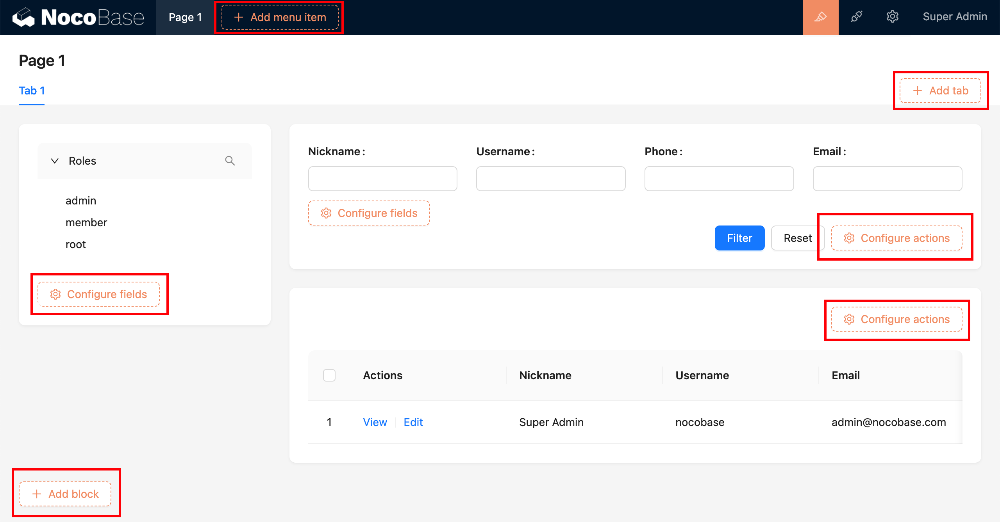

# Schema initializer

After activating the UI configuration, the various visible orange buttons on the interface are Schema initializers, used for adding various blocks, fields, actions, etc., to the interface.



## Built-in initializers


## Adding items to existing initializers

It is recommended to use the [`schemaInitializerManager.addItem()`](#) method to add items. For detailed item configurations, refer to [SchemaInitializer Item API](#).

```ts
class PluginDemoAddSchemaInitializerItem extends Plugin {
  async load() {
    this.schemaInitializerManager.addItem(
      'myInitializer', // Example of an existing schema initializer
      'otherBlocks.custom', // Add custom to the otherBlocks group
      {
        type: 'item',
        useComponentProps() {},
      },
    );
  }
}
```

<!-- <code src="./demos/schema-initializer-manager-add-item/index.tsx"></code> -->

## Adding new initializers

For detailed parameters of SchemaInitializer, refer to [SchemaInitializerOptions API](https://client.docs-cn.nocobase.com/core/ui-schema/schema-initializer#new-schemainitializeroptions).

```ts
const myInitializer = new SchemaInitializer({
  // Unique identifier for the initializer
  name: 'myInitializer',
  title: 'Add Block',
  // Wrapper, for example, inserting into a Grid requires using Grid.wrap (adds row and column tags)
  wrap: Grid.wrap,
  // Insertion position, defaults to beforeEnd, supports 'beforeBegin' | 'afterBegin' | 'beforeEnd' | 'afterEnd'
  insertPosition: 'beforeEnd',
  // Dropdown menu items
  items: [
    {
      name: 'a',
      type: 'item',
      useComponentProps() {},
    },
  ],
});
```

### Registering in the plugin's load method

It is recommended to use `schemaInitializerManager.add()` to add the new initializer to the application.

```ts
class PluginDemoAddSchemaInitializer extends Plugin {
  async load() {
    const myInitializer = new SchemaInitializer({
      name: 'myInitializer',
      title: 'Add block',
      wrap: Grid.wrap,
      items: [
        {
          name: 'helloBlock',
          type: 'item',
          useComponentProps() {
            const { insert } = useSchemaInitializer();
            return {
              title: 'Hello',
              onClick: () => {
                insert({
                  type: 'void',
                  'x-decorator': 'CardItem',
                  'x-component': 'h1',
                  'x-content': 'Hello, world!',
                });
              },
            };
          },
        },
      ],
    });
    this.schemaInitializerManager.add(myInitializer);
  }
}
```

### How to use the newly added initializer

SchemaInitializer is used in the Schema's `x-initializer` parameter.

#### Schema components that support `x-initializer`

General Schema components that support `x-initializer` include Grid, ActionBar, Tabs. For example:

```ts
{
  type: 'void',
  'x-component': 'Grid',
  'x-initializer': 'myInitializer',
}
```

<code src="./demos/schema-initializer-manager-add/index.tsx"></code>

#### How to support `x-initializer` in custom components

If Grid, ActionBar, Tabs, and similar components do not meet your needs, you can use [useSchemaInitializerRender()](https://client.docs-cn.nocobase.com/core/ui-schema/schema-initializer#useschemainitializerrender) to handle the rendering of `x-initializer` in custom components.

<code src="./demos/use-schema-initializer-render/index.tsx"></code>

## API Reference

- [SchemaInitializerManager](https://client.docs-cn.nocobase.com/core/ui-schema/schema-initializer-manager)
- [SchemaInitializer](https://client.docs-cn.nocobase.com/core/ui-schema/schema-initializer)
