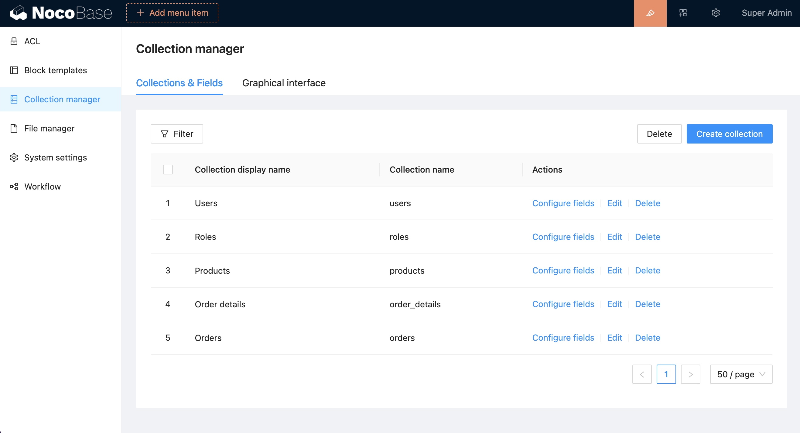
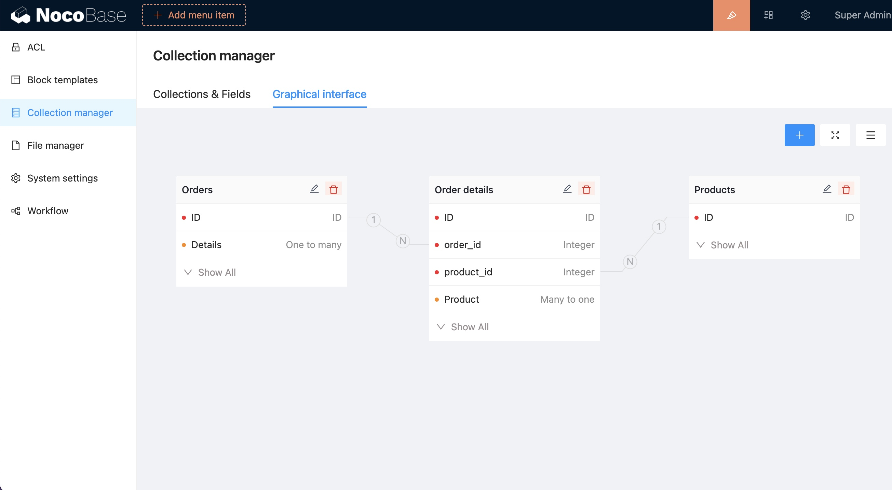

# Настройка коллекций

В NocoBase существует три способа настройки коллекций.



## Настройка через интерфейс

Для бизнес-данных рекомендуется использовать интерфейс. Платформа NocoBase предоставляет два варианта:

### Обычный табличный интерфейс



### Графический интерфейс



## Определение в коде плагина

В плагинах пользовательские коллекции должны располагаться в директории `src/server/collections/*.ts`:

```ts
import { defineCollection } from '@nocobase/database';

export default defineCollection({
  name: 'examples',
});
```

Для расширения существующей коллекции используйте `extendCollection()`:

```ts
import { extendCollection } from '@nocobase/database';

export default extendCollection({
  name: 'examples',
});
```

Ссылки на API:
- [defineCollection()](/api/database#definecollection)
- [extendCollection()](/api/database#extendcollection)

:::info{title="ИНФОРМАЦИЯ"}
Коллекции в плагинах автоматически синхронизируются с БД при активации плагина. Если плагин уже активен, используйте команду `yarn nocobase upgrade` для синхронизации.
:::

## Управление через REST API

Третьи стороны могут управлять таблицами через HTTP-интерфейс (требуются права):

### Коллекции

```bash
GET /api/collections
POST /api/collections
GET /api/collections/<collectionName>
PUT /api/collections/<collectionName>
DELETE /api/collections/<collectionName>
```

### Поля коллекций

```bash
GET /api/collections/<collectionName>/fields
POST /api/collections/<collectionName>/fields
GET /api/collections/<collectionName>/fields/<fieldName>
PUT /api/collections/<collectionName>/fields/<fieldName>
DELETE /api/collections/<collectionName>/fields/<fieldName>
```
