# Как расширить поля

Состав поля коллекции в NocoBase состоит из



## Расширить тип поля

Например, чтобы расширить поле ввода пароля введите: 'password'`

```ts
export class MyPlugin extends Plugin {
  beforeLoad() {
    this.db.registerFieldTypes({
      password: PasswordField,
    });
  }
}

export class PasswordField extends Field {
  get dataType() {
    return DataTypes.STRING;
  }
}
```

- [С другими реализациями встроенных типов полей можно ознакомиться здесь](https://github.com/nocobase/nocobase/tree/main/packages/core/database/src/fields)
- Также смотрите полные образцы плагина [пакеты/образцы/магазин-моделирование](https://github.com/nocobase/nocobase/tree/main/packages/samples/shop-modeling)

## Расширить полевой компонент

Соответствующую документацию по расширению можно найти здесь

- [Расширение компонентов схемы](/development/client/ui-schema-designer/extending-schema-components)
- [[Библиотека компонентов Schema](/development/client/ui-schema-designer/component-library)

## Расширить полевой интерфейс

- [Встроенные полевые интерфейсы можно посмотреть здесь](https://github.com/nocobase/nocobase/tree/main/packages/core/client/src/collection-manager/interfaces)
