# Протокол коллекций

Коллекция - это основа NocoBase, протокол для описания структур данных (коллекций и полей), близкий к концепции реляционных баз данных, но не ограниченный ими. Может также использоваться для NoSQL баз данных, HTTP API и других источников данных.



На текущем этапе протокол Collection основан на интерфейсе реляционных БД (db.collections), поддержка NoSQL и HTTP API будет добавлена позже.

Протокол Collection состоит из двух частей: CollectionOptions и FieldOptions. Поскольку Field расширяем, параметры FieldOptions очень гибкие.

## CollectionOptions

```ts
interface CollectionOptions {
  name: string; // Название коллекции
  title?: string; // Отображаемое имя
  // Древовидная структура:
  tree?: 'adjacency-list' | 'closure-table' | 'materialized-path' | 'nested-set';
  // Наследование:
  inherits?: string | string[];
  // Поля коллекции:
  fields?: FieldOptions[];
  // Автоматические временные метки:
  timestamps?: boolean;
  // Мягкое удаление:
  paranoid?: boolean;
  // Сортировка:
  sortable?: CollectionSortable;
  // Модель:
  model?: string;
  // Репозиторий:
  repository?: string;
  [key: string]: any;
}

type CollectionSortable = string | boolean | { name?: string; scopeKey?: string };
```

## FieldOptions

Базовые параметры поля:

```ts
interface FieldOptions {
  name: string; // Имя поля
  type: string; // Тип поля
  hidden?: boolean; // Скрытое поле
  index?: boolean; // Индексируемое поле
  interface?: string; // Интерфейс поля
  uiSchema?: ISchema; // Схема UI
```

[Подробнее о UI Schema](/development/client/ui-schema-designer/what-is-ui-schema)

### Типы полей

Типы полей включают атрибутивные и ассоциативные.

**Атрибутивные типы**

- 'boolean' - Логический
- 'integer' - Целое число
- 'bigInt' - Большое целое
- 'double' - Двойная точность
- 'real' - Вещественное
- 'decimal' - Десятичное
- 'string' - Строка
- 'text' - Текст
- 'password' - Пароль
- 'date' - Дата
- 'time' - Время
- 'array' - Массив
- 'json' - JSON
- 'jsonb' - JSON бинарный
- 'uuid' - UUID
- 'uid' - UID
- 'formula' - Формула
- 'radio' - Радио
- 'sort' - Сортировка
- 'virtual' - Виртуальное

**Ассоциативные типы**

- 'belongsTo' - Принадлежит к
- 'hasOne' - Имеет один
- 'hasMany' - Имеет много
- 'belongsToMany' - Принадлежит ко многим

### Интерфейсы полей

**Базовые**

- input - Поле ввода
- textarea - Текстовая область
- phone - Телефон
- email - Email
- integer - Целое число
- number - Число
- percent - Процент
- password - Пароль
- icon - Иконка

**Выбор**

- checkbox - Чекбокс
- select - Выпадающий список
- multipleSelect - Множественный выбор
- radioGroup - Группа радио-кнопок
- checkboxGroup - Группа чекбоксов
- chinaRegion - Китайские регионы

**Медиа**

- attachment - Вложение
- markdown - Markdown
- richText - Текстовый редактор

**Дата и время**

- datetime - Дата и время
- time - Время

**Связи**

- linkTo - `type: 'believesToMany'`
- oho - `type: 'hasOne'`
- obo - `type: 'believesTo'`
- o2m - `type: 'hasMany'`
- m2o - `type: 'believesTo'`
- m2m - `type: 'believesToMany'`

**Продвинутые**

- formula - Формула
- sequence - Последовательность

**Системная информация**

- id - ID
- createdAt - Дата создания
- createdBy - Создано
- updatedAt - Дата обновления
- updatedBy - Обновлено
