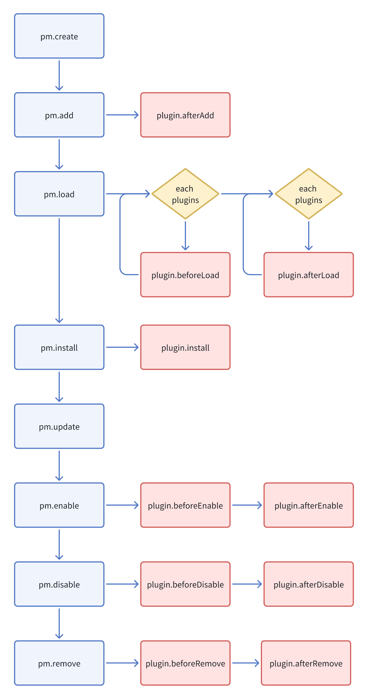

### **Структура серверной части плагина**

Структура каталога, связанного с серверной частью инициализированного пустого плагина, выглядит следующим образом:

```
|- /plugin-sample-hello
  |- /src
    |- /server      # Серверный код плагина
      |- plugin.ts  # Класс плагина
      |- index.ts   # Точка входа серверной части
  |- server.d.ts
  |- server.js
```

#### **Плагин**

Файл `plugin.ts` позволяет вызывать различные методы на разных этапах жизненного цикла плагина.

```ts
import { InstallOptions, Plugin } from '@nocobase/server';

export class PluginSampleHelloServer extends Plugin {
  afterAdd() {
    // Вызывается после регистрации плагина через pm.add.
    // В основном используется для установки слушателей события app.beforeLoad
    this.app.on('beforeLoad');
  }

  beforeLoad() {
    // Настройка классов или методов
    this.db.registerFieldTypes();
    this.db.registerModels();
    this.db.registerRepositories();
    this.db.registerOperators();
    // Слушатели событий
    this.app.on();
    this.db.on();
  }

  async load() {
    // Определение коллекции
    this.db.collection();
    // Импорт конфигураций коллекций
    this.db.import();
    this.db.addMigrations();

    // Определение ресурса
    this.resourcer.define();
    // Регистрация действий ресурса
    this.resourcer.registerActions();

    // Регистрация промежуточного ПО (middleware)
    this.resourcer.use();
    this.acl.use();
    this.app.use();

    this.app.i18n;
    // Пользовательские команды
    this.app.command();
  }

  async install(options?: InstallOptions) {
    // Логика установки
  }

  async afterEnable() {
    // После активации
  }

  async afterDisable() {
    // После деактивации
  }

  async remove() {
    // Логика удаления
  }
}

export default PluginSampleHelloServer;
```

#### **Жизненный цикл плагина**



- После инициализации плагина вызывается `afterAdd`. На этом этапе не все остальные плагины могут быть ещё созданы.
- В `beforeLoad` все активированные плагины уже инстанцированы, и их экземпляры можно получить через `app.pluginManager.get()`.
- В `load` метод `beforeLoad` всех плагинов уже выполнен.

#### **Основные свойства и методы класса плагина**

| API | Описание |
| --- | --- |
| `this.name` | Название плагина |
| `this.enabled` | Активирован ли плагин |
| `this.installed` | Установлен ли плагин |
| `this.app` | Экземпляр приложения |
| `this.pm` | Экземпляр менеджера плагинов |
| `this.db` | Экземпляр базы данных |
| `this.resourcer` | Менеджер ресурсов |
| `this.acl` | Система контроля доступа |
| `this.log` | Логирование |
| `this.app.i18n` | Интернационализация |
| `this.db.registerFieldTypes()` | Регистрация типов полей |
| `this.db.registerModels()` | Регистрация моделей |
| `this.db.registerRepositories()` | Регистрация репозиториев |
| `this.db.registerOperators()` | Регистрация пользовательских операторов |
| `this.app.on()` | События приложения |
| `this.db.on()` | События базы данных |
| `this.db.collection()` | Настройка таблиц данных |
| `this.db.import()` | Импорт конфигураций таблиц данных |
| `this.db.addMigrations()` | Миграции |
| `this.resourcer.registerActions()` | Регистрация действий ресурса |
| `this.resourcer.use()` | Промежуточное ПО (middleware) |
| `this.acl.use()` | Промежуточное ПО (middleware) |
| `this.app.use()` | Промежуточное ПО (middleware) |
| `this.app.command()` | Командная строка |
