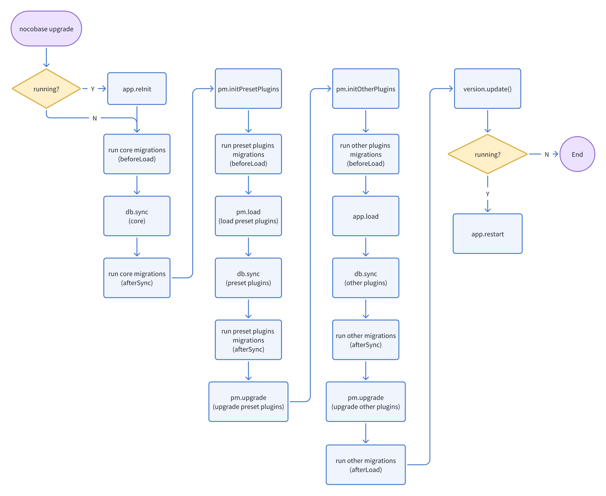

# Migration

During the update and iteration process of plugins, there might be some incompatible changes. These incompatible upgrades can be handled by writing migration files, which are triggered by the `nocobase upgrade` command. The relevant process is as follows:



The migrations for upgrades are divided into beforeLoad, afterSync, and afterLoad:

- beforeLoad: Executed before the loading of each module, divided into three phases:
  - Before the loading of the core module
  - Before the loading of preset plugins
  - Before the loading of other plugins
- afterSync: After the synchronization of table configurations with the database, divided into three phases:
  - After the synchronization of the core tables with the database
  - After the synchronization of the preset plugins' tables with the database
  - After the synchronization of other plugins' tables with the database
- afterLoad: Executed after all applications have been loaded

## Creating migration files

Create migration files through the create-migration command

```bash
yarn nocobase create-migration -h

Usage: nocobase create-migration [options] <name>

Options:
  --pkg <pkg>  package name
  --on [on]    Options include beforeLoad, afterSync, and afterLoad
  -h, --help   display help for command
```

Example

```bash
$ yarn nocobase create-migration update-ui --pkg=@nocobase/plugin-client

2024-01-07 17:33:13 [info ] add app main into supervisor     
2024-01-07 17:33:13 [info ] migration file in /nocobase/packages/plugins/@nocobase/plugin-client/src/server/migrations/20240107173313-update-ui.ts
✨  Done in 5.02s.
```

A migration file named 20240107173313-update-ui.ts will be generated in the src/server/migrations of the plugin package @nocobase/plugin-client, with the initial content as follows:

```ts
import { Migration } from '@nocobase/server';

export default class extends Migration {
  on = 'afterLoad'; // 'beforeLoad' | 'afterSync' | 'afterLoad'
  appVersion = '<0.19.0-alpha.3';

  async up() {
    // coding
  }
}
```

## Triggering migration

Triggered by the `nocobase upgrade` command

```bash
$ yarn nocobase upgrade
```

## Testing migration

```ts
import { createMockServer, MockServer } from '@nocobase/test';

describe('test example', () => {
  let app: MockServer;

  beforeEach(async () => {
    app = await createMockServer({
      plugins: ['my-plugin'], // Plugins
      version: '0.18.0-alpha.5', // Version before upgrade
    });
  });

  afterEach(async () => {
    await app.destroy();
  });

  test('case1', async () => {
    await app.runCommand('upgrade');
    // coding...
  });
});
```
