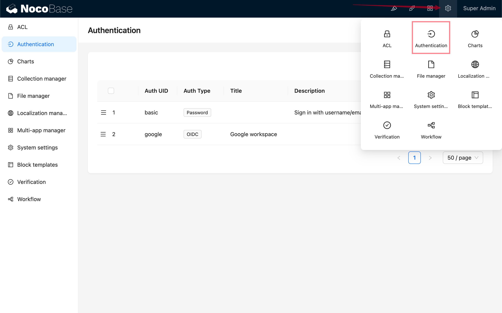

# Аутентификация: SAML 2.0

<PluginInfo commercial="true" name="auth-saml"></PluginInfo>

## Введение

Плагин «Аутентификация: SAML 2.0» соответствует стандарту протокола SAML 2.0 (Security Assertion Markup Language 2.0) и позволяет пользователям входить в систему NocoBase, используя учётные записи, предоставленные сторонними провайдерами удостоверяющих центров (IdP).

## Активация плагина

## Добавление аутентификации по SAML

Перейдите на страницу управления плагином аутентификации пользователей.

Нажмите «Добавить — SAML».

## Настройка

- **SSO URL** — предоставляется IdP, используется для единого входа (Single Sign-On).
- **Публичный сертификат** — предоставляется IdP.
- **Entity ID (IdP Issuer)** — необязательно, предоставляется IdP.
- **HTTP** — установите флажок, если ваше приложение NocoBase использует протокол HTTP.
- **Использовать это поле для привязки пользователя** — поле, по которому будет выполняться сопоставление с существующими пользователями. Можно выбрать `email` или `username`, по умолчанию — `email`. Информация о пользователе, передаваемая IdP, должна содержать поле `email` или `username`.
- **Автоматическая регистрация, если пользователь не существует** — создавать ли автоматически нового пользователя, если не найден соответствующий существующий.
- **Использование** — значения `SP Issuer / EntityID` и `ACS URL` используются для копирования и заполнения соответствующих настроек на стороне IdP.

## Сопоставление полей

Сопоставление полей необходимо настроить на платформе конфигурации IdP. Вы можете ознакомиться с примером: [Google](../auth-saml/example/google.md).

Поля, доступные для сопоставления в NocoBase:

- email (обязательно)
- phone (работает только на платформах, поддерживающих `phone` в scope, например, Alibaba Cloud, Lark)
- nickname
- username
- firstName
- lastName

Поле `nameID` передаётся протоколом SAML и не требует сопоставления — оно сохраняется как уникальный идентификатор пользователя.

Приоритет при формировании псевдонима нового пользователя:  
`nickname` > `firstName lastName` > `username` > `nameID`

В настоящее время сопоставление организаций и ролей пользователя не поддерживается.

## Вход в систему

Перейдите на страницу входа и нажмите кнопку под формой входа, чтобы запустить процесс аутентификации через сторонний провайдер.

