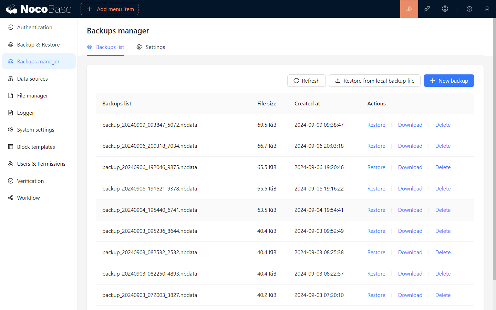
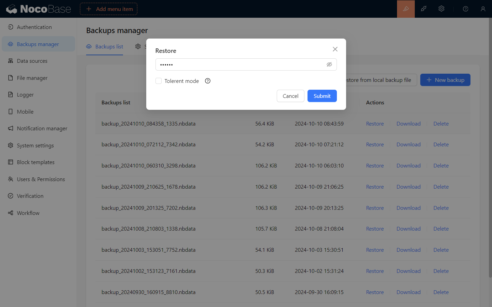
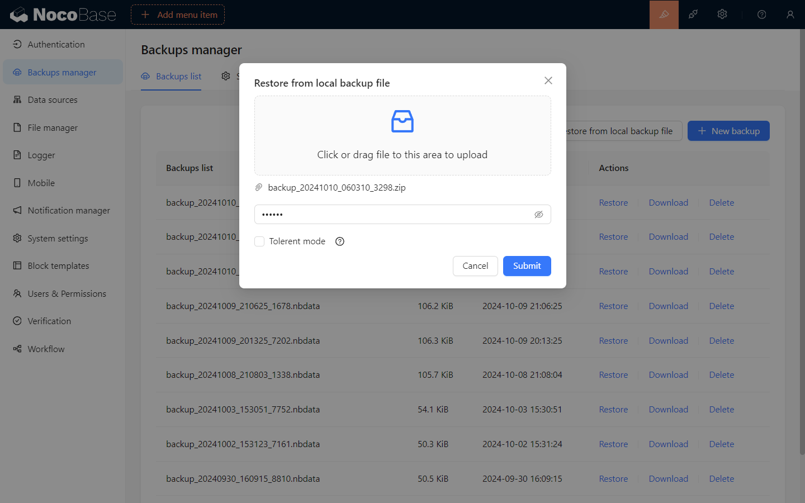
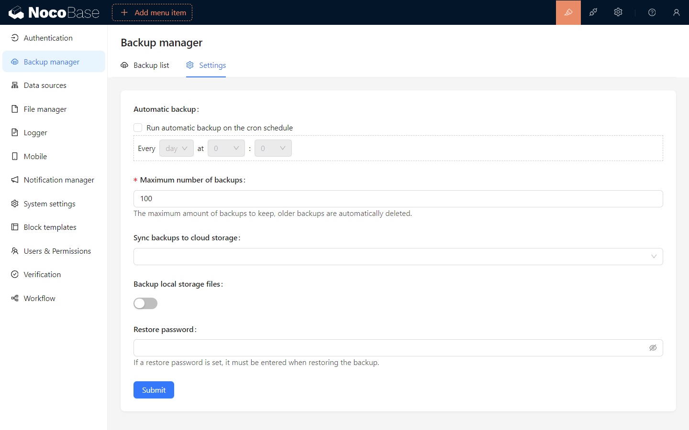

# Менеджер резервного копирования

<PluginInfo licenseBundled="true" name="backups"></PluginInfo>

## Введение

Плагин менеджера резервного копирования NocoBase предоставляет функции для полного резервного копирования базы данных NocoBase и загруженных пользователем файлов, включая планирование резервного копирования, загрузку, удаление и восстановление.

:::warning
Плагин менеджера резервного копирования включен в редакции Professional и Enterprise. Для пользователей редакций Community и Standard вы можете напрямую создавать резервную копию базы данных; см. подробности на странице: [`Как сделать резервную копию и восстановить NocoBase`](https://www.nocobase.com/en/blog/nocobase-backup-restore)
:::

## Установка

<embed src="./install.md"></embed>

## Инструкции по использованию

### Создать новую резервную копию

Нажмите кнопку «Новая резервная копия», чтобы создать новую резервную копию на основе конфигурации резервной копии и отобразить статус резервной копии в списке резервных копий.

### Восстановить резервную копию

Поддерживает восстановление резервных копий из списка резервных копий или загрузку локальных файлов резервных копий для восстановления резервных копий.
Операции восстановления не допускаются в следующих сценариях:

- Когда текущая версия NocoBase ниже версии NocoBase в файле резервной копии.
- Когда текущая база данных NocoBase не соответствует следующим конфигурациям в файле резервной копии:
- диалект
- подчеркивание
- префикс таблицы
- схема
- Когда «Толерантный режим» не включен, а версия базы данных при создании резервной копии выше текущей версии базы данных приложения.

> **Восстановление — это полная операция базы данных. Рекомендуется создать резервную копию текущей базы данных перед восстановлением резервной копии.**

#### Восстановление из списка резервных копий

Нажмите кнопку «Восстановить» элемента резервной копии в списке резервных копий, введите пароль шифрования файла резервной копии во всплывающем окне и нажмите «Подтвердить», чтобы восстановить резервную копию.

> Оставьте пароль пустым для незашифрованной резервной копии.

> Если вам нужно восстановить резервную копию до более низкой версии базы данных, вам необходимо включить толерантный режим.

#### Восстановить из локального файла резервной копии

Нажмите кнопку «Восстановить из локальной резервной копии», выберите локальный файл резервной копии во всплывающем окне, введите пароль шифрования файла резервной копии и нажмите «Подтвердить», чтобы восстановить резервную копию.

> Оставьте пароль пустым для незашифрованной резервной копии.

> Если вам нужно восстановить резервную копию до более низкой версии базы данных, вам нужно включить толерантный режим.

#### Загрузить файл резервной копии

Нажмите кнопку «Загрузить» элемента резервной копии в списке резервных копий, чтобы загрузить файл резервной копии.

#### Удалить резервную копию

Нажмите кнопку «Удалить» элемента резервной копии в списке резервных копий, чтобы удалить файл резервной копии.

## Настройки резервного копирования

Перейдите на вкладку «Настройки», измените настройки резервного копирования и нажмите «Сохранить», чтобы изменения вступили в силу.

### Описание настроек резервного копирования

- `Автоматическое резервное копирование`: если включен параметр `Запускать автоматическое резервное копирование по расписанию cron`, можно настроить автоматическое резервное копирование в указанное время.
- `Максимальное количество резервных копий`: установите максимальное количество локально сохраненных файлов резервных копий. После превышения этого количества самые ранние файлы резервных копий будут автоматически удалены.
- `Синхронизация резервного копирования с облачным хранилищем`: установите место хранения в облаке, куда автоматически загружаются файлы резервных копий после успешного резервного копирования, поддерживается только облачное хранилище.
- `Резервное копирование файлов локального хранилища`: следует ли включать в резервную копию файлы, загруженные пользователями в локальное хранилище сервера (хранение/загрузки).
- `Восстановление пароля`: если установлен пароль восстановления, его необходимо ввести при восстановлении резервной копии.

> **Пожалуйста, сохраните пароль восстановления в надежном месте. Если вы забудете пароль, восстановление файла резервной копии станет невозможным.**
