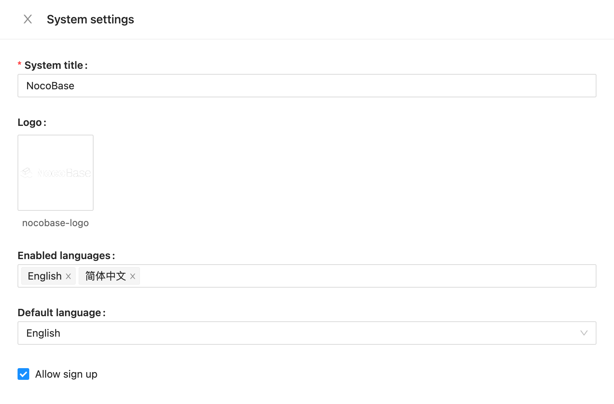

# Перевод

Языком по умолчанию в NocoBase является английский. В настоящее время основное приложение поддерживает Английский, Итальянский, Нидерландский, Упрощённый китайский, Японский языки и Русский язык. Мы искренне приглашаем вас внести вклад в перевод на другие языки, чтобы пользователи по всему миру могли получать ещё больше удовольствия и удобства от использования NocoBase.

---

## I. Локализация системы

### 1. Перевод интерфейса системы и плагинов

#### 1.1 Область перевода
Это относится только к переводу интерфейса системы NocoBase и встроенных плагинов, и **не распространяется** на другие пользовательские материалы (например, таблицы данных или Markdown-блоки).


#### 1.2 Обзор локализуемого контента
NocoBase использует Git для управления файлами локализации. Основной репозиторий находится по адресу:
https://github.com/nocobase/locales

Каждый язык представлен отдельным JSON-файлом, название которого соответствует языковому коду (например, `de-DE.json`, `fr-FR.json`).  
Структура файла организована по модулям плагинов и использует пары ключ-значение для хранения переводов.  
Пример:

```json
{
  // Client plugin
  "@nocobase/client": {
    "(Fields only)": "(Fields only)",
    "12 hour": "12 hour",
    "24 hour": "24 hour"
    // ...other key-value pairs
  },
  "@nocobase/plugin-acl": {
    // Key-value pairs for this plugin
  }
  // ...other plugin modules
}
```

При переводе, пожалуйста, постепенно приводите структуру к следующему формату:

```json
{
  // Клиентский JSON
  "@nocobase/client": {
    "(Fields only)": "(Только поля)",
    "12 hour": "12 часов",
    "24 hour": "24 часа"
    // ... другие ключ-значения
  },
  "@nocobase/plugin-acl": {
    // Ключ-значение для плагина
  }
  // ...другие плагины
}
}
```

#### 1.3 Тестирование и синхронизация перевода
- После завершения перевода обязательно протестируйте отображение всех текстов в интерфейсе.  
  Мы также выпустили плагин для проверки перевода — найдите его в маркетплейсе плагинов под названием `Locale tester`.

После установки плагина скопируйте содержимое соответствующего JSON-файла локализации из репозитория Git, вставьте его в поле ввода и нажмите OK — так вы сможете проверить, корректно ли работает ваш перевод.


- После отправки переводов системные скрипты автоматически синхронизируют локализованный контент с исходным кодом в репозитории.

## II. Локализация документации и пользовательского руководства

Контент для локализации документации и руководства пользователя хранится в следующем разделе:
https://github.com/nocobase/docs

Локализация реализуется путём добавления отдельных директорий для каждого языка, например:
https://github.com/nocobase/docs/blob/main/docs/en-US/


Примечания:
- Для изменений в текстах директории, пожалуйста, обратитесь к:
  https://github.com/nocobase/docs/blob/main/docs/config/
  
  

- Изменения текстов глобальных компонентов находятся по адресу:
  https://github.com/nocobase/docs/blob/main/.dumi/theme/builtins/

  Например, текстовая информация о плагинах:
  https://github.com/nocobase/docs/blob/main/.dumi/theme/builtins/PluginInfo.tsx
  
  

## III. Локализация сайта (Подробное руководство)

Страницы сайта и весь контент расположен по адресу:
https://github.com/nocobase/website

### 3.0 Начало работы и справочные ресурсы

При добавлении нового языка, пожалуйста, ориентируйтесь на уже существующие страницы:
- English: https://github.com/nocobase/website/blob/main/src/en/
- Chinese: https://github.com/nocobase/website/blob/main/src/cn/
- Japanese: https://github.com/nocobase/website/blob/main/src/ja/
- Русский: https://github.com/nocobase/website/blob/main/src/ru/


Изменения глобальных стилей размещаются по адресам:
- English: https://github.com/nocobase/website/blob/main/src/layouts/BaseEN.astro
- Chinese: https://github.com/nocobase/website/blob/main/src/layouts/BaseCN.astro
- Japanese: https://github.com/nocobase/website/blob/main/src/layouts/BaseJA.astro
- Русский: https://github.com/nocobase/website/blob/main/src/layouts/BaseRU.astro


Глобальная локализация компонентов сайта доступна по ссылке:
https://github.com/nocobase/website/tree/main/src/components


### 3.1 Структура контента и метод локализации

Мы используем смешанный подход к управлению контентом. Контент на Английском, Китайском, Японском и Русском языке регулярно синхронизируется с CMS и перезаписывается, а другие языки можно редактировать напрямую в локальных файлах. Локальный контент хранится в директории content, структура следующая:
```
/content
  /articles        # Статьи блога
    /article-slug
      index.md     # Английский контент (по умолчанию)
      index.cn.md  # Китайский контент
      index.ja.md  # Японский контент
      metadata.json # Метаданные и параметры локализации
  /tutorials       # Обучающие материалы
  /releases        # Информация о релизах
  /pages           # Статические страницы
  /categories      # Информация о категориях
    /article-categories.json  # Список категорий статей
    /category-slug            # Данные отдельной категории
      /category.json
  /tags            # Информация о тегах
    /article-tags.json        # Теги статей
    /release-tags.json        # Теги релизов
    /tag-slug                 # Данные отдельного тега
      /tag.json
  /help-center     # Контент Центра помощи
    /help-center-tree.json    # Структура навигации по помощи
  ....
```

### 3.2 Рекомендации по переводу контента

- Перевод Markdown-файлов

1. Создайте новый файл для нужного языка на основе стандартного (например, `index.md` → `index.fr.md`)
2. Добавьте локализованные значения в соответствующие поля JSON-файла
3. Соблюдайте структуру файлов, ссылки и изображения

- Перевод JSON-контента
Многие метаданные хранятся в JSON-файлах, в которых используются многоязычные поля:

```json
{
  "id": 123,
  "title": "English Title",       // Английский заголовок (по умолчанию)
  "title_cn": "中文标题",          // Китайский заголовок
  "title_ja": "日本語タイトル",    // Японский заголовок
  "title_ru": "Русский заголовок",// Русский заголовок
  "description": "English description",
  "description_cn": "中文描述",
  "description_ja": "日本語の説明",
  "description_ru": "Русское описание",
  "slug": "article-slug",         // URL (обычно не переводится)
  "status": "published",
  "publishedAt": "2025-03-19T12:00:00Z"
}
```

**Примечания по переводу:**

1. **Именование полей:**: Используйте формат `{original_field}_{language_code}`
   - Например: title_fr (французский заголовок), description_de (описание на немецком)

2. **При добавлении нового языка:**:
   - Создайте версии всех необходимых полей с соответствующим суффиксом языка
   - Не изменяйте оригинальные значения (например, title, description), они используются как контент по умолчанию

3. **Механизм синхронизации CMS:**:
   - CMS периодически обновляет данные на Английском, Китайском, Японском и Русском языках
   - При этом **не удаляются поля** других языков, добавленные вручную
   - Например, поле `title_fr` с французским переводом останется без изменений после синхронизации


### 3.3 Настройка поддержки нового языка

Чтобы добавить поддержку нового языка, измените объект `SUPPORTED_LANGUAGES` в файле `src/utils/index.ts`:

```typescript
export const SUPPORTED_LANGUAGES = {
  en: {
    code: 'en',
    locale: 'en-US',
    name: 'English',
    default: true
  },
  cn: {
    code: 'cn',
    locale: 'zh-CN',
    name: 'Chinese'
  },
  ja: {
    code: 'ja',
    locale: 'ja-JP',
    name: 'Japanese'
  },
  // Пример добавления нового языка:
  ru: {
    code: 'ru',
    locale: 'ru-RU',
    name: 'Russian'
  }
};
```

### 3.4 Файлы шаблонов и стили

Каждому языку должен соответствовать свой layout-файл:

1. Создайте новый файл шаблона, например, `src/layouts/BaseRU.astro`
2. Скопируйте существующий (например, `BaseEN.astro`) и переведите его
3. В шаблоне локализуются глобальные элементы — меню, футеры и пр.
4. Обязательно обновите конфигурацию переключателя языков

### 3.5 Создание директорий для страниц на новом языке

Создайте независимые каталоги страниц для нового языка:

1. В каталоге `src` создайте новую папку с кодом языка (например, `src/ru/`)
2. Скопируйте структуру из существующего языка (например, `src/en/`)
3. Переведите содержимое страниц: заголовки, описания, текст
4. Убедитесь, что используется правильный layout-файл (`.layout: '@/layouts/BaseFR.astro'`)

### 3.6 Локализация компонентов

Часто используемые компоненты тоже требуют перевода:

1. Проверьте содержимое `src/components/`
2. Особое внимание уделите элементам с фиксированным текстом (меню, футер и пр.)
3. В компонентах может использоваться условный рендеринг:

```astro
{Astro.url.pathname.startsWith('/en') && <p>English content</p>}
{Astro.url.pathname.startsWith('/cn') && <p>中文内容</p>}
{Astro.url.pathname.startsWith('/fr') && <p>Contenu français</p>}\
{Astro.url.pathname.startsWith('/ru') && <p>Контент на Русском</p>}
```

### 3.7 Тестирование и проверка

После завершения перевода убедитесь в корректной работе:

1. Запустите сайт локально (`yarn dev`)
2. Проверьте отображение всех страниц на новом языке
3. Убедитесь, что переключение языков работает корректно
4. Проверьте правильность всех ссылок
5. Убедитесь, что вёрстка не ломается из-за длины переведённого текста

## IV. Как начать перевод

Если вы хотите внести перевод на новый язык в NocoBase, следуйте инструкции:

1. Для интерфейса системы — клонируйте репозиторий: https://github.com/nocobase/locales
Создайте JSON-файл для нового языка на основе существующего.
2. Для документации — клонируйте: https://github.com/nocobase/docs
   Создайте папку с кодом языка и начните перевод.
3. Для сайта — клонируйте: https://github.com/nocobase/website
   Создайте страницы нового языка, ориентируясь на текущие.

После завершения перевода создайте Pull Request. Новый язык появится в конфигурации системы и станет доступен для отображения.


## Устаревшая информация

The NocoBase language files are located at the following locations:

```shell
packages/core/**/src/locale
packages/plugins/**/src/locale
```

Файлы локализации NocoBase находятся в следующих директориях:

https://github.com/nocobase/nocobase/tree/main/packages/core/client/src/locale

Скопируйте файл `en_US.ts`, переименуйте в соответствие с новым языковым кодом и переведите его строки. После завершения отправьте `Pull Request` — язык будет добавлен в конфигурацию.



## Поддерживаемые языки и прогресс локализации

В таблице ниже указаны доступные языки и прогресс их локализации (см. оригинальный документ).

| Language Culture Name  | Display Name                 | Progress  | Contributors |
| ---------------------------------------------------------------------------------------------------------------------------- | -------------------- | --- | --- |
| ar-EG                                                                                                                        | العربية              |     |     |
| az-AZ                                                                                                                        | Azərbaycan dili      |     |     |
| bg-BG                                                                                                                        | Български            |     |     |
| bn-BD                                                                                                                        | Bengali              |     |     |
| by-BY                                                                                                                        | Беларускі            |     |     |
| ca-ES                                                                                                                        | Сatalà/Espanya       |     |     |
| cs-CZ                                                                                                                        | Česky                |     |     |
| da-DK                                                                                                                        | Dansk                |     |     |
| [de-DE](https://github.com/nocobase/locales/blob/main/de-DE.json "https://github.com/nocobase/locales/blob/main/de-DE.json") | Deutsch              |     |     |
| el-GR                                                                                                                        | Ελληνικά             |     |     |
| en-GB                                                                                                                        | English(GB)          |     |     |
| [en-US](https://github.com/nocobase/locales/blob/main/en-US.json "https://github.com/nocobase/locales/blob/main/en-US.json") | English              |     |     |
| [es-ES](https://github.com/nocobase/locales/blob/main/es-ES.json "https://github.com/nocobase/locales/blob/main/es-ES.json") | Español              |     |     |
| et-EE                                                                                                                        | Estonian (Eesti)     |     |     |
| fa-IR                                                                                                                        | فارسی                |     |     |
| fi-FI                                                                                                                        | Suomi                |     |     |
| fr-BE                                                                                                                        | Français(BE)         |     |     |
| fr-CA                                                                                                                        | Français(CA)         |     |     |
| [fr-FR](https://github.com/nocobase/locales/blob/main/fr-FR.json "https://github.com/nocobase/locales/blob/main/fr-FR.json") | Français             |     |     |
| ga-IE                                                                                                                        | Gaeilge              |     |     |
| gl-ES                                                                                                                        | Galego               |     |     |
| he-IL                                                                                                                        | עברית                |     |     |
| hi-IN                                                                                                                        | हिन्दी               |     |     |
| hr-HR                                                                                                                        | Hrvatski jezik       |     |     |
| hu-HU                                                                                                                        | Magyar               |     |     |
| hy-AM                                                                                                                        | Հայերեն              |     |     |
| id-ID                                                                                                                        | Bahasa Indonesia     |     |     |
| is-IS                                                                                                                        | Íslenska             |     |     |
| [it-IT](https://github.com/nocobase/locales/blob/main/it-IT.json "https://github.com/nocobase/locales/blob/main/it-IT.json") | Italiano             |     |   [@N3tN00b3r](https://github.com/N3tN00b3r)   |
| [ja-JP](https://github.com/nocobase/locales/blob/main/ja-JP.json "https://github.com/nocobase/locales/blob/main/ja-JP.json") | 日本語                  |     |     |
| ka-GE                                                                                                                        | ქართული              |     |     |
| kk-KZ                                                                                                                        | Қазақ тілі           |     |     |
| km-KH                                                                                                                        | ភាសាខ្មែរ            |     |     |
| kn-IN                                                                                                                        | ಕನ್ನಡ                |     |     |
| [ko-KR](https://github.com/nocobase/locales/blob/main/ko-KR.json "https://github.com/nocobase/locales/blob/main/ko-KR.json") | 한국어                  |     |     |
| ku-IQ                                                                                                                        | کوردی                |     |     |
| lt-LT                                                                                                                        | lietuvių             |     |     |
| lv-LV                                                                                                                        | Latviešu valoda      |     |     |
| mk-MK                                                                                                                        | македонски јазик     |     |     |
| ml-IN                                                                                                                        | മലയാളം               |     |     |
| mn-MN                                                                                                                        | Монгол хэл           |     |     |
| ms-MY                                                                                                                        | بهاس ملايو           |     |     |
| nb-NO                                                                                                                        | Norsk bokmål         |     |     |
| ne-NP                                                                                                                        | नेपाली               |     |     |
| nl-BE                                                                                                                        | Vlaams               |     |     |
| nl-NL                                                                                                                        | Nederlands           |     |   [@mathyvds](https://github.com/mathyvds)   |
| pl-PL                                                                                                                        | Polski               |     |     |
| [pt-BR](https://github.com/nocobase/locales/blob/main/pt-BR.json "https://github.com/nocobase/locales/blob/main/pt-BR.json") | Português brasileiro |     |     |
| pt-PT                                                                                                                        | Português            |     |     |
| ro-RO                                                                                                                        | România              |     |     |
| [ru-RU](https://github.com/nocobase/locales/blob/main/ru-RU.json "https://github.com/nocobase/locales/blob/main/ru-RU.json") | Русский              |     |     |
| si-LK                                                                                                                        | සිංහල                |     |     |
| sk-SK                                                                                                                        | Slovenčina           |     |     |
| sl-SI                                                                                                                        | Slovenščina          |     |     |
| sr-RS                                                                                                                        | српски језик         |     |     |
| sv-SE                                                                                                                        | Svenska              |     |     |
| ta-IN                                                                                                                        | Tamil                |     |     |
| th-TH                                                                                                                        | ภาษาไทย              |     |     |
| tk-TK                                                                                                                        | Turkmen              |     |     |
| [tr-TR](https://github.com/nocobase/locales/blob/main/tr-TR.json "https://github.com/nocobase/locales/blob/main/tr-TR.json") | Türkçe               |     |     |
| [uk-UA](https://github.com/nocobase/locales/blob/main/uk-UA.json "https://github.com/nocobase/locales/blob/main/uk-UA.json") | Українська           |     |     |
| ur-PK                                                                                                                        | Oʻzbekcha            |     |     |
| vi-VN                                                                                                                        | Tiếng Việt           |     |     |
| [zh-CN](https://github.com/nocobase/locales/blob/main/zh-CN.json "https://github.com/nocobase/locales/blob/main/zh-CN.json") | 简体中文                 |     |     |
| zh-HK                                                                                                                        | 繁體中文（香港）             |     |     |
| [zh-TW](https://github.com/nocobase/locales/blob/main/zh-TW.json "https://github.com/nocobase/locales/blob/main/zh-TW.json") | 繁體中文（台湾）             |     |     |
