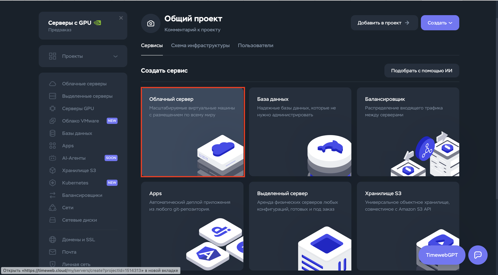

# Timeweb

## 1. Регистрация в Timeweb.Cloud

### Шаг 1.1: Переход на сайт
Откройте браузер и перейдите по адресу: https://timeweb.cloud

### Шаг 1.2: Регистрация
1. Нажмите кнопку «Создать «аккаунт
2. Заполните обязательные поля:

3. Подтвердите email, перейдя по ссылке в письме

---

## 2. Создание проекта

### Шаг 2.1: Переход в раздел проектов
После входа в аккаунт:
1. В левом меню выберите "Проекты"
2. Нажмите "Создать проект"

### Шаг 2.2: Заполнение информации
Введите данные проекта:
- **Название**
- **Описание**
- **Пользователи**

3. Нажмите "Создать"

---

## 3. Установка через маркетплейс

### Шаг 3.1: Сервисы
1. Выберите "Облачный сервер"

### Шаг 3.2: Настройка сервера
В конструкторе сервера:

1. В разделе "Образ" выберите "Маркетплейс"
2. В строке поиска введите "NocoBase"

3. Выберите NocoBase из списка доступных приложений

---

## 4. Конфигурация сервера

### Шаг 4.1: Выбор региона
Прокрутите страницу вниз до раздела "Регион":
- Выберите ближайший к вам регион
- Для России рекомендуем "Москва"

### Шаг 4.2: Настройка конфигурации
Система автоматически предложит оптимальные параметры:

### Шаг 4.3: Дополнительные настройки
1. Раздел "Сеть" настройте по своему усмотрению
2. В "Дополнительных услугах" можно включить:
   - Автоматические бэкапы
   - Защиту от DDoS-атак

---

## 5. Завершение установки

### Шаг 5.1: Авторизация
Оставьте настройки авторизации по умолчанию:

### Шаг 5.2: Имя сервера
1. Введите имя сервера: "nocobase-server"
2. Выберите проект, созданный в шаге 2

### Шаг 5.3: Запуск
Нажмите кнопку "Заказать" и дождитесь завершения процесса (5-10 минут)

---

## 6. Первый запуск NocoBase

После успешной установки:
1. Перейдите по ссылке, которая придет на email
2. Используйте стандартные учетные данные:
   - Логин: admin@nocobase.com
   - Пароль: admin123
